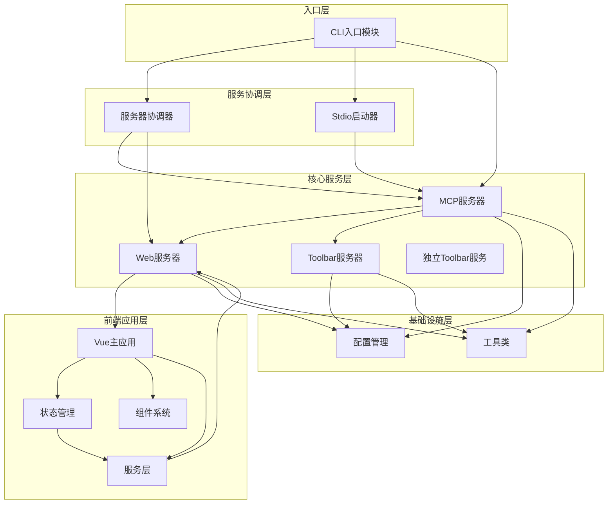
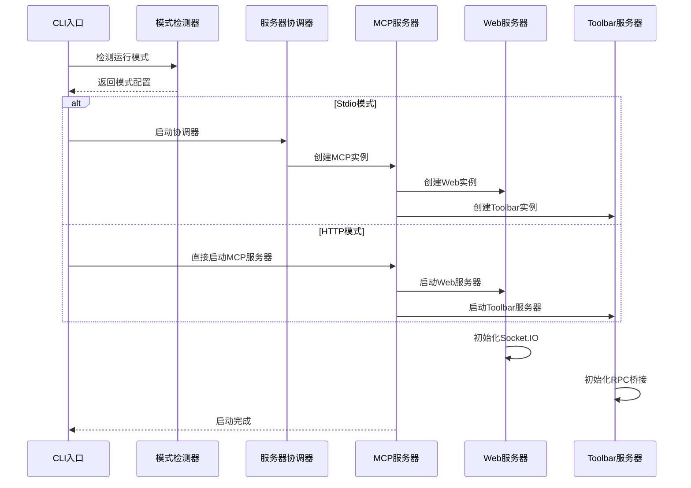
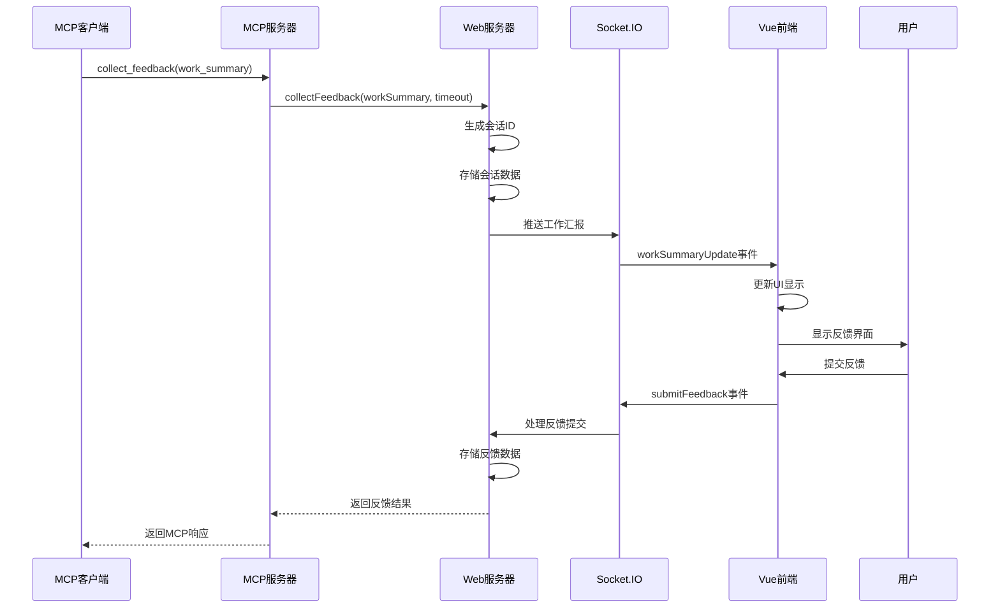
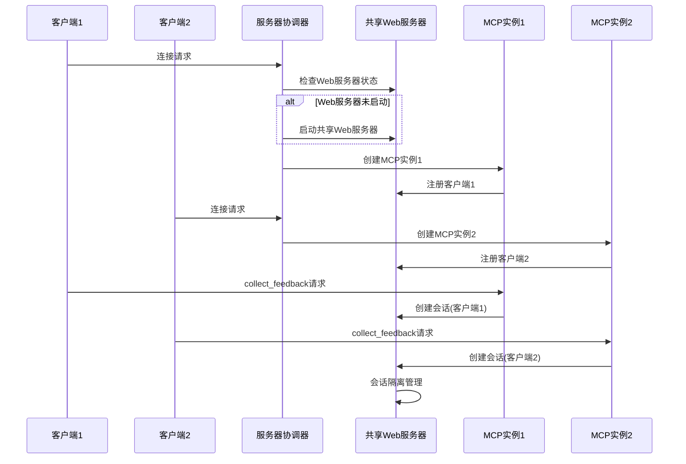
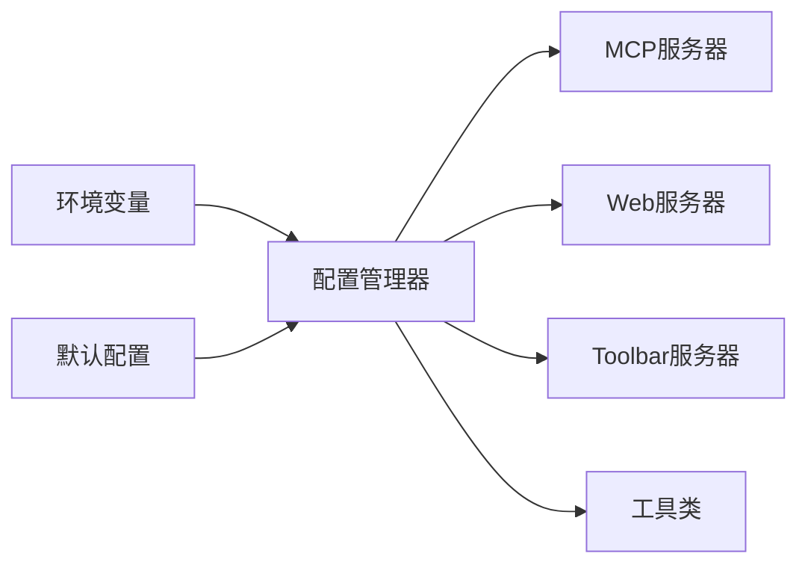
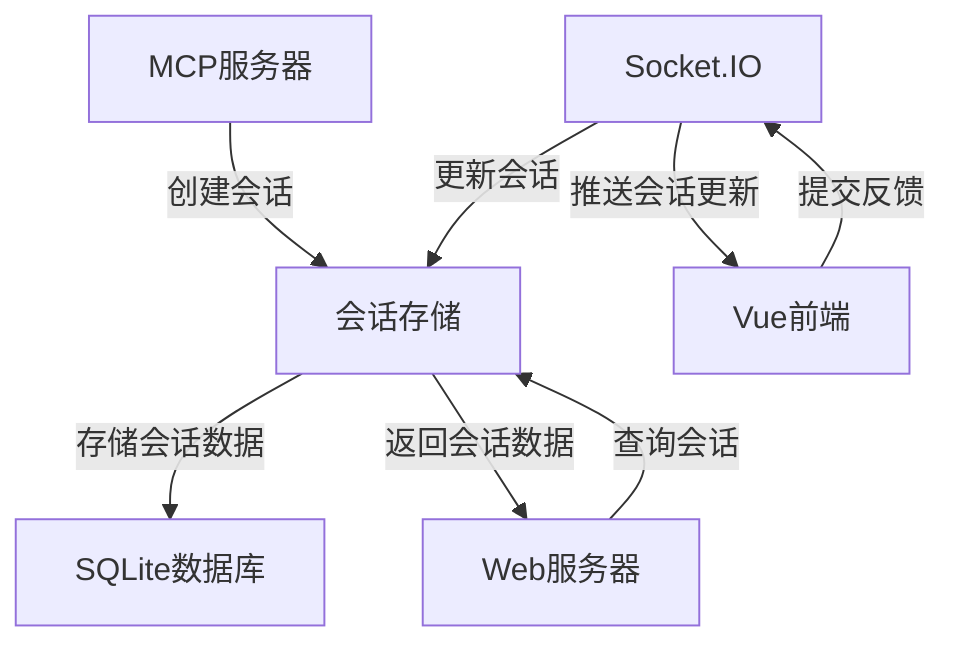
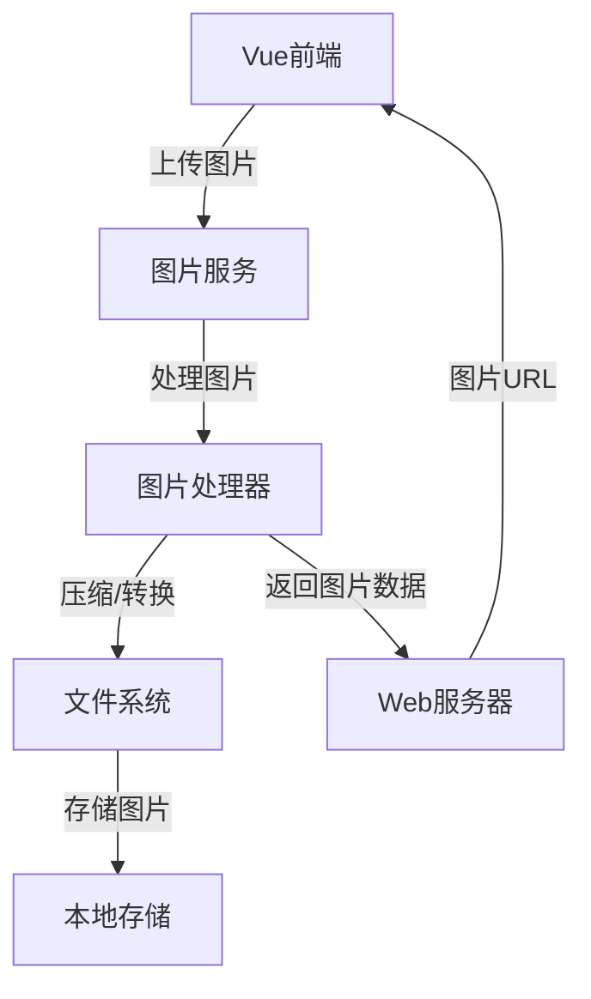
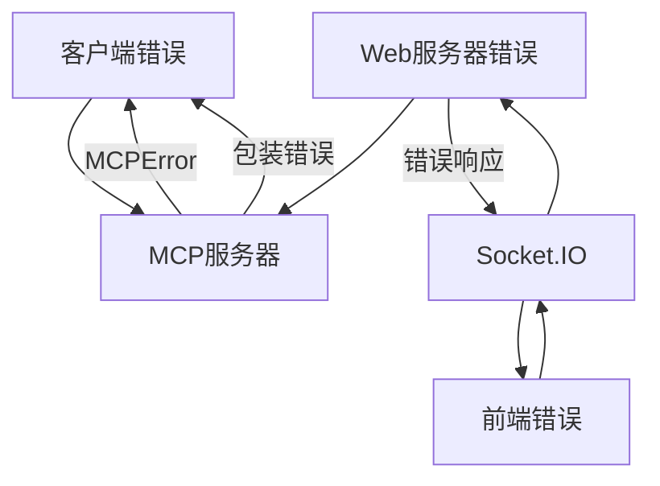
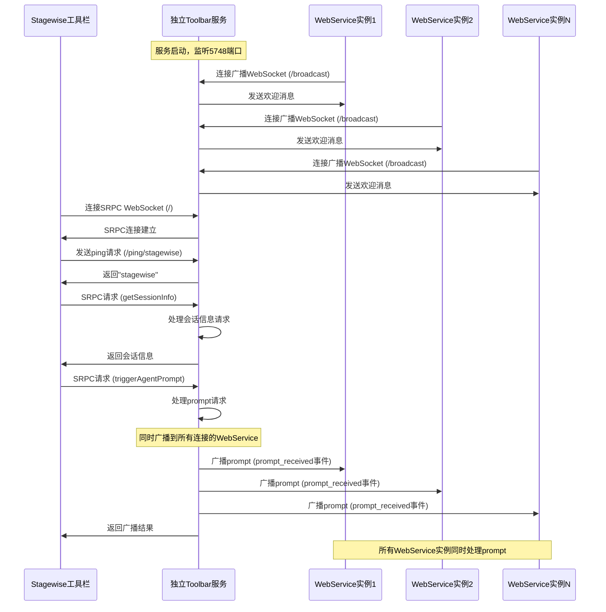
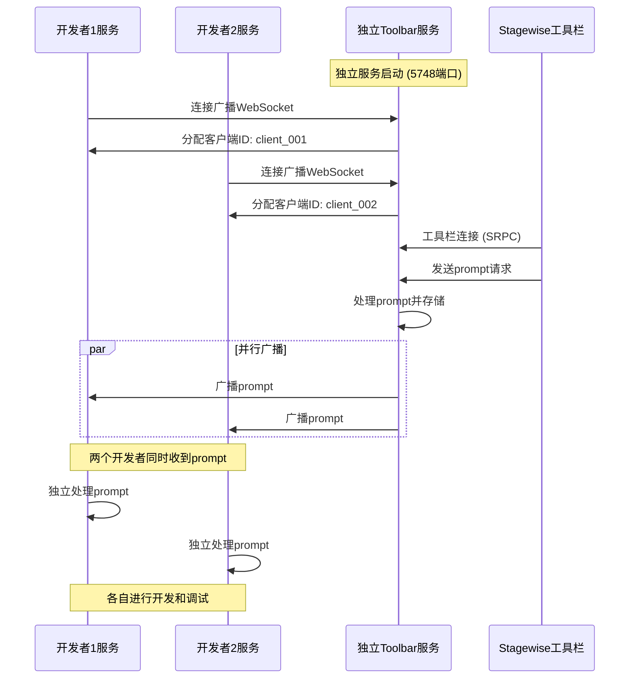

# 模块间交互分析

## 模块清单

基于实际项目结构分析，主要模块包括：

### 后端核心模块
- **CLI入口模块** (`src/cli.ts`)
- **MCP服务器模块** (`src/server/mcp-server.ts`)
- **Web服务器模块** (`src/server/web-server.ts`)
- **Toolbar服务器模块** (`src/server/toolbar-server.ts`)
- **独立Toolbar服务模块** (`toolbar/src/server/toolbar-server.ts`)
- **服务器协调器模块** (`src/server/server-coordinator.ts`)
- **Stdio启动器模块** (`src/server/stdio-server-launcher.ts`)

### 前端核心模块
- **Vue主应用模块** (`frontend/src/App.vue`)
- **状态管理模块** (`frontend/src/stores/`)
- **组件模块** (`frontend/src/components/`)
- **服务模块** (`frontend/src/services/`)

### 工具和配置模块
- **配置管理模块** (`src/config/`)
- **工具类模块** (`src/utils/`)

## 模块依赖关系图



## 核心交互时序图

### 1. 系统启动流程



### 2. 反馈收集核心流程



### 3. 多客户端协调流程



## 关键交互接口

### 1. MCP服务器与Web服务器接口

```typescript
// MCP服务器调用Web服务器的主要接口
interface MCPToWebInterface {
  collectFeedback(workSummary: string, timeoutSeconds: number, mcpSessionId?: string): Promise<FeedbackData[]>
  cleanupMcpSession(mcpSessionId: string): void
  getSessionMappingStats(): SessionMappingStats
}
```

### 2. Web服务器与前端接口

```typescript
// Socket.IO事件接口
interface SocketEvents {
  // 服务器到客户端
  'workSummaryUpdate': (data: WorkSummaryData) => void
  'feedbackReceived': (feedback: FeedbackData) => void
  'sessionClosed': () => void
  
  // 客户端到服务器
  'submitFeedback': (feedback: FeedbackData) => void
  'requestLatestSummary': () => void
  'uploadImage': (imageData: ImageUploadData) => void
}
```

### 3. Toolbar服务器与Stagewise接口

```typescript
// RPC桥接接口
interface ToolbarRPCInterface {
  handlePrompt(prompt: string, sessionId: string): Promise<void>
  notifyPromptReceived(data: PromptNotificationData): void
}
```

## 数据流分析

### 1. 配置数据流



### 2. 会话数据流



### 3. 图片数据流



## 模块通信模式

### 1. 同步通信
- **配置加载**: 各模块同步加载配置信息
- **工具调用**: MCP工具的同步执行
- **数据验证**: 输入数据的同步验证

### 2. 异步通信
- **Socket.IO**: 前后端实时双向通信
- **HTTP API**: RESTful API异步调用
- **文件操作**: 异步文件读写操作

### 3. 事件驱动通信
- **系统事件**: 进程信号处理
- **自定义事件**: 模块间事件通知
- **Socket事件**: 实时事件推送

## 错误处理和异常传播

### 1. 错误传播链



### 2. 错误处理策略
- **分层错误处理**: 每层处理相应的错误类型
- **错误转换**: 内部错误转换为用户友好的错误信息
- **错误日志**: 统一的错误日志记录和监控

## 性能优化的交互设计

### 1. 连接复用
- **Web服务器共享**: 多个MCP实例共享同一个Web服务器
- **Socket连接池**: 复用Socket.IO连接
- **会话缓存**: 内存中缓存活跃会话

### 2. 异步处理
- **非阻塞IO**: 所有IO操作异步化
- **并发控制**: 限制并发请求数量
- **资源清理**: 自动清理过期资源

## 扩展性考虑

### 1. 模块解耦
- **接口抽象**: 定义清晰的模块接口
- **依赖注入**: 支持模块的动态替换
- **插件机制**: 支持第三方插件扩展

### 2. 配置灵活性
- **运行时配置**: 支持运行时配置更新
- **环境适配**: 支持多种部署环境
- **功能开关**: 支持功能的开启和关闭

## 📍 深入分析建议

### 🎯 重点模块推荐
基于交互复杂度和重要性，建议优先深入分析以下模块：
1. **MCP服务器模块** - 核心协议实现和工具注册机制
2. **Web服务器模块** - Socket.IO集成和会话管理的关键节点
3. **前端状态管理** - Pinia状态管理的设计和数据流

### 🔍 关注的交互点
- **反馈收集流程** - 从MCP调用到用户反馈的完整链路
- **多客户端协调** - 资源共享和冲突避免机制
- **错误处理机制** - 端到端的错误处理和恢复策略

## 独立Toolbar服务交互模式

### 4. 独立Toolbar服务广播流程



### 5. 多服务实例协调流程



### 独立Toolbar服务接口规范

#### WebSocket广播接口
```typescript
// 广播WebSocket连接端点
const BROADCAST_ENDPOINT = 'ws://localhost:5748/broadcast'

// 广播消息格式
interface BroadcastMessage {
  event: 'welcome' | 'prompt_received' | 'pong'
  data: any
  timestamp: number
}

// Prompt广播数据格式
interface PromptBroadcastData {
  prompt: string
  sessionId: string
  model?: string
  files?: any[]
  images?: any[]
  mode?: string
  metadata?: any
  timestamp: number
}
```

#### SRPC接口
```typescript
// SRPC WebSocket连接端点
const SRPC_ENDPOINT = 'ws://localhost:5748'

// 支持的RPC方法
interface SRPCMethods {
  getSessionInfo(): Promise<SessionInfo>
  triggerAgentPrompt(request: PromptRequest): Promise<PromptResponse>
}
```

#### HTTP API接口
```typescript
// 健康检查
GET /health
Response: {
  status: 'ok',
  timestamp: string,
  service: 'standalone-toolbar-service',
  version: string,
  port: number,
  running: boolean,
  srpcConnected: boolean,
  broadcastClients: number,
  uptime: number
}

// 服务状态
GET /api/toolbar/status
Response: ToolbarStatus

// 最新Prompt
GET /api/latest-prompt
Response: {
  success: boolean,
  prompt?: PromptBroadcastData,
  message?: string,
  timestamp: string
}

// 客户端列表
GET /api/clients
Response: {
  success: boolean,
  clientCount: number,
  clients: ClientInfo[],
  timestamp: string
}

// 服务发现
GET /ping/stagewise
Response: "stagewise"
```

## 🧭 导航链接

- **📋 [返回主目录](../README.md)** - 返回文档导航中心
- **🔄 [返回交互层目录](./index.md)** - 返回交互层导航
- **🏗️ [上一层：架构层](../架构层/index.md)** - 返回架构文档
- **🔧 [下一层：模块层](../模块层/index.md)** - 查看模块详细分析

---

*模块交互分析最后更新: 2024年12月* 