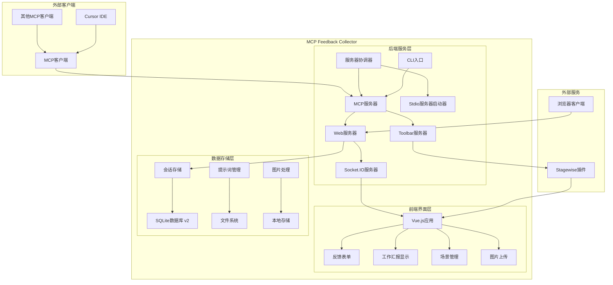
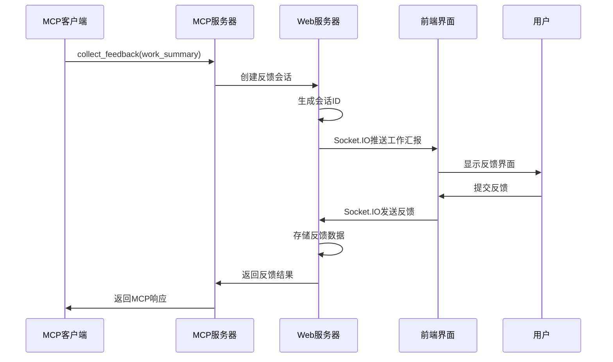

# 架构设计

## 整体架构

## 核心模块说明

### 1. 后端服务模块 (`/src/server/`)

#### MCP服务器 (`mcp-server.ts`)
- **功能**: 实现MCP协议的核心服务器
- **职责**: 
  - 处理MCP客户端连接
  - 注册和执行`collect_feedback`工具
  - 管理HTTP和Stdio传输模式
  - 协调Web服务器和Toolbar服务器

#### Web服务器 (`web-server.ts`)
- **功能**: 提供Web界面和API服务
- **职责**:
  - 静态文件服务
  - Socket.IO实时通信
  - 会话管理和反馈收集
  - 图片上传和处理
  - 性能监控和健康检查

#### Toolbar服务器 (`toolbar-server.ts`)
- **功能**: 集成Stagewise插件的工具栏服务
- **职责**:
  - 提供UI选择工具
  - 处理来自Stagewise的提示词
  - 与MCP服务器通信

#### 服务器协调器 (`server-coordinator.ts`)
- **功能**: 协调多个服务器实例
- **职责**:
  - 管理服务器生命周期
  - 处理多客户端连接
  - 资源分配和清理

#### Stdio服务器启动器 (`stdio-server-launcher.ts`)
- **功能**: 专门处理Stdio模式的服务器启动
- **职责**:
  - 多客户端环境检测
  - Stdio传输模式优化
  - 客户端隔离和资源管理

### 2. 前端界面模块 (`/frontend/src/`)

#### 主应用 (`App.vue`)
- **功能**: Vue.js主应用组件
- **职责**:
  - 整体布局管理
  - Socket.IO连接初始化
  - 全局状态管理
  - Stagewise工具栏集成

#### 核心组件
- **FeedbackForm.vue**: 反馈表单组件
- **WorkSummary.vue**: 工作汇报显示组件
- **SceneManagement.vue**: 场景管理组件
- **ImageUpload.vue**: 图片上传组件
- **PhraseModeSelector.vue**: 快捷语模式选择器
- **LeftPanelTabs.vue**: 左侧面板标签页

#### 状态管理 (`/stores/`)
- **app.ts**: 应用主状态管理
- **connection.ts**: 连接状态管理
- **feedback.ts**: 反馈数据管理
- **scenes.ts**: 场景数据管理

#### 服务层 (`/services/`)
- **socket.ts**: Socket.IO客户端服务
- **promptService.ts**: 提示词服务
- **imageService.ts**: 图片处理服务
- **phraseService.ts**: 快捷语服务

### 3. 工具模块 (`/src/utils/`)

#### 核心工具类
- **logger.ts**: 日志管理系统
- **session-storage.ts**: 会话存储管理
- **prompt-manager.ts**: 提示词管理器
- **image-processor.ts**: 图片处理器
- **client-identifier.ts**: 客户端识别器
- **port-manager.ts**: 端口管理器
- **performance-monitor.ts**: 性能监控器

### 4. 配置模块 (`/src/config/`)

#### 配置管理
- **index.ts**: 配置文件管理
- 支持环境变量配置
- 默认配置项管理
- 配置验证和显示

## 技术架构特点

### 1. 多传输模式支持
- **Stdio模式**: 直接与MCP客户端通过标准输入输出通信
- **HTTP模式**: 通过HTTP API与客户端通信
- **混合模式**: 同时支持两种传输方式

### 2. 多客户端架构
- 支持多个Cursor窗口同时连接
- 客户端隔离和会话管理
- 资源共享和冲突避免

### 3. 实时通信架构
- Socket.IO实现前后端实时通信
- 会话状态同步
- 反馈数据实时更新

### 4. 模块化设计
- 清晰的模块边界
- 依赖注入模式
- 易于测试和维护

## 数据流架构

## 性能优化

### 1. 连接管理
- 连接池和复用
- 自动重连机制
- 超时和清理策略

### 2. 资源优化
- 图片压缩和处理
- 静态资源缓存
- 内存使用监控

### 3. 并发处理
- 异步操作优化
- 请求队列管理
- 性能指标监控

## 安全考虑

### 1. 数据安全
- 会话隔离
- 敏感信息过滤
- 文件上传限制

### 2. 网络安全
- CORS配置
- 请求验证
- 端口访问控制

## 扩展性设计

### 1. 插件架构
- Stagewise插件集成
- 工具栏扩展接口
- 第三方服务集成

### 2. 配置灵活性
- 环境变量配置
- 运行时配置更新
- 多环境支持

## 📍 深入分析建议

### 🎯 重点模块推荐
基于架构复杂度和重要性，建议优先深入分析以下模块：
1. **MCP服务器模块** - 核心协议实现，建议优先分析
2. **Web服务器模块** - 关键服务节点，影响多个流程
3. **前端状态管理** - 复杂的状态管理逻辑，值得深入研究

## 🧭 导航链接

- **📋 [返回主目录](../README.md)** - 返回文档导航中心
- **🏗️ [返回架构层目录](./index.md)** - 返回架构层导航
- **🏗️ [项目概览](./项目概览.md)** - 查看项目基本信息
- **🔄 [下一层：交互层](../交互层/index.md)** - 查看模块交互分析

---

*架构设计最后更新: 2024年1月* 