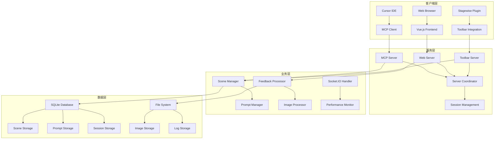
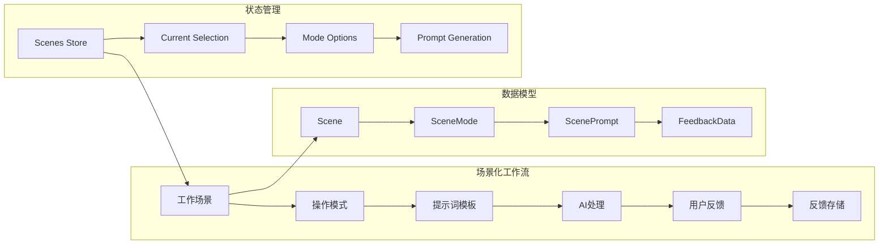
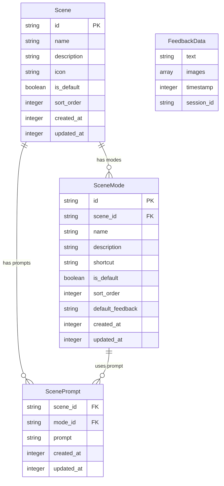

# 项目概览

## 项目基本信息

- **项目名称**: MCP Feedback Collector (smd-mcp-feedback-collector)
- **版本**: 1.3.1-beta.0
- **技术栈**: Node.js + TypeScript + Vue.js 3 + Socket.IO + Express + Pinia + SQLite + Better-SQLite3
- **项目类型**: 基于MCP (Model Context Protocol) 的场景化反馈收集服务
- **主要功能**: AI工作汇报反馈收集、场景化工作流管理、多客户端支持、实时通信、数据持久化存储

## 项目简介

MCP Feedback Collector 是一个基于 Model Context Protocol (MCP) 的现代化反馈收集服务，专注于为AI协作提供场景化的反馈收集解决方案。该项目实现了完整的MCP协议支持，提供了现代化的Web界面，支持多客户端同时连接，并引入了创新的场景化工作流管理系统和SQLite数据库持久化存储。

## 核心技术架构

### 🏗️ 整体架构设计



### 🎭 场景化业务架构



## 核心特性

### 🔌 MCP协议支持
- **完整MCP实现**: 基于@modelcontextprotocol/sdk实现标准MCP协议
- **多传输模式**: 支持Stdio和HTTP传输模式
- **工具注册**: 提供`collect_feedback`工具接口
- **会话隔离**: 支持多客户端会话独立管理
- **错误处理**: 完善的错误处理和恢复机制

### 🌐 现代化Web界面
- **Vue.js 3**: 基于Composition API的现代化前端框架
- **响应式设计**: 适配各种设备和屏幕尺寸
- **实时通信**: Socket.IO实现前后端实时双向通信
- **TypeScript**: 全栈TypeScript开发，强类型保证
- **Vite构建**: 快速的开发和构建体验

### 🎭 场景化工作流管理
- **多场景支持**: 创建、编辑、删除自定义工作场景
- **场景模式**: 每个场景可配置多种操作模式
- **默认配置**: 内置编码场景，包含讨论、编辑、搜索三种模式
- **实时切换**: 支持运行时动态切换场景和模式
- **场景导入导出**: 支持场景配置的批量管理
- **快捷键支持**: 场景模式支持自定义快捷键

### 💾 SQLite数据库存储
- **Better-SQLite3**: 高性能的SQLite数据库引擎
- **跨平台存储**: 根据操作系统自动选择存储路径
- **数据库迁移**: 支持版本升级和数据迁移
- **事务处理**: 完整的ACID事务支持
- **数据完整性**: 外键约束和数据验证

### 📊 Pinia状态管理
- **模块化Store**: 按功能模块划分的状态管理
- **响应式状态**: Vue 3响应式系统集成
- **TypeScript支持**: 完整的类型推导和检查
- **状态持久化**: 关键状态的持久化存储
- **开发工具**: Vue DevTools集成支持

### 🖼️ 图片处理系统
- **多格式支持**: 支持JPEG、PNG、WebP等图片格式
- **客户端压缩**: Canvas API实现图片压缩
- **后端处理**: 服务端图片处理和存储
- **预览功能**: 实时图片预览和管理
- **大小限制**: 可配置的文件大小限制

### 🔌 Stagewise工具栏集成
- **插件集成**: 集成@stagewise/toolbar-vue插件
- **开发环境**: 仅在开发环境显示工具栏
- **UI选择工具**: 提供增强的UI交互功能
- **RPC桥接**: 支持工具栏与应用的通信

### 🔄 多客户端支持
- **会话隔离**: 每个客户端独立的会话管理
- **资源共享**: 智能的资源分配和冲突避免
- **客户端识别**: 自动识别客户端环境和配置
- **状态同步**: 多客户端状态的实时同步

### 📈 性能监控
- **实时监控**: 内置性能监控和健康检查
- **指标收集**: 请求响应时间、成功率等关键指标
- **资源监控**: CPU、内存使用情况监控
- **日志系统**: 分级日志记录和分析

## 技术栈详细说明

### 后端技术栈
- **Node.js**: 18.0.0+ 运行时环境
- **TypeScript**: 5.2.2 类型系统
- **Express**: 4.18.2 Web框架
- **Socket.IO**: 4.7.2 实时通信
- **Better-SQLite3**: 9.2.2 数据库引擎
- **@modelcontextprotocol/sdk**: 1.12.3 MCP协议实现

### 前端技术栈
- **Vue.js**: 3.5.13 前端框架
- **Pinia**: 3.0.3 状态管理
- **TypeScript**: 5.8.3 类型系统
- **Vite**: 6.3.5 构建工具
- **Socket.IO Client**: 4.8.1 实时通信客户端
- **@stagewise/toolbar-vue**: 0.4.4 工具栏插件

### 开发工具链
- **tsx**: 3.14.0 TypeScript执行器
- **ESLint**: 8.50.0 代码检查
- **Concurrently**: 8.2.2 并发任务执行
- **Commander**: 11.1.0 CLI工具

## 主要目录结构

```
mcp-feedback-collector/
├── src/                        # 后端源码目录
│   ├── server/                 # 服务器模块
│   │   ├── mcp-server.ts       # MCP协议服务器
│   │   ├── web-server.ts       # Web服务器和Socket.IO
│   │   ├── toolbar-server.ts   # Stagewise工具栏服务器
│   │   ├── server-coordinator.ts # 服务器协调器
│   │   └── web-server-manager.ts # Web服务器管理器
│   ├── utils/                  # 工具类库
│   │   ├── prompt-database.ts  # SQLite数据库管理
│   │   ├── prompt-manager.ts   # 提示词管理器
│   │   ├── session-storage.ts  # 会话存储管理
│   │   ├── image-processor.ts  # 图片处理器
│   │   ├── performance-monitor.ts # 性能监控器
│   │   └── logger.ts           # 日志系统
│   ├── config/                 # 配置管理
│   ├── toolbar/                # Stagewise工具栏集成
│   └── types/                  # 全局类型定义
├── frontend/                   # 前端源码目录
│   └── src/                    # Vue.js应用源码
│       ├── components/         # Vue组件
│       │   ├── SceneManagement.vue # 场景管理组件
│       │   ├── FeedbackForm.vue     # 反馈表单组件
│       │   ├── SceneSelector.vue    # 场景选择器
│       │   └── PhraseModeSelector.vue # 模式选择器
│       ├── stores/             # Pinia状态管理
│       │   ├── scenes.ts       # 场景状态管理
│       │   ├── app.ts          # 应用状态管理
│       │   └── feedback.ts     # 反馈状态管理
│       ├── services/           # 前端服务层
│       │   ├── promptService.ts # 提示词服务
│       │   ├── socket.ts       # Socket.IO服务
│       │   └── imageService.ts # 图片服务
│       └── types/              # 前端类型定义
├── docs/                       # 项目文档目录
├── scripts/                    # 构建和测试脚本
└── logs/                       # 日志文件目录
```

## 数据模型架构

### 核心数据实体



### 默认场景配置

```typescript
// 内置编码场景
const defaultScene = {
  id: 'coding',
  name: '编码场景',
  description: '专为代码开发和技术讨论设计的工作场景',
  modes: [
    {
      id: 'discuss',
      name: '讨论',
      description: '用于技术讨论和问题分析',
      shortcut: '1',
      isDefault: true
    },
    {
      id: 'edit',
      name: '编辑',
      description: '用于代码编辑和修改建议',
      shortcut: '2'
    },
    {
      id: 'search',
      name: '搜索',
      description: '用于代码搜索和查找',
      shortcut: '3'
    }
  ]
}
```

## 部署和集成方式

### 开发环境
- **前端开发服务器**: Vite开发服务器，热重载支持
- **后端开发服务器**: tsx watch模式，自动重启
- **并发开发**: concurrently同时启动前后端服务
- **数据库**: SQLite自动初始化和迁移

### 生产环境
- **前端构建**: Vue.js应用构建为静态文件
- **后端编译**: TypeScript编译为JavaScript
- **NPM包发布**: 支持全局安装和使用
- **数据库**: 跨平台SQLite数据库文件

### 集成方式
- **Cursor IDE**: MCP配置集成
- **全局安装**: `npm install -g smd-mcp-feedback-collector`
- **本地开发**: `npm run dev:full`
- **持久化服务**: `npm run start:persistent`

## 🧭 导航链接

- **📋 [返回主目录](../README.md)** - 返回文档导航中心
- **🏗️ [返回架构层目录](./index.md)** - 返回架构层导航
- **🏗️ [架构设计](./架构设计.md)** - 查看详细架构设计
- **🔄 [下一层：交互层](../交互层/index.md)** - 查看模块交互分析

---

*项目概览最后更新: 2024年1月* 