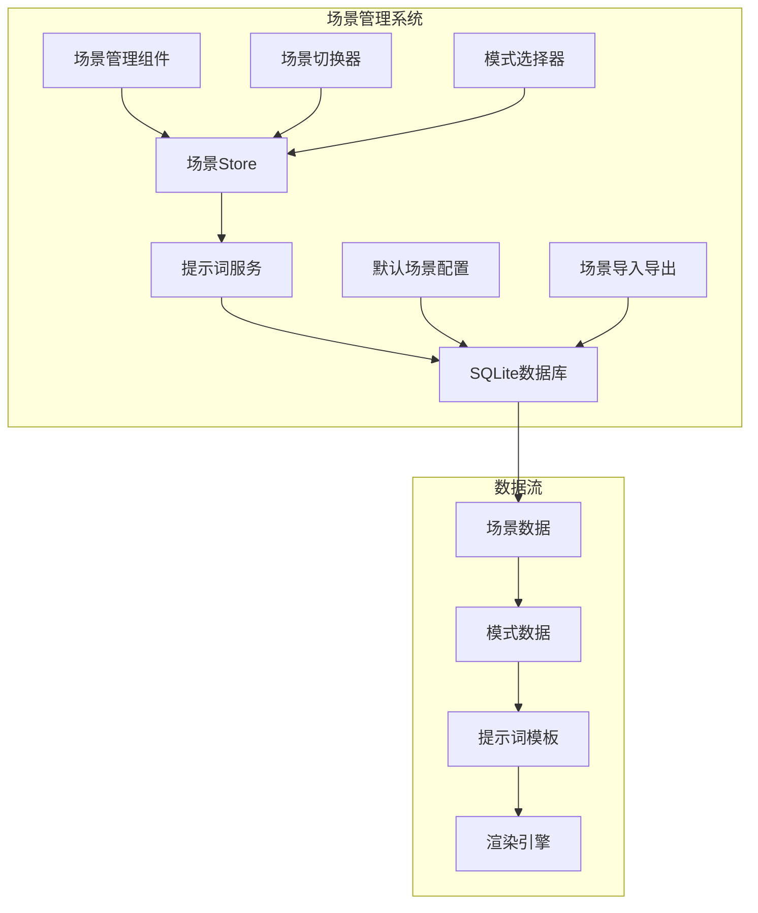
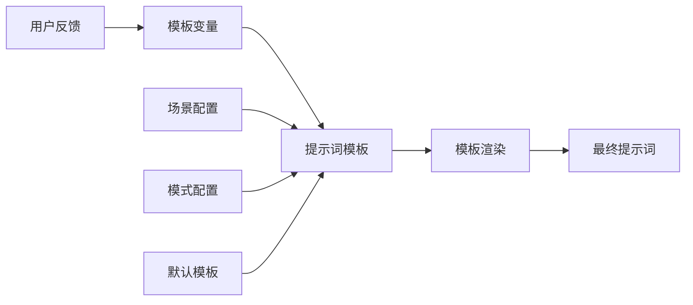

# 项目概览

## 项目基本信息

- **项目名称**: MCP Feedback Collector
- **版本**: 1.3.0-beta.2
- **技术栈**: Node.js + TypeScript + Vue.js 3 + Socket.IO + Express + Pinia + SQLite
- **项目类型**: 基于MCP (Model Context Protocol) 的反馈收集服务
- **主要功能**: AI工作汇报反馈收集、场景化工作流管理、多客户端支持、实时通信

## 项目简介

MCP Feedback Collector 是一个基于 Model Context Protocol (MCP) 的现代化反馈收集服务，主要用于收集用户对AI工作汇报的反馈意见。该项目实现了完整的MCP协议支持，提供了现代化的Web界面，支持多客户端同时连接，并引入了场景化工作流管理系统。

## 核心特性

### 🔌 MCP协议支持
- 完整实现MCP协议规范
- 支持多种传输模式（Stdio、HTTP）
- 兼容标准MCP客户端
- 提供`collect_feedback`工具接口

### 🌐 实时Web界面
- 基于Vue.js 3的现代化用户界面
- 响应式设计，适配各种设备和屏幕尺寸
- Socket.IO实现实时双向通信
- 支持图片上传和预览功能

### 🔄 多客户端支持
- 支持多个Cursor窗口同时连接
- 智能的会话隔离和状态管理
- 资源共享和冲突避免机制
- 客户端自动识别和环境检测

### 🎨 Stagewise集成
- 集成Stagewise插件提供增强功能
- 支持UI选择工具和提示词处理
- RPC桥接和工具栏通信
- 与场景管理系统无缝集成

### 🎭 场景化工作流管理
- **多场景支持**: 创建、编辑、删除自定义工作场景
- **场景模式**: 每个场景可配置多种工作模式（探讨、编辑、搜索等）
- **默认场景**: 内置编码场景，包含常用的三种工作模式
- **实时切换**: 支持运行时动态切换场景和模式
- **场景导入导出**: 支持场景配置的导入和导出

### 🔧 增强的提示词系统
- **模板化提示词**: 支持变量替换和模板渲染
- **场景化提示词**: 不同场景使用不同的提示词模板
- **数据库存储**: 提示词配置存储在SQLite数据库中
- **动态加载**: 支持运行时动态加载和更新提示词

### 📊 性能监控
- 内置性能监控和健康检查
- 实时性能指标收集
- 资源使用情况监控
- 自动化的问题检测和报告

## 技术亮点

### TypeScript全栈开发
- 前后端统一使用TypeScript开发
- 强类型系统保证代码质量
- 完整的类型定义和接口规范
- 编译时错误检查和优化

### 模块化架构设计
- 清晰的模块边界和依赖关系
- 依赖注入模式实现松耦合
- 易于测试和维护的代码结构
- 支持插件化扩展

### 实时通信机制
- Socket.IO实现前后端实时双向通信
- 会话状态同步和数据一致性
- 反馈数据实时更新和推送
- 连接管理和自动重连机制

### 智能会话管理
- 会话隔离和状态管理
- 多客户端环境下的资源分配
- 会话超时和自动清理
- 状态持久化和恢复

### 数据持久化
- SQLite数据库存储场景和提示词配置
- 会话数据的持久化存储
- 数据迁移和版本管理
- 数据备份和恢复机制

### 状态管理优化
- Pinia实现前端状态管理
- 模块化的状态store设计
- 响应式数据绑定
- 状态持久化和同步

### 图片处理能力
- 支持图片上传、压缩和处理
- 客户端Canvas压缩优化
- 多种图片格式支持
- 图片预览和管理功能

### 完善的错误处理
- 全面的错误处理和恢复机制
- 详细的日志记录和分析
- 用户友好的错误提示
- 自动重试和容错机制

## 主要目录结构

```
mcp-feedback-collector/
├── src/                    # 后端源码目录
│   ├── server/            # 服务器模块
│   ├── utils/             # 工具类库
│   ├── config/            # 配置管理
│   └── toolbar/           # Stagewise工具栏集成
├── frontend/              # 前端源码目录
│   └── src/               # Vue.js应用源码
├── docs/                  # 项目文档目录
├── scripts/               # 构建和测试脚本
└── logs/                  # 日志文件目录
```

## 最新功能架构

### 场景管理架构


### 提示词系统架构


## 部署和集成方式

### 开发环境
- 前端开发服务器 (Vite)
- 后端开发服务器 (tsx watch)
- 热重载和实时调试支持
- SQLite数据库自动初始化

### 生产环境
- 前端构建静态文件
- 后端TypeScript编译
- NPM包发布和全局安装
- 数据库迁移和配置管理

### 集成方式
- Cursor IDE MCP配置
- 全局NPM包安装
- 本地开发模式支持
- Stagewise插件集成

## 🧭 导航链接

- **📋 [返回主目录](../README.md)** - 返回文档导航中心
- **🏗️ [返回架构层目录](./index.md)** - 返回架构层导航
- **🏗️ [架构设计](./架构设计.md)** - 查看详细架构设计
- **🔄 [下一层：交互层](../交互层/index.md)** - 查看模块交互分析

---

*项目概览最后更新: 2024年1月* 