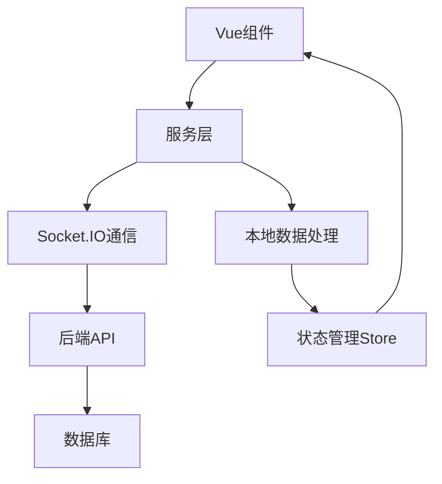

# 前端服务模块文档

## 📋 服务模块概述

前端服务层提供了与后端通信、数据处理和业务逻辑封装的功能。

## 🔌 核心服务

### Socket.IO 通信服务
- **文件**: `frontend/src/services/socket.ts`
- **功能**: WebSocket 连接管理、实时数据同步
- **主要方法**: 
  - `connectSocket()` - 建立连接
  - `disconnectSocket()` - 断开连接
  - `emitEvent()` - 发送事件

### 提示词服务
- **文件**: `frontend/src/services/promptService.ts`
- **功能**: 提示词数据管理、模板处理
- **主要方法**:
  - `loadPrompts()` - 加载提示词
  - `savePrompt()` - 保存提示词
  - `deletePrompt()` - 删除提示词

### 图片处理服务
- **文件**: `frontend/src/services/imageService.ts`
- **功能**: 图片上传、压缩、处理
- **主要方法**:
  - `uploadImage()` - 上传图片
  - `compressImage()` - 压缩图片
  - `processImage()` - 图片处理

### 快捷语服务
- **文件**: `frontend/src/services/phraseService.ts`
- **功能**: 快捷语管理、模式切换
- **主要方法**:
  - `loadPhrases()` - 加载快捷语
  - `savePhrases()` - 保存快捷语
  - `switchMode()` - 切换模式

### 错误处理服务
- **文件**: `frontend/src/services/errorHandler.ts`
- **功能**: 统一错误处理、异常上报
- **主要方法**:
  - `handleError()` - 处理错误
  - `reportError()` - 上报错误
  - `showErrorMessage()` - 显示错误消息

## 🔄 服务交互流程

## 📊 服务架构特点

### 统一接口设计
- 所有服务提供统一的调用接口
- 统一的错误处理机制
- 统一的数据格式规范

### 异步操作支持
- 基于Promise的异步调用
- 支持async/await语法
- 自动处理加载状态

### 可扩展性
- 模块化设计，易于扩展
- 服务间解耦，独立开发
- 支持插件式扩展

## 🧭 导航链接

- **📋 [返回前端模块导航](../index.md)** - 返回前端模块主目录
- **🔧 [返回模块层目录](../../index.md)** - 返回模块层导航
- **📁 [组件模块文档](../组件/index.md)** - 查看组件模块分析
- **📊 [状态管理文档](../状态管理/index.md)** - 查看状态管理分析

---

*前端服务模块文档最后更新: 2024年1月* 