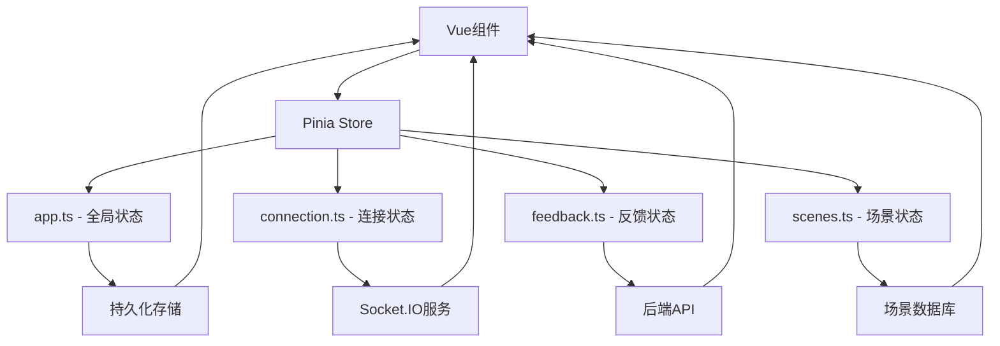

# 前端状态管理模块文档

## 📋 状态管理概述

基于 Pinia 的状态管理系统，提供响应式的数据状态管理和组件间的数据共享。

## 📊 核心 Store

### 应用主状态 (app.ts)
- **文件**: `frontend/src/stores/app.ts`
- **功能**: 全局应用状态、用户设置、UI状态
- **主要状态**:
  - `currentUser` - 当前用户信息
  - `settings` - 应用设置
  - `uiState` - UI状态管理
  - `loading` - 加载状态

### 连接状态管理 (connection.ts)
- **文件**: `frontend/src/stores/connection.ts`
- **功能**: Socket.IO 连接状态管理
- **主要状态**:
  - `isConnected` - 连接状态
  - `connectionId` - 连接ID
  - `lastHeartbeat` - 最后心跳时间
  - `reconnectAttempts` - 重连次数

### 反馈数据管理 (feedback.ts)
- **文件**: `frontend/src/stores/feedback.ts`
- **功能**: 反馈表单数据、提交状态管理
- **主要状态**:
  - `feedbackData` - 反馈数据
  - `submissionStatus` - 提交状态
  - `history` - 历史记录
  - `drafts` - 草稿数据

### 场景数据管理 (scenes.ts)
- **文件**: `frontend/src/stores/scenes.ts`
- **功能**: 场景管理、场景切换状态
- **主要状态**:
  - `scenes` - 场景列表
  - `currentScene` - 当前场景
  - `sceneHistory` - 场景历史
  - `isEditing` - 编辑状态

## 🔄 状态管理架构

## 📝 状态管理模式

### 响应式更新
- 使用 Pinia 的响应式特性
- 自动更新依赖的组件
- 支持计算属性和监听器

### 数据持久化
- 关键状态自动持久化到 localStorage
- 页面刷新后状态恢复
- 支持数据迁移和版本管理

### 异步操作
- 统一的异步操作处理
- 错误状态管理
- 加载状态指示

## 🎯 Store 设计原则

### 单一职责原则
- 每个 Store 负责特定的业务领域
- 避免 Store 间的强耦合
- 清晰的状态边界定义

### 可预测性
- 状态变更通过 actions 进行
- 支持状态变更的追踪和调试
- 提供清晰的状态变更日志

### 性能优化
- 合理的状态颗粒度设计
- 避免不必要的响应式计算
- 支持状态的懒加载

## 🧭 导航链接

- **📋 [返回前端模块导航](../index.md)** - 返回前端模块主目录
- **🔧 [返回模块层目录](../../index.md)** - 返回模块层导航
- **📁 [组件模块文档](../组件/index.md)** - 查看组件模块分析
- **🔌 [服务模块文档](../服务/index.md)** - 查看服务模块分析

---

*前端状态管理模块文档最后更新: 2024年1月* 