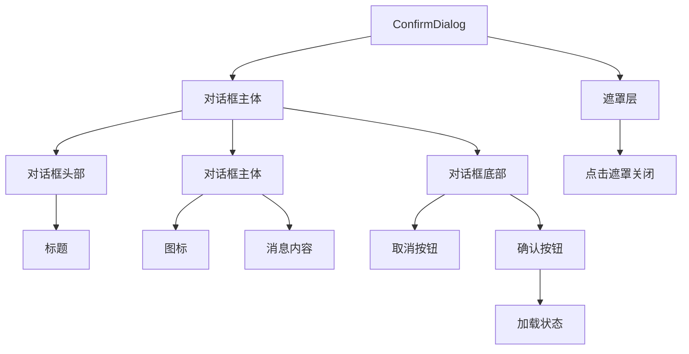
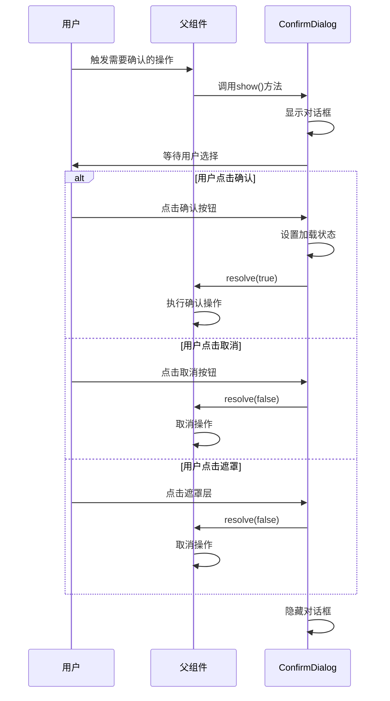
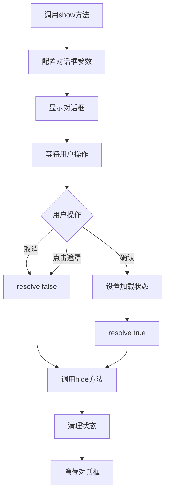

# ConfirmDialog 确认对话框组件

## 组件概述

**ConfirmDialog** 是一个可复用的确认对话框组件，提供基于Promise的异步确认功能，支持多种对话框类型和自定义配置。

- **文件路径**: `frontend/src/components/ConfirmDialog.vue`
- **文件大小**: 4.4KB (230行)
- **组件类型**: 通用UI组件
- **主要功能**: 确认对话框、异步确认、多类型支持

## 功能特性

### 核心功能
- **Promise API**: 基于Promise的异步确认机制
- **多种类型**: 支持信息、警告、危险三种对话框类型
- **自定义配置**: 支持自定义标题、消息、按钮文本
- **加载状态**: 支持确认过程中的加载状态显示
- **模态遮罩**: 提供模态遮罩层，支持点击遮罩关闭

### 对话框类型
1. **信息对话框** (`info`) - 一般信息确认
2. **警告对话框** (`warning`) - 警告类操作确认
3. **危险对话框** (`danger`) - 危险操作确认（如删除）

## 技术实现

### 组件架构


### Promise API设计
```typescript
interface ConfirmOptions {
  title?: string
  message: string
  type?: 'info' | 'warning' | 'danger'
  confirmText?: string
  cancelText?: string
}

// Promise-based API
const show = (options: ConfirmOptions): Promise<boolean> => {
  return new Promise((resolve) => {
    // 配置对话框
    visible.value = true
    title.value = options.title || '确认操作'
    message.value = options.message
    type.value = options.type || 'info'
    confirmText.value = options.confirmText || '确认'
    cancelText.value = options.cancelText || '取消'
    
    // 保存resolve函数
    resolvePromise = resolve
  })
}
```

### 状态管理
```typescript
// 组件状态
const visible = ref(false)
const title = ref('')
const message = ref('')
const type = ref<'info' | 'warning' | 'danger'>('info')
const confirmText = ref('确认')
const cancelText = ref('取消')
const loading = ref(false)

// Promise状态
let resolvePromise: ((value: boolean) => void) | null = null
```

## 组件接口

### 配置选项接口
```typescript
interface ConfirmOptions {
  title?: string           // 对话框标题
  message: string         // 确认消息（必填）
  type?: DialogType       // 对话框类型
  confirmText?: string    // 确认按钮文本
  cancelText?: string     // 取消按钮文本
}

type DialogType = 'info' | 'warning' | 'danger'
```

### 组件方法
```typescript
interface ConfirmDialogMethods {
  show: (options: ConfirmOptions) => Promise<boolean>
  hide: () => void
}
```

### 暴露的API
```typescript
// 通过defineExpose暴露给父组件
defineExpose({
  show,
  hide
})
```

## 使用方法

### 基本使用
```vue
<template>
  <div>
    <button @click="showConfirm">删除项目</button>
    <ConfirmDialog ref="confirmDialogRef" />
  </div>
</template>

<script setup lang="ts">
import { ref } from 'vue'
import ConfirmDialog from '@/components/ConfirmDialog.vue'

const confirmDialogRef = ref()

const showConfirm = async () => {
  const result = await confirmDialogRef.value.show({
    title: '删除确认',
    message: '确定要删除这个项目吗？此操作不可撤销。',
    type: 'danger',
    confirmText: '删除',
    cancelText: '取消'
  })
  
  if (result) {
    // 用户点击了确认
    console.log('用户确认删除')
  } else {
    // 用户点击了取消
    console.log('用户取消操作')
  }
}
</script>
```

### 不同类型的对话框
```typescript
// 信息确认
const showInfo = async () => {
  const result = await confirmDialogRef.value.show({
    title: '信息确认',
    message: '确定要继续此操作吗？',
    type: 'info'
  })
}

// 警告确认
const showWarning = async () => {
  const result = await confirmDialogRef.value.show({
    title: '警告',
    message: '此操作可能会影响系统性能，确定继续吗？',
    type: 'warning'
  })
}

// 危险操作确认
const showDanger = async () => {
  const result = await confirmDialogRef.value.show({
    title: '危险操作',
    message: '此操作将永久删除所有数据，确定继续吗？',
    type: 'danger',
    confirmText: '确认删除',
    cancelText: '取消'
  })
}
```

## 交互流程

### 确认流程


### 生命周期流程


## 样式设计

### 遮罩层样式
```scss
.confirm-dialog-overlay {
  position: fixed;
  top: 0;
  left: 0;
  right: 0;
  bottom: 0;
  background: rgba(0, 0, 0, 0.6);
  display: flex;
  align-items: center;
  justify-content: center;
  z-index: 9999;
  backdrop-filter: blur(4px);
}
```

### 对话框主体样式
```scss
.confirm-dialog {
  background: #2d2d30;
  border: 1px solid #3e3e42;
  border-radius: 8px;
  min-width: 400px;
  max-width: 500px;
  box-shadow: 0 8px 32px rgba(0, 0, 0, 0.4);
  animation: confirmDialogEnter 0.2s ease-out;
}

@keyframes confirmDialogEnter {
  from {
    opacity: 0;
    transform: scale(0.9) translateY(-20px);
  }
  to {
    opacity: 1;
    transform: scale(1) translateY(0);
  }
}
```

### 按钮样式
```scss
.confirm-btn {
  padding: 8px 16px;
  border: none;
  border-radius: 4px;
  font-size: 13px;
  font-weight: 500;
  cursor: pointer;
  transition: all 0.2s ease;
  min-width: 80px;
  
  &.secondary {
    background: #3e3e42;
    color: #cccccc;
    
    &:hover {
      background: #4a4a4f;
    }
  }
  
  &.primary {
    background: #0e639c;
    color: #ffffff;
    
    &:hover {
      background: #1177bb;
    }
    
    &.danger {
      background: #dc3545;
      
      &:hover {
        background: #c82333;
      }
    }
  }
  
  &:disabled {
    opacity: 0.6;
    cursor: not-allowed;
  }
}
```

### 图标样式
```scss
.confirm-dialog-icon {
  font-size: 24px;
  flex-shrink: 0;
  margin-top: 2px;
}

// 不同类型的图标
.confirm-dialog-icon span {
  &[data-type="info"] { color: #17a2b8; }
  &[data-type="warning"] { color: #ffc107; }
  &[data-type="danger"] { color: #dc3545; }
}
```

## 事件处理

### 核心事件处理器
```typescript
const handleConfirm = () => {
  loading.value = true
  if (resolvePromise) {
    resolvePromise(true)
  }
  hide()
}

const handleCancel = () => {
  if (resolvePromise) {
    resolvePromise(false)
  }
  hide()
}

const handleOverlayClick = () => {
  handleCancel()
}
```

### 状态清理
```typescript
const hide = () => {
  visible.value = false
  title.value = ''
  message.value = ''
  type.value = 'info'
  confirmText.value = '确认'
  cancelText.value = '取消'
  loading.value = false
  resolvePromise = null
}
```

## 高级用法

### 自定义样式
```vue
<template>
  <ConfirmDialog 
    ref="confirmDialogRef"
    class="custom-confirm-dialog"
  />
</template>

<style>
.custom-confirm-dialog .confirm-dialog {
  min-width: 500px;
  border-radius: 12px;
}
</style>
```

### 结合异步操作
```typescript
const deleteItem = async (itemId: string) => {
  const confirmed = await confirmDialogRef.value.show({
    title: '删除确认',
    message: `确定要删除项目 ${itemId} 吗？`,
    type: 'danger'
  })
  
  if (confirmed) {
    try {
      await api.deleteItem(itemId)
      showMessage('删除成功', 'success')
    } catch (error) {
      showMessage('删除失败', 'error')
    }
  }
}
```

## 可访问性

### 键盘导航
- 支持 `Tab` 键在按钮间导航
- 支持 `Enter` 键确认
- 支持 `Escape` 键取消

### 屏幕阅读器
- 使用语义化的HTML结构
- 提供适当的 `aria-label` 属性
- 支持焦点管理

### 视觉反馈
- 清晰的按钮状态指示
- 加载状态的视觉反馈
- 不同类型的图标区分

## 性能优化

### 内存管理
- 在hide方法中清理所有状态
- 避免Promise内存泄漏
- 及时清理事件监听器

### 渲染优化
- 使用 `v-if` 条件渲染
- 避免不必要的重新渲染
- 优化动画性能

## 测试建议

### 单元测试
```typescript
describe('ConfirmDialog', () => {
  it('应该正确显示对话框', () => {
    // 测试对话框显示
  })
  
  it('应该正确处理确认操作', () => {
    // 测试确认逻辑
  })
  
  it('应该正确处理取消操作', () => {
    // 测试取消逻辑
  })
  
  it('应该支持不同类型的对话框', () => {
    // 测试不同类型
  })
})
```

### 集成测试
- 测试Promise API的正确性
- 测试与父组件的集成
- 测试键盘导航功能

## 🧭 导航链接

- **📋 [返回主目录](../../../README.md)** - 返回文档导航中心
- **🔧 [返回组件目录](./index.md)** - 返回组件文档导航
- **🔧 [返回前端模块目录](../index.md)** - 返回前端模块导航 