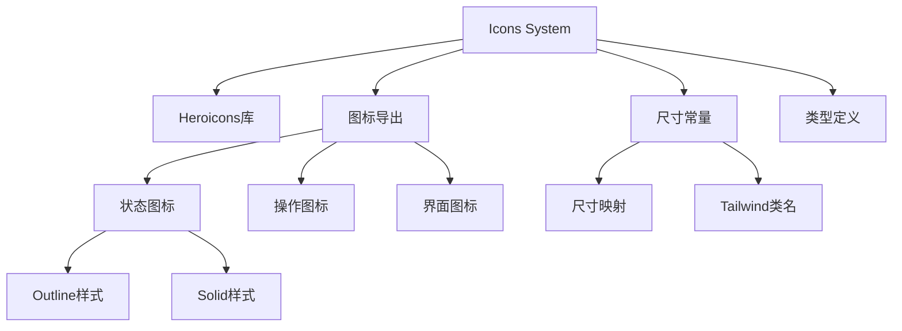

# Icons 图标系统

## 系统概述

**Icons** 是基于Heroicons的图标系统，提供统一的图标管理和使用规范，支持多种尺寸和样式变体。

- **文件路径**: `frontend/src/components/icons/index.ts`
- **文件大小**: 1.9KB (104行)
- **系统类型**: 通用UI系统
- **主要功能**: 图标导出、尺寸管理、类型定义

## 功能特性

### 核心功能
- **统一导出**: 集中管理所有项目图标的导出
- **多样式支持**: 支持outline和solid两种样式
- **尺寸标准化**: 提供标准化的图标尺寸常量
- **类型安全**: 完整的TypeScript类型定义
- **按需引入**: 支持按需导入特定图标

### 图标分类
1. **状态图标**: 成功、错误、警告、信息等状态指示
2. **操作图标**: 编辑、删除、复制、查看等操作
3. **界面图标**: 导航、菜单、搜索等界面元素
4. **功能图标**: 特定业务功能的图标

## 技术实现

### 系统架构


### 图标导入策略
```typescript
// 从 Heroicons 导入 outline 样式
import {
  CheckCircleIcon,
  XCircleIcon,
  ExclamationTriangleIcon,
  InformationCircleIcon,
  // ... 更多图标
} from '@heroicons/vue/24/outline'

// 从 Heroicons 导入 solid 样式
import {
  CheckCircleIcon as CheckCircleIconSolid,
  XCircleIcon as XCircleIconSolid,
  // ... 更多图标
} from '@heroicons/vue/24/solid'
```

### 尺寸系统
```typescript
export const ICON_SIZES = {
  xs: 'w-3 h-3',      // 12px
  sm: 'w-4 h-4',      // 16px  
  md: 'w-5 h-5',      // 20px
  lg: 'w-6 h-6',      // 24px
  xl: 'w-8 h-8',      // 32px
} as const

export type IconSize = keyof typeof ICON_SIZES
```

## 图标分类详解

### 状态图标 (Status Icons)
```typescript
// Outline 样式
CheckCircleIcon,           // ✓ 成功状态
XCircleIcon,              // ✗ 错误状态
ExclamationTriangleIcon,  // ⚠ 警告状态
InformationCircleIcon,    // ℹ 信息状态

// Solid 样式
CheckCircleIconSolid,     // ✓ 成功状态(实心)
XCircleIconSolid,         // ✗ 错误状态(实心)
ExclamationTriangleIconSolid, // ⚠ 警告状态(实心)
InformationCircleIconSolid,   // ℹ 信息状态(实心)
```

### 操作图标 (Action Icons)
```typescript
EyeIcon,                  // 👁 查看
PencilIcon,              // ✏ 编辑
DocumentDuplicateIcon,   // 📋 复制
TrashIcon,               // 🗑 删除
PlusIcon,                // ➕ 添加
PlusIconSolid,           // ➕ 添加(实心)
```

### 界面图标 (Interface Icons)
```typescript
LightBulbIcon,           // 💡 想法/提示
SparklesIcon,            // ✨ 特殊/魔法
Cog6ToothIcon,           // ⚙ 设置
HomeIcon,                // 🏠 首页
UserIcon,                // 👤 用户
FolderIcon,              // 📁 文件夹
DocumentIcon,            // 📄 文档
ClockIcon,               // 🕐 时间
CalendarIcon,            // 📅 日历
MagnifyingGlassIcon,     // 🔍 搜索
BellIcon,                // 🔔 通知
ChatBubbleLeftIcon,      // 💬 聊天
```

### 交互图标 (Interactive Icons)
```typescript
HeartIcon,               // ❤ 喜欢
HeartIconSolid,          // ❤ 喜欢(实心)
StarIcon,                // ⭐ 收藏
StarIconSolid,           // ⭐ 收藏(实心)
BookmarkIcon,            // 🔖 书签
ShareIcon,               // 📤 分享
ClipboardIcon,           // 📋 剪贴板
```

### 导航图标 (Navigation Icons)
```typescript
ArrowDownTrayIcon,       // ⬇ 下载
ArrowUpTrayIcon,         // ⬆ 上传
ArrowPathIcon,           // 🔄 刷新
XMarkIcon,               // ✕ 关闭
DocumentTextIcon,        // 📝 文本文档
```

## 使用方法

### 基本使用
```vue
<template>
  <div>
    <!-- 基本图标使用 -->
    <CheckCircleIcon class="w-5 h-5 text-green-500" />
    <XCircleIcon class="w-5 h-5 text-red-500" />
    
    <!-- 使用尺寸常量 -->
    <SparklesIcon :class="ICON_SIZES.lg" />
    
    <!-- Solid 样式图标 -->
    <HeartIconSolid class="w-6 h-6 text-red-500" />
  </div>
</template>

<script setup lang="ts">
import { 
  CheckCircleIcon, 
  XCircleIcon, 
  SparklesIcon,
  HeartIconSolid,
  ICON_SIZES 
} from '@/components/icons'
</script>
```

### 动态图标组件
```vue
<template>
  <component 
    :is="iconComponent" 
    :class="iconClass"
  />
</template>

<script setup lang="ts">
import { computed } from 'vue'
import * as Icons from '@/components/icons'

interface Props {
  name: keyof typeof Icons
  size?: keyof typeof Icons.ICON_SIZES
  color?: string
}

const props = withDefaults(defineProps<Props>(), {
  size: 'md',
  color: 'currentColor'
})

const iconComponent = computed(() => Icons[props.name])
const iconClass = computed(() => [
  Icons.ICON_SIZES[props.size],
  `text-${props.color}`
])
</script>
```

### 状态指示器组件
```vue
<template>
  <div class="status-indicator">
    <component 
      :is="statusIcon" 
      :class="statusClass"
    />
    <span>{{ message }}</span>
  </div>
</template>

<script setup lang="ts">
import { computed } from 'vue'
import { 
  CheckCircleIcon,
  XCircleIcon,
  ExclamationTriangleIcon,
  InformationCircleIcon,
  ICON_SIZES
} from '@/components/icons'

interface Props {
  type: 'success' | 'error' | 'warning' | 'info'
  message: string
  size?: keyof typeof ICON_SIZES
}

const props = withDefaults(defineProps<Props>(), {
  size: 'md'
})

const statusConfig = {
  success: { icon: CheckCircleIcon, color: 'text-green-500' },
  error: { icon: XCircleIcon, color: 'text-red-500' },
  warning: { icon: ExclamationTriangleIcon, color: 'text-yellow-500' },
  info: { icon: InformationCircleIcon, color: 'text-blue-500' }
}

const statusIcon = computed(() => statusConfig[props.type].icon)
const statusClass = computed(() => [
  ICON_SIZES[props.size],
  statusConfig[props.type].color
])
</script>
```

## 样式指南

### 尺寸使用建议
```scss
// 小图标 - 用于内联文本、小按钮
.icon-xs { @apply w-3 h-3; }    // 12px

// 标准图标 - 用于按钮、表单元素
.icon-sm { @apply w-4 h-4; }    // 16px
.icon-md { @apply w-5 h-5; }    // 20px

// 大图标 - 用于标题、重要操作
.icon-lg { @apply w-6 h-6; }    // 24px
.icon-xl { @apply w-8 h-8; }    // 32px
```

### 颜色使用规范
```scss
// 状态颜色
.icon-success { @apply text-green-500; }
.icon-error { @apply text-red-500; }
.icon-warning { @apply text-yellow-500; }
.icon-info { @apply text-blue-500; }

// 界面颜色
.icon-primary { @apply text-blue-600; }
.icon-secondary { @apply text-gray-400; }
.icon-muted { @apply text-gray-500; }

// 交互状态
.icon-hover { @apply hover:text-blue-500; }
.icon-active { @apply text-blue-600; }
.icon-disabled { @apply text-gray-300 opacity-50; }
```

### 动画效果
```scss
// 基础过渡
.icon-transition {
  @apply transition-colors duration-200 ease-in-out;
}

// 旋转动画
.icon-spin {
  animation: spin 1s linear infinite;
}

// 脉冲动画
.icon-pulse {
  animation: pulse 2s cubic-bezier(0.4, 0, 0.6, 1) infinite;
}

// 悬停缩放
.icon-scale {
  @apply transform transition-transform duration-200;
  
  &:hover {
    @apply scale-110;
  }
}
```

## 最佳实践

### 图标选择原则
1. **语义明确**: 选择语义清晰的图标
2. **风格统一**: 保持整个应用图标风格一致
3. **尺寸适当**: 根据使用场景选择合适尺寸
4. **对比度**: 确保图标与背景有足够对比度

### 性能优化
```typescript
// 按需导入，避免打包全部图标
import { CheckCircleIcon, XCircleIcon } from '@/components/icons'

// 而不是
import * as Icons from '@/components/icons'
```

### 可访问性
```vue
<template>
  <!-- 提供 aria-label -->
  <CheckCircleIcon 
    class="w-5 h-5"
    aria-label="操作成功"
  />
  
  <!-- 装饰性图标使用 aria-hidden -->
  <SparklesIcon 
    class="w-4 h-4"
    aria-hidden="true"
  />
  
  <!-- 结合文本说明 -->
  <div class="flex items-center gap-2">
    <XCircleIcon class="w-4 h-4 text-red-500" />
    <span>操作失败</span>
  </div>
</template>
```

## 扩展建议

### 自定义图标
```typescript
// 添加项目特定图标
export const CustomIcon = () => (
  <svg viewBox="0 0 24 24" fill="currentColor">
    {/* 自定义SVG路径 */}
  </svg>
)
```

### 图标组合
```vue
<template>
  <div class="icon-group">
    <PlusIcon class="w-4 h-4" />
    <DocumentIcon class="w-4 h-4" />
  </div>
</template>

<style scoped>
.icon-group {
  @apply flex items-center gap-1;
}
</style>
```

## 🧭 导航链接

- **📋 [返回主目录](../../../README.md)** - 返回文档导航中心
- **🔧 [返回组件目录](./index.md)** - 返回组件文档导航
- **🔧 [返回前端模块目录](../index.md)** - 返回前端模块导航 