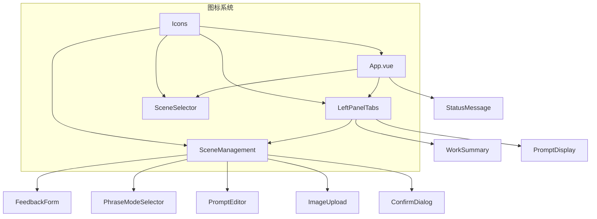
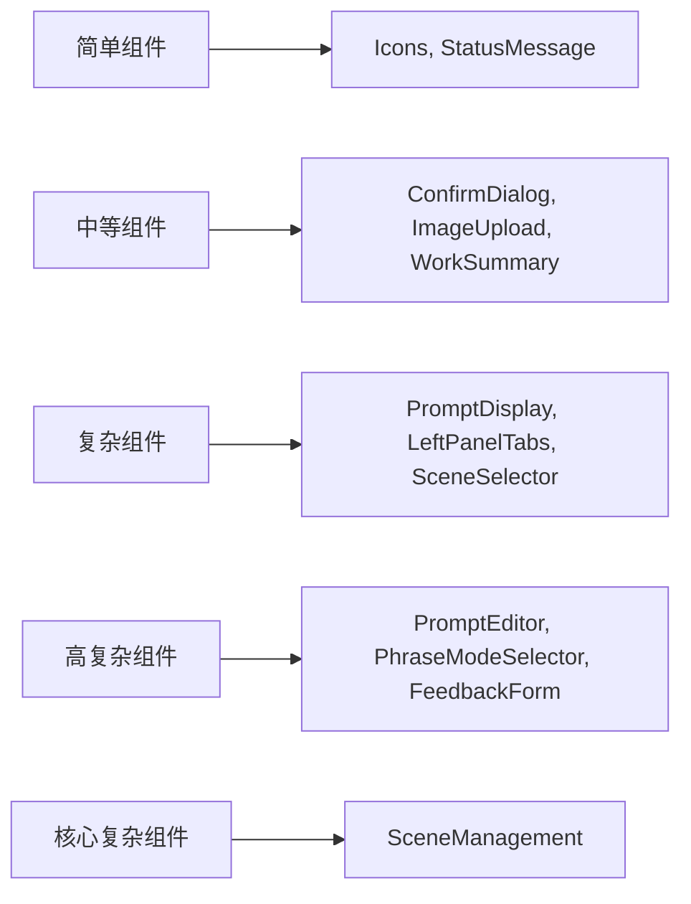

# 前端组件文档导航

## 📋 本目录文档列表

### 核心业务组件
- **[场景管理组件](./scene-management.md)** - 场景配置和管理的核心组件 (16KB, 496行)
- **[场景选择器](./scene-selector.md)** - 智能场景选择器，支持场景切换和状态显示 (10KB, 448行)
- **[反馈表单组件](./feedback-form.md)** - 用户反馈收集的主要界面组件 (5.6KB, 196行)
- **[工作汇报组件](./work-summary.md)** - AI工作汇报的显示和管理组件 (7.5KB, 314行)

### 界面交互组件
- **[左侧面板标签页](./left-panel-tabs.md)** - 左侧面板的标签页容器组件 (3.8KB, 176行)
- **[提示词显示组件](./prompt-display.md)** - 显示从Toolbar接收到的Prompt内容 (7.1KB, 331行)
- **[短语模式选择器](./phrase-mode-selector.md)** - 短语模式选择和管理组件 (13KB, 555行)
- **[提示词编辑器](./prompt-editor.md)** - 提示词编辑和管理的核心组件 (8.5KB, 339行)

### 通用UI组件
- **[确认对话框](./confirm-dialog.md)** - 基于Promise的异步确认对话框组件 (4.4KB, 230行)
- **[图片上传组件](./image-upload.md)** - 图片上传、预览和管理功能 (6.9KB, 262行)
- **[状态消息组件](./status-message.md)** - 全局状态消息显示和管理 (8.5KB, 377行)

### 系统组件
- **[图标系统](./icons.md)** - 基于Heroicons的统一图标管理系统 (1.9KB, 104行)

## 📊 组件统计信息

| 组件类型 | 数量 | 总代码量 | 平均复杂度 |
|---------|------|----------|-----------|
| 核心业务组件 | 4个 | ~38KB | 高 |
| 界面交互组件 | 4个 | ~34KB | 中-高 |
| 通用UI组件 | 3个 | ~19KB | 中 |
| 系统组件 | 1个 | ~2KB | 低 |
| **总计** | **12个** | **~93KB** | **中-高** |

## 🎯 组件重要性分级

### 🔴 核心组件（必须深入了解）
1. **SceneManagement** - 场景管理核心，最复杂组件
2. **SceneSelector** - 场景选择器，用户交互入口
3. **FeedbackForm** - 反馈收集主界面
4. **LeftPanelTabs** - 界面布局核心

### 🟡 重要组件（建议了解）
1. **PromptDisplay** - Prompt显示功能
2. **PhraseModeSelector** - 短语模式管理
3. **PromptEditor** - 提示词编辑功能
4. **WorkSummary** - 工作汇报展示

### 🟢 辅助组件（按需了解）
1. **ConfirmDialog** - 通用确认对话框
2. **ImageUpload** - 图片处理功能
3. **StatusMessage** - 状态消息系统
4. **Icons** - 图标系统

## 🏗️ 组件架构关系

### 主要组件依赖关系

### 组件复杂度层次

## 🧭 导航链接

- **📋 [返回主目录](../../../README.md)** - 返回文档导航中心
- **🔧 [返回前端模块目录](../index.md)** - 返回前端模块导航
- **🏗️ [上一层：架构层](../../../架构层/index.md)** - 返回架构文档

---
*组件文档导航最后更新: 2024年12月* 