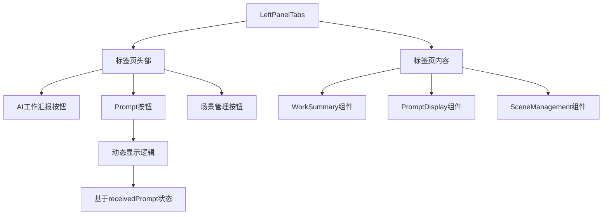
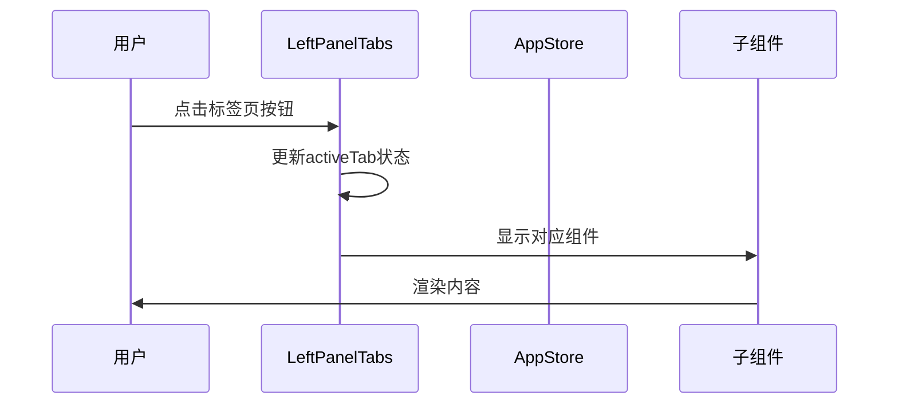
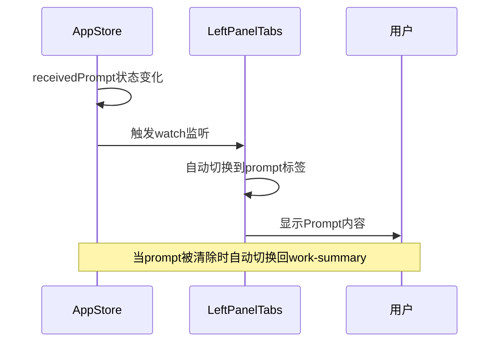
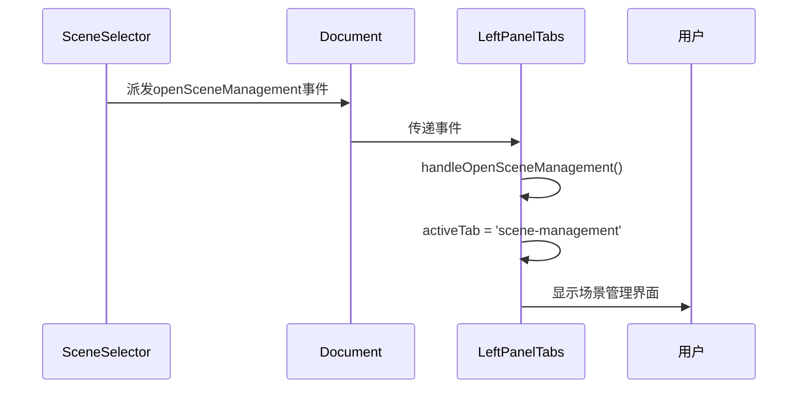

# LeftPanelTabs 左侧面板标签页组件

## 组件概述

**LeftPanelTabs** 是左侧面板的标签页容器组件，负责管理AI工作汇报、Prompt显示和场景管理三个主要功能模块的切换。

- **文件路径**: `frontend/src/components/LeftPanelTabs.vue`
- **文件大小**: 3.8KB (176行)
- **组件类型**: 布局组件
- **主要功能**: 标签页管理、内容切换、状态同步

## 功能特性

### 核心功能
- **标签页管理**: 管理三个主要功能标签页
- **动态显示**: 根据状态动态显示/隐藏标签页
- **自动切换**: 根据业务状态自动切换标签页
- **事件响应**: 响应全局事件进行标签页切换

### 标签页类型
1. **AI工作汇报** (`work-summary`) - 默认标签页
2. **收到的Prompt** (`prompt`) - 动态显示，仅在有Prompt时显示
3. **场景管理** (`scene-management`) - 场景配置管理

## 技术实现

### 组件架构


### 状态管理
```typescript
// Store依赖
const appStore = useAppStore()

// 标签页状态
const activeTab = ref<'work-summary' | 'prompt' | 'scene-management'>('work-summary')

// 动态显示逻辑
const showPromptTab = computed(() => appStore.receivedPrompt)
```

### 关键逻辑

#### 标签页切换逻辑
```typescript
// 监听prompt状态变化
watch(
  () => appStore.receivedPrompt,
  (newPrompt, oldPrompt) => {
    // 首次收到prompt时自动跳转到prompt Tab
    if (newPrompt && !oldPrompt) {
      activeTab.value = 'prompt'
    }
    // 当prompt被清除时切换回AI工作汇报Tab
    else if (!newPrompt && activeTab.value === 'prompt') {
      activeTab.value = 'work-summary'
    }
  }
)
```

#### 场景管理跳转处理
```typescript
// 处理场景管理跳转事件
const handleOpenSceneManagement = () => {
  activeTab.value = 'scene-management'
}

// 生命周期事件监听
onMounted(() => {
  document.addEventListener('openSceneManagement', handleOpenSceneManagement)
})

onUnmounted(() => {
  document.removeEventListener('openSceneManagement', handleOpenSceneManagement)
})
```

## 组件接口

### 标签页类型定义
```typescript
type TabType = 'work-summary' | 'prompt' | 'scene-management'

interface TabConfig {
  id: TabType
  icon: string
  title: string
  component: Component
  visible: boolean
}
```

### 标签页配置
```typescript
const tabConfigs: TabConfig[] = [
  {
    id: 'work-summary',
    icon: '🤖',
    title: 'AI工作汇报',
    component: WorkSummary,
    visible: true
  },
  {
    id: 'prompt',
    icon: '📝',
    title: '收到的Prompt',
    component: PromptDisplay,
    visible: computed(() => appStore.receivedPrompt)
  },
  {
    id: 'scene-management',
    icon: '🎭',
    title: '场景管理',
    component: SceneManagement,
    visible: true
  }
]
```

## 交互流程

### 标签页切换流程


### 自动切换流程


### 场景管理跳转流程


## 布局设计

### 整体布局
```scss
.left-panel-tabs {
  display: flex;
  flex-direction: row;
  height: 100%;
}

.tab-header {
  display: flex;
  flex-direction: column;
  background-color: #1e1e1e;
  border-right: 1px solid #3e3e42;
  flex-shrink: 0;
  width: 50px;
}

.tab-content {
  flex: 1;
  overflow: hidden;
  display: flex;
  flex-direction: column;
  min-width: 0;
}
```

### 标签页按钮样式
```scss
.tab-button {
  background: none;
  border: none;
  color: #cccccc;
  padding: 16px 8px;
  cursor: pointer;
  font-size: 18px;
  font-weight: 500;
  transition: all 0.2s ease;
  border-right: 3px solid transparent;
  display: flex;
  align-items: center;
  justify-content: center;
  width: 100%;
  height: 50px;
  position: relative;
  
  &:hover {
    background-color: #2d2d30;
    color: #ffffff;
  }
  
  &.active {
    color: #ffffff;
    background-color: #252526;
    border-right-color: #0e639c;
  }
}
```

### 工具提示样式
```scss
.tab-button[title]:hover::after {
  content: attr(title);
  position: absolute;
  left: 60px;
  top: 50%;
  transform: translateY(-50%);
  background: #2d2d30;
  color: #ffffff;
  padding: 8px 12px;
  border-radius: 4px;
  font-size: 12px;
  white-space: nowrap;
  z-index: 1000;
  border: 1px solid #3e3e42;
  box-shadow: 0 2px 8px rgba(0, 0, 0, 0.3);
}
```

## 子组件集成

### 组件导入
```typescript
import PromptDisplay from './PromptDisplay.vue'
import WorkSummary from './WorkSummary.vue'
import SceneManagement from './SceneManagement.vue'
```

### 条件渲染
```vue
<template>
  <div class="tab-content">
    <!-- AI工作汇报Tab -->
    <div v-if="activeTab === 'work-summary'" class="tab-pane">
      <WorkSummary />
    </div>
    
    <!-- Prompt显示Tab -->
    <div v-if="activeTab === 'prompt' && appStore.receivedPrompt" class="tab-pane">
      <PromptDisplay />
    </div>
    
    <!-- 场景管理Tab -->
    <div v-if="activeTab === 'scene-management'" class="tab-pane">
      <SceneManagement />
    </div>
  </div>
</template>
```

### 标签页面板样式
```scss
.tab-pane {
  flex: 1;
  overflow: hidden;
  display: flex;
  flex-direction: column;
}
```

## 事件系统

### 全局事件监听
```typescript
// 监听的全局事件
interface GlobalEvents {
  openSceneManagement: CustomEvent<{
    action: 'open-scene-management'
  }>
}

// 事件处理器
const eventHandlers = {
  openSceneManagement: handleOpenSceneManagement
}
```

### 事件生命周期管理
```typescript
onMounted(() => {
  // 注册事件监听器
  Object.entries(eventHandlers).forEach(([event, handler]) => {
    document.addEventListener(event, handler)
  })
})

onUnmounted(() => {
  // 清理事件监听器
  Object.entries(eventHandlers).forEach(([event, handler]) => {
    document.removeEventListener(event, handler)
  })
})
```

## 使用示例

### 基本使用
```vue
<template>
  <div class="app-layout">
    <LeftPanelTabs />
  </div>
</template>

<script setup lang="ts">
import LeftPanelTabs from '@/components/LeftPanelTabs.vue'
</script>
```

### 编程式标签页切换
```typescript
// 通过事件切换到场景管理标签页
const openSceneManagement = () => {
  const event = new CustomEvent('openSceneManagement', {
    bubbles: true,
    detail: { action: 'open-scene-management' }
  })
  document.dispatchEvent(event)
}
```

## 性能优化

### 条件渲染优化
- 使用 `v-if` 进行条件渲染，避免不必要的组件实例化
- 动态显示Prompt标签页，减少内存占用

### 事件监听优化
- 在组件挂载时注册事件监听器
- 在组件卸载时清理事件监听器
- 防止内存泄漏

### 状态同步优化
- 使用 `watch` 监听状态变化
- 避免不必要的重新渲染

## 可访问性

### 键盘导航
- 支持 `Tab` 键在标签页间导航
- 支持 `Enter` 键激活标签页

### 屏幕阅读器
- 提供 `title` 属性说明
- 使用语义化的按钮元素
- 支持 `aria-label` 属性

### 视觉反馈
- 清晰的活动状态指示
- 悬停状态反馈
- 工具提示说明

## 测试建议

### 单元测试
```typescript
describe('LeftPanelTabs', () => {
  it('应该正确显示默认标签页', () => {
    // 测试默认标签页显示
  })
  
  it('应该根据prompt状态动态显示标签页', () => {
    // 测试动态标签页显示逻辑
  })
  
  it('应该正确处理标签页切换', () => {
    // 测试标签页切换逻辑
  })
  
  it('应该正确响应全局事件', () => {
    // 测试全局事件响应
  })
})
```

### 集成测试
- 测试与子组件的集成
- 测试与AppStore的集成
- 测试全局事件系统

## 扩展建议

### 功能扩展
- 支持标签页拖拽排序
- 支持标签页关闭功能
- 支持标签页徽章显示

### 性能扩展
- 实现标签页懒加载
- 添加标签页缓存机制
- 优化大量标签页的性能

## 🧭 导航链接

- **📋 [返回主目录](../../../README.md)** - 返回文档导航中心
- **🔧 [返回组件目录](./index.md)** - 返回组件文档导航
- **🔧 [返回前端模块目录](../index.md)** - 返回前端模块导航 