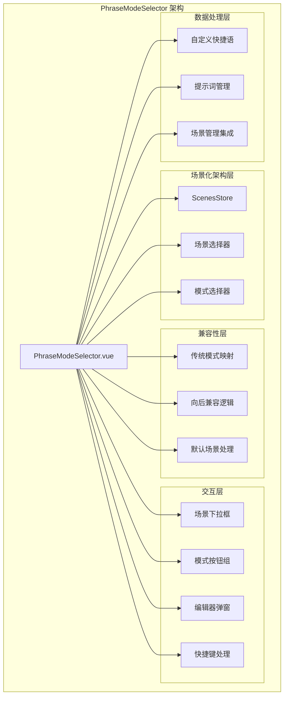
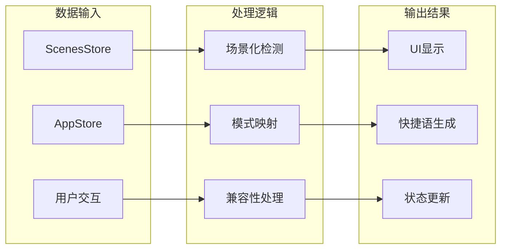
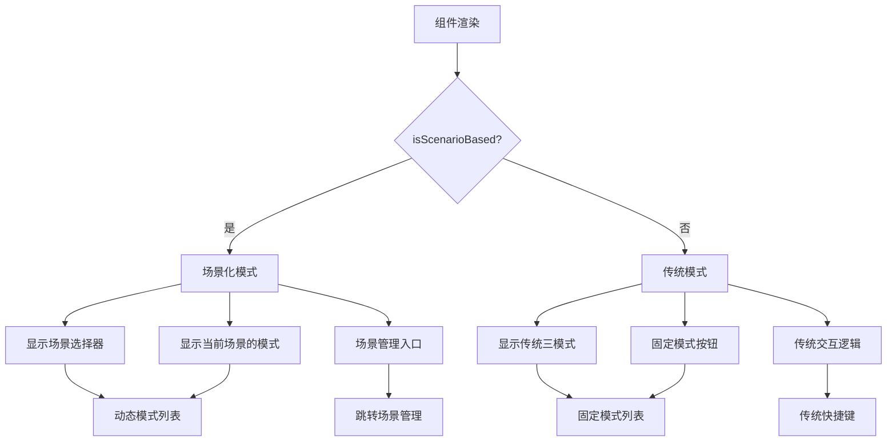
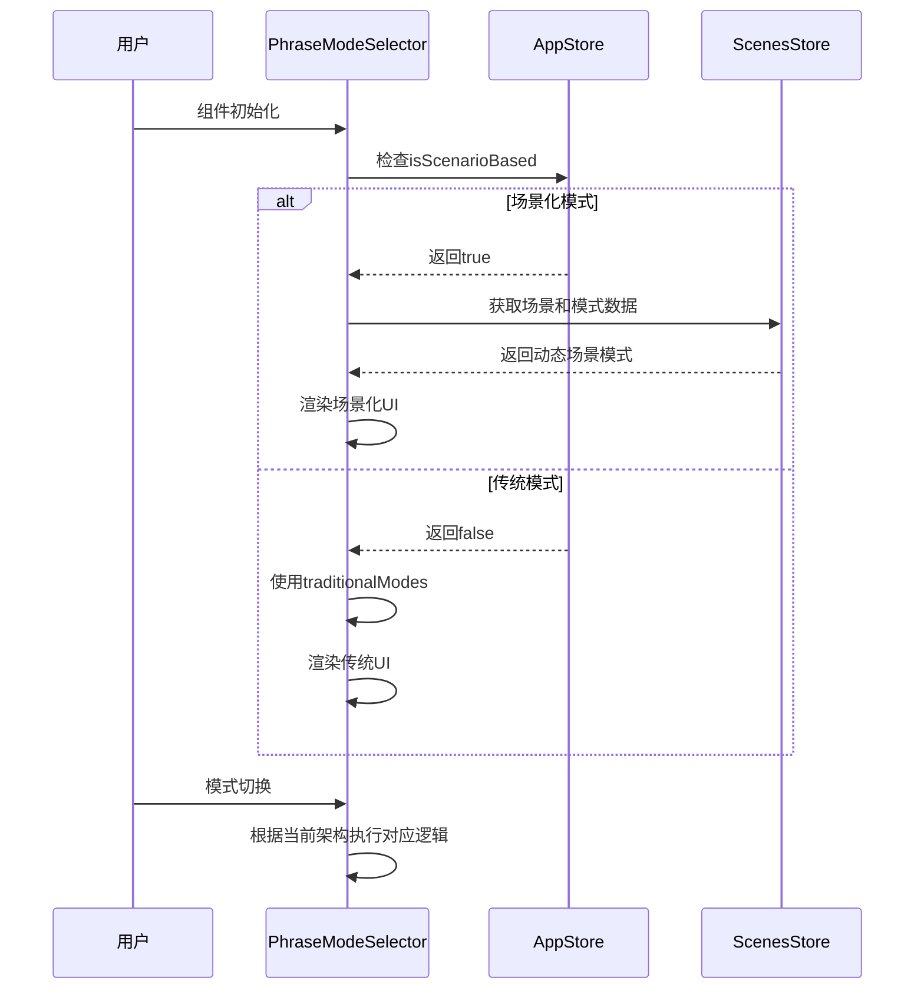
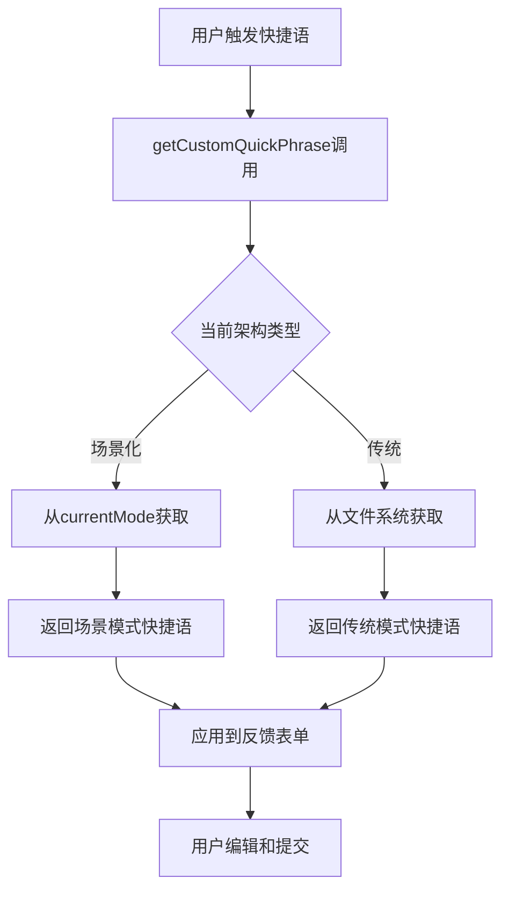
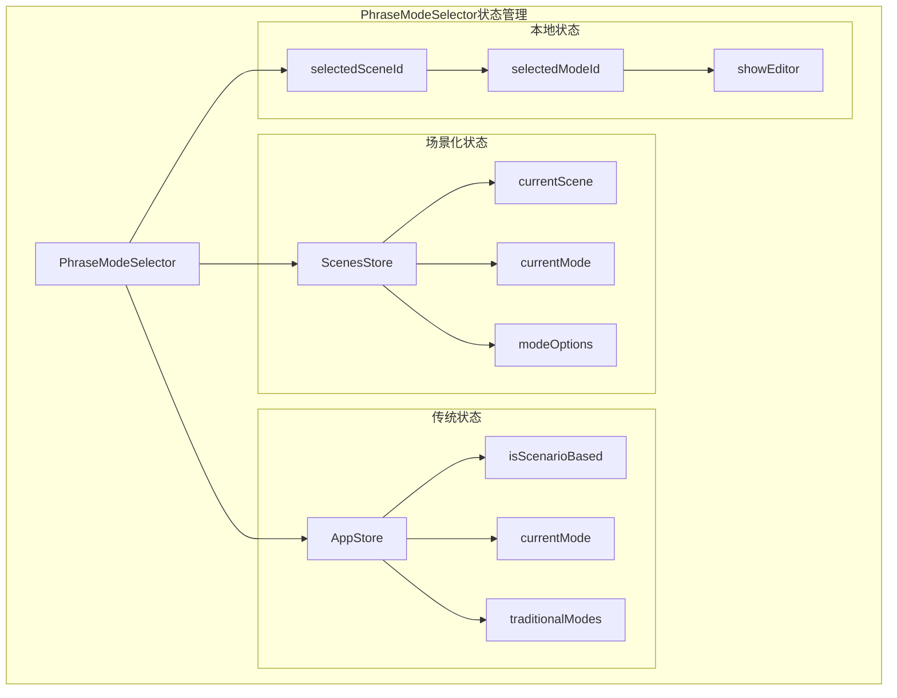
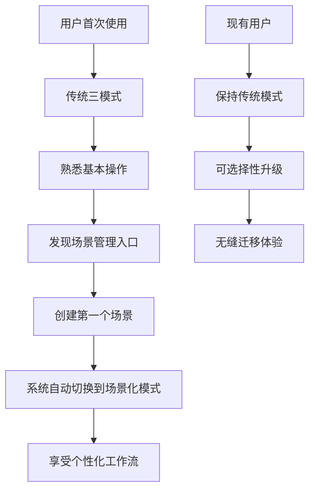

# PhraseModeSelector.vue 组件详细分析

## 组件概述

**文件路径**: `frontend/src/components/PhraseModeSelector.vue`  
**代码规模**: 783行（模板：200行，脚本：400行，样式：183行）  
**复杂度等级**: 高  
**核心价值**: 场景化工作流管理与传统模式的无缝兼容

### 核心职责
- 工作场景选择和切换
- 反馈模式管理
- 自定义提示词编辑
- 传统三模式兼容支持
- 场景化工作流引导

## 架构设计

### 组件架构图


### 数据流设计


## 核心功能模块

### 1. 场景化架构支持

#### 场景检测与切换
```typescript
// 场景化状态检测
const isScenarioBased = computed(() => appStore.isScenarioBased)

// 当前场景信息
const currentScene = computed(() => scenesStore.currentScene)
const currentSceneModes = computed(() => scenesStore.modeOptions)

// 场景切换处理
const onSceneChange = async () => {
  if (!selectedSceneId.value) return
  
  try {
    await scenesStore.switchToScene(selectedSceneId.value)
    
    // 重新获取模式选项
    await nextTick()
    
    // 如果当前模式在新场景中不存在，切换到默认模式
    const modes = scenesStore.modeOptions
    if (!modes.find(m => m.value === selectedModeId.value)) {
      const defaultMode = modes.find(m => m.isDefault) || modes[0]
      if (defaultMode) {
        selectedModeId.value = defaultMode.value
      }
    }
  } catch (error) {
    console.error('切换场景失败:', error)
  }
}
```

#### 场景化UI渲染


### 2. 向后兼容机制

#### 传统模式定义
```typescript
// 传统三模式定义
const traditionalModes = [
  { 
    id: 'discuss', 
    name: '探讨', 
    description: '探讨模式：自动附加深入分析和建议的提示词', 
    shortcut: '1' 
  },
  { 
    id: 'edit', 
    name: '编辑', 
    description: '编辑模式：自动附加代码修改和优化的提示词', 
    shortcut: '2' 
  },
  { 
    id: 'search', 
    name: '搜索', 
    description: '搜索模式：自动附加信息查找和解决方案的提示词', 
    shortcut: '3' 
  }
]
```

#### 兼容性处理逻辑


### 3. 自定义快捷语管理

#### 快捷语生成机制
```typescript
// 获取自定义快捷语
const getCustomQuickPhrase = async (): Promise<string> => {
  try {
    if (isScenarioBased.value) {
      // 场景化模式：从当前模式获取自定义快捷语
      const currentMode = scenesStore.currentMode
      if (currentMode?.customQuickPhrase) {
        return currentMode.customQuickPhrase
      }
    } else {
      // 传统模式：从文件系统获取快捷语
      const modeId = selectedModeId.value || 'discuss'
      const quickPhrase = await promptService.getQuickPhrase(modeId)
      return quickPhrase || ''
    }
    return ''
  } catch (error) {
    console.error('获取自定义快捷语失败:', error)
    return ''
  }
}
```

#### 快捷语应用流程


### 4. 交互体验优化

#### 快捷键支持
```typescript
// 快捷键处理
const handleKeydown = (e: KeyboardEvent) => {
  // 数字键1-3快速切换模式
  if (e.key >= '1' && e.key <= '3') {
    const index = parseInt(e.key) - 1
    const modes = isScenarioBased.value ? currentSceneModes.value : traditionalModes
    
    if (modes[index]) {
      selectMode(modes[index].value || modes[index].id)
      e.preventDefault()
    }
  }
}

// 监听键盘事件
onMounted(() => {
  document.addEventListener('keydown', handleKeydown)
})

onUnmounted(() => {
  document.removeEventListener('keydown', handleKeydown)
})
```

#### 模式选择优化
```typescript
// 智能模式选择
const selectMode = async (modeId: string) => {
  selectedModeId.value = modeId
  
  if (isScenarioBased.value) {
    // 场景化模式：更新ScenesStore
    await scenesStore.switchToMode(modeId)
  } else {
    // 传统模式：更新AppStore
    appStore.setCurrentMode(modeId)
  }
  
  // 触发自定义事件通知其他组件
  emit('mode-changed', modeId)
}
```

### 5. 场景管理集成

#### 场景管理入口
```typescript
// 跳转到场景管理
const openSceneManagement = () => {
  // 触发全局事件，由LeftPanelTabs组件监听
  const event = new CustomEvent('openSceneManagement')
  document.dispatchEvent(event)
}
```

#### 编辑器集成
```typescript
// 显示提示词编辑器
const showEditor = async () => {
  try {
    const customPhrase = await getCustomQuickPhrase()
    
    // 这里可以集成更复杂的编辑器逻辑
    // 目前通过场景管理界面进行编辑
    openSceneManagement()
  } catch (error) {
    console.error('打开编辑器失败:', error)
  }
}
```

## 状态管理策略

### 双Store协作模式


### 状态同步机制
```typescript
// 监听场景化状态变化
watch(
  () => appStore.isScenarioBased,
  async (newValue) => {
    if (newValue) {
      // 切换到场景化模式
      await scenesStore.loadScenes()
      if (scenesStore.hasScenes) {
        selectedSceneId.value = scenesStore.currentScene?.id || ''
        selectedModeId.value = scenesStore.currentMode?.id || ''
      }
    } else {
      // 切换到传统模式
      selectedModeId.value = appStore.currentMode || 'discuss'
    }
  },
  { immediate: true }
)

// 监听场景变化
watch(
  () => scenesStore.currentScene,
  (newScene) => {
    if (newScene && selectedSceneId.value !== newScene.id) {
      selectedSceneId.value = newScene.id
    }
  }
)

// 监听模式变化
watch(
  () => scenesStore.currentMode,
  (newMode) => {
    if (newMode && selectedModeId.value !== newMode.id) {
      selectedModeId.value = newMode.id
    }
  }
)
```

## 用户体验设计

### 渐进式场景化迁移


### 交互反馈优化
```typescript
// 模式切换反馈
const selectMode = async (modeId: string) => {
  // 立即更新UI状态
  selectedModeId.value = modeId
  
  try {
    // 执行后台切换逻辑
    if (isScenarioBased.value) {
      await scenesStore.switchToMode(modeId)
    } else {
      appStore.setCurrentMode(modeId)
    }
    
    // 成功反馈
    showSuccessMessage(`已切换到${getCurrentModeName()}模式`)
  } catch (error) {
    // 错误处理和回滚
    selectedModeId.value = previousModeId
    showErrorMessage('模式切换失败，请重试')
  }
}
```

## 性能优化策略

### 1. 计算属性缓存
```typescript
// 缓存模式选项计算
const availableModes = computed(() => {
  if (isScenarioBased.value) {
    return currentSceneModes.value
  } else {
    return traditionalModes.map(mode => ({
      value: mode.id,
      label: mode.name,
      description: mode.description
    }))
  }
})

// 缓存当前模式信息
const currentModeInfo = computed(() => {
  const modes = availableModes.value
  return modes.find(mode => mode.value === selectedModeId.value)
})
```

### 2. 异步操作优化
```typescript
// 防抖处理场景切换
const debouncedSceneChange = debounce(onSceneChange, 300)

// 批量状态更新
const updateMultipleStates = async (updates: StateUpdate[]) => {
  const promises = updates.map(update => update.execute())
  await Promise.all(promises)
}
```

### 3. 内存管理
```typescript
// 组件卸载时清理资源
onUnmounted(() => {
  document.removeEventListener('keydown', handleKeydown)
  // 清理其他监听器和定时器
})
```

## 测试策略

### 单元测试重点
```typescript
describe('PhraseModeSelector', () => {
  test('场景化模式下正确显示场景选择器', () => {
    // 测试场景化UI渲染
  })
  
  test('传统模式下正确显示三模式按钮', () => {
    // 测试传统UI渲染
  })
  
  test('模式切换正确更新状态', () => {
    // 测试状态同步
  })
  
  test('快捷键正确触发模式切换', () => {
    // 测试快捷键功能
  })
  
  test('自定义快捷语正确获取和应用', () => {
    // 测试快捷语逻辑
  })
})
```

### 集成测试场景
- 场景化模式与传统模式的无缝切换
- 与SceneManagement组件的协作
- 与FeedbackForm组件的数据传递
- Store状态的一致性验证

## 维护建议

### 1. 架构演进方向
- **逐步减少传统模式依赖**: 随着用户迁移到场景化模式，可以考虑简化传统模式逻辑
- **增强场景化功能**: 添加更多场景化特性，如场景模板、智能推荐等
- **性能优化**: 优化大量场景和模式时的渲染性能

### 2. 代码重构建议
- **抽取兼容性逻辑**: 将向后兼容逻辑抽取为独立的Composable
- **简化状态管理**: 统一场景化和传统模式的状态管理接口
- **增强类型安全**: 完善TypeScript类型定义

### 3. 用户体验优化
- **引导式升级**: 提供更好的场景化模式引导体验
- **个性化推荐**: 基于使用习惯推荐合适的场景和模式
- **快捷操作**: 增加更多快捷键和手势支持

---

*本文档基于PhraseModeSelector.vue组件的实际代码分析生成，重点阐述了场景化架构的设计理念和向后兼容策略。* 