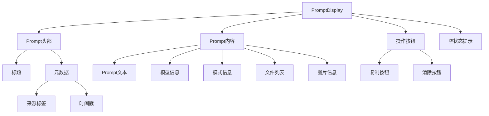
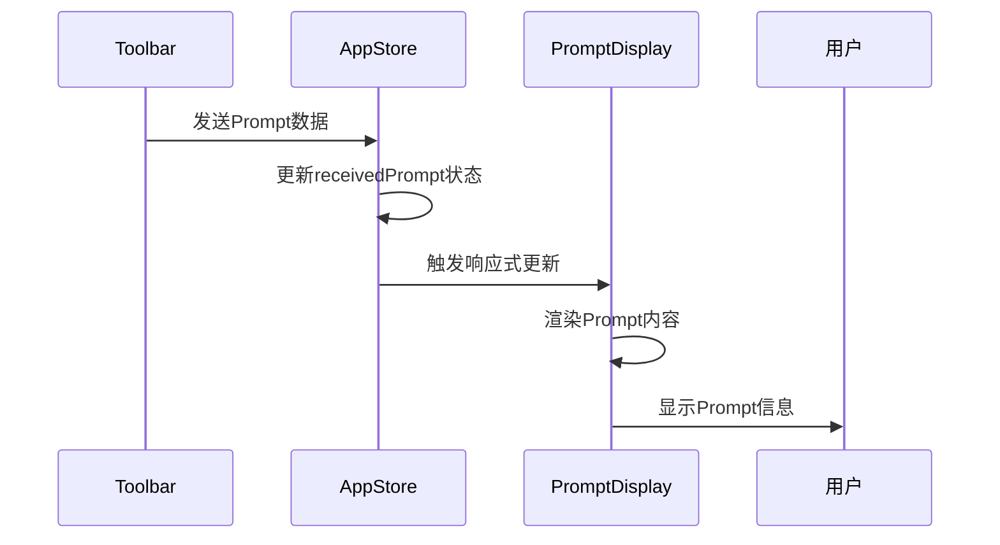
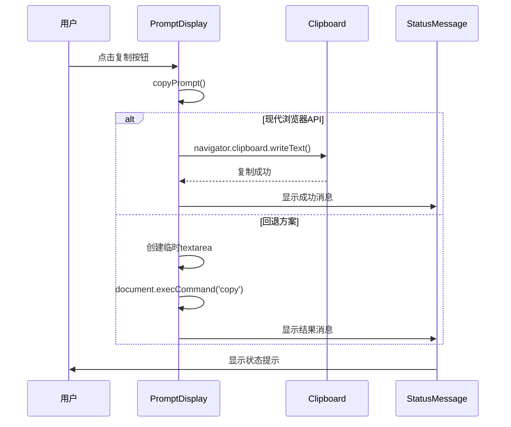

# PromptDisplay 提示词显示组件

## 组件概述

**PromptDisplay** 是专门用于显示从Toolbar接收到的Prompt内容的组件，提供详细的Prompt信息展示和操作功能。

- **文件路径**: `frontend/src/components/PromptDisplay.vue`
- **文件大小**: 7.1KB (331行)
- **组件类型**: 业务组件
- **主要功能**: Prompt内容显示、复制操作、元数据展示

## 功能特性

### 核心功能
- **Prompt显示**: 完整显示接收到的Prompt内容
- **元数据展示**: 显示来源、时间戳、模型、模式等信息
- **文件列表**: 显示相关文件列表
- **图片信息**: 显示关联的图片数量
- **复制功能**: 一键复制Prompt到剪贴板
- **清除功能**: 清除当前显示的Prompt

### 界面特性
- **结构化展示**: 清晰的信息层次结构
- **时间格式化**: 友好的时间显示格式
- **状态反馈**: 操作成功/失败的状态提示
- **空状态处理**: 无Prompt时的友好提示

## 技术实现

### 组件架构


### 状态管理集成
```typescript
// Store依赖
const appStore = useAppStore()

// 计算属性
const receivedPrompt = computed(() => appStore.receivedPrompt)

// 注入状态消息方法
const showStatusMessage = inject<(
  type: 'success' | 'error' | 'warning' | 'info', 
  message: string, 
  autoRemove?: boolean
) => string | undefined>('showStatusMessage')
```

### 关键方法

#### 时间格式化
```typescript
const formatTimestamp = (timestamp: number): string => {
  const date = new Date(timestamp)
  return date.toLocaleString('zh-CN', {
    year: 'numeric',
    month: '2-digit',
    day: '2-digit',
    hour: '2-digit',
    minute: '2-digit',
    second: '2-digit'
  })
}
```

#### 复制功能
```typescript
const copyPrompt = async () => {
  if (receivedPrompt.value?.prompt) {
    try {
      await navigator.clipboard.writeText(receivedPrompt.value.prompt)
      showStatusMessage?.('success', 'Prompt已成功复制到剪贴板！')
    } catch (error) {
      // 回退方案：使用传统复制方法
      try {
        const textArea = document.createElement('textarea')
        textArea.value = receivedPrompt.value.prompt
        document.body.appendChild(textArea)
        textArea.select()
        const successful = document.execCommand('copy')
        document.body.removeChild(textArea)
        
        if (successful) {
          showStatusMessage?.('success', 'Prompt已成功复制到剪贴板！')
        } else {
          showStatusMessage?.('error', '复制失败，请手动选择文本进行复制')
        }
      } catch (fallbackError) {
        showStatusMessage?.('error', '复制失败，请手动选择文本进行复制')
      }
    }
  } else {
    showStatusMessage?.('warning', '没有可复制的Prompt内容')
  }
}
```

#### 清除功能
```typescript
const clearPrompt = () => {
  appStore.clearReceivedPrompt()
}
```

## 组件接口

### Prompt数据结构
```typescript
interface ReceivedPrompt {
  prompt: string              // Prompt文本内容
  model?: string             // 使用的模型
  mode?: string              // 工作模式
  files?: string[]           // 相关文件列表
  images?: string[]          // 关联图片列表
  timestamp: number          // 接收时间戳
  metadata?: {
    source?: string          // 来源信息
    [key: string]: any      // 其他元数据
  }
}
```

### 注入的方法
```typescript
interface InjectedMethods {
  showStatusMessage?: (
    type: 'success' | 'error' | 'warning' | 'info',
    message: string,
    autoRemove?: boolean
  ) => string | undefined
}
```

## 使用示例

### 基本使用
```vue
<template>
  <PromptDisplay />
</template>

<script setup lang="ts">
import PromptDisplay from '@/components/PromptDisplay.vue'
</script>
```

### 在标签页中使用
```vue
<template>
  <div class="tab-content">
    <div v-if="activeTab === 'prompt' && appStore.receivedPrompt" class="tab-pane">
      <PromptDisplay />
    </div>
  </div>
</template>
```

## 样式设计

### 主容器样式
```scss
.prompt-display {
  background: #252526;
  border-radius: 8px;
  padding: 20px;
  box-shadow: 0 2px 8px rgba(0, 0, 0, 0.3);
  border: 1px solid #3e3e42;
  flex: 1;
  min-height: 0;
  display: flex;
  flex-direction: column;
}
```

### 头部样式
```scss
.prompt-header {
  display: flex;
  justify-content: space-between;
  align-items: center;
  margin-bottom: 20px;
  padding-bottom: 10px;
  border-bottom: 1px solid #3e3e42;
  
  h3 {
    margin: 0;
    color: #e2e8f0;
    font-size: 18px;
  }
}

.prompt-meta {
  display: flex;
  gap: 10px;
  align-items: center;
}

.source-tag {
  background: #0e639c;
  color: #ffffff;
  padding: 4px 8px;
  border-radius: 4px;
  font-size: 12px;
  font-weight: 500;
}

.timestamp {
  color: #a0aec0;
  font-size: 12px;
}
```

### 内容区域样式
```scss
.prompt-content {
  display: flex;
  flex-direction: column;
  gap: 15px;
  flex: 1;
  min-height: 0;
  overflow-y: auto;
}

.prompt-text {
  display: flex;
  flex-direction: column;
  gap: 8px;
  flex: 1;
  min-height: 0;
  
  .text-content {
    background: #1e1e1e;
    border: 1px solid #3e3e42;
    border-radius: 6px;
    padding: 16px;
    color: #e2e8f0;
    font-family: 'Consolas', 'Monaco', 'Courier New', monospace;
    font-size: 14px;
    line-height: 1.5;
    white-space: pre-wrap;
    word-wrap: break-word;
    overflow-y: auto;
    flex: 1;
    min-height: 100px;
  }
}
```

### 操作按钮样式
```scss
.prompt-actions {
  display: flex;
  gap: 12px;
  justify-content: flex-end;
  padding-top: 16px;
  border-top: 1px solid #3e3e42;
  margin-top: auto;
  flex-shrink: 0;
}

.btn {
  padding: 8px 16px;
  border: none;
  border-radius: 4px;
  font-size: 13px;
  font-weight: 500;
  cursor: pointer;
  transition: all 0.2s ease;
  
  &.btn-primary {
    background: #0e639c;
    color: #ffffff;
    
    &:hover {
      background: #1177bb;
    }
  }
  
  &.btn-secondary {
    background: #3e3e42;
    color: #cccccc;
    
    &:hover {
      background: #4a4a4f;
    }
  }
}
```

## 交互流程

### Prompt显示流程


### 复制操作流程


## 性能优化

### 计算属性缓存
- 使用 `computed` 缓存Prompt数据
- 避免不必要的重新计算

### 条件渲染
- 使用 `v-if` 进行条件渲染
- 避免渲染空内容

### 内存管理
- 及时清理大文本内容
- 优化长文本的显示性能

## 可访问性

### 键盘导航
- 支持 `Tab` 键在按钮间导航
- 支持 `Enter` 键执行操作

### 屏幕阅读器
- 提供适当的 `aria-label` 属性
- 使用语义化的HTML结构

### 视觉反馈
- 清晰的操作状态指示
- 友好的错误提示信息

## 测试建议

### 单元测试
```typescript
describe('PromptDisplay', () => {
  it('应该正确显示Prompt内容', () => {
    // 测试Prompt内容渲染
  })
  
  it('应该正确格式化时间戳', () => {
    // 测试时间格式化功能
  })
  
  it('应该正确处理复制操作', () => {
    // 测试复制功能
  })
  
  it('应该正确处理空状态', () => {
    // 测试空状态显示
  })
})
```

## 🧭 导航链接

- **📋 [返回主目录](../../../README.md)** - 返回文档导航中心
- **🔧 [返回组件目录](./index.md)** - 返回组件文档导航
- **🔧 [返回前端模块目录](../index.md)** - 返回前端模块导航 