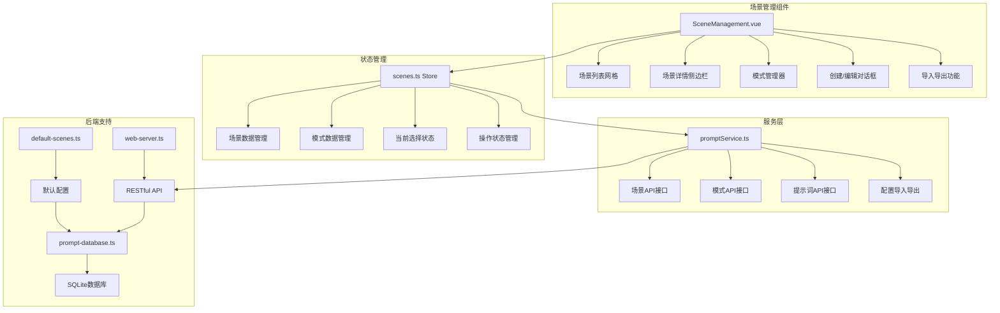
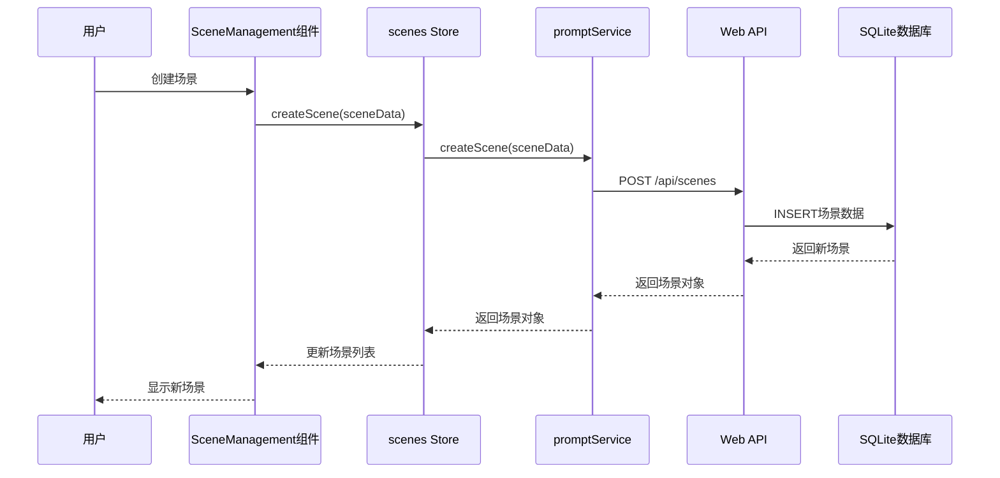

# 场景管理功能详细文档

## 📋 功能概述

场景管理系统是MCP Feedback Collector的核心功能之一，提供了完整的工作场景创建、编辑、删除和管理能力。系统支持场景化的AI协作体验，用户可以根据不同的工作需求创建自定义场景，每个场景可以配置多种工作模式，实现个性化的提示词管理和工作流程。

## 🎭 核心特性

### 场景管理
- **创建场景**: 支持创建自定义工作场景，包含名称、描述、图标、默认设置等信息
- **编辑场景**: 实时编辑场景配置，支持修改基本信息和设置
- **删除场景**: 安全删除场景，包含确认机制和依赖检查（默认场景不可删除）
- **场景复制**: 快速复制现有场景，便于创建相似配置
- **默认场景**: 内置编码场景，包含探讨、编辑、搜索三种核心模式
- **场景排序**: 支持场景的排序管理，优化用户体验

### 模式管理
- **模式配置**: 每个场景可配置多种工作模式（探讨、编辑、搜索等）
- **模式切换**: 实时切换工作模式，无需重启服务
- **默认模式**: 支持设置场景的默认工作模式
- **快捷键管理**: 支持数字键快速切换模式（1-9），自动分配和冲突处理
- **模式排序**: 支持模式的排序管理，按快捷键或自定义顺序排列

### 提示词管理
- **模板化提示词**: 支持变量替换和模板渲染（如`{{ feedback }}`）
- **场景化提示词**: 不同场景使用不同的提示词模板
- **动态加载**: 支持运行时动态加载和更新提示词
- **缓存机制**: 实现SQLite+localStorage双重缓存策略，提升性能

### 配置导入导出
- **配置导出**: 支持导出场景配置为JSON文件，包含场景、模式、提示词
- **配置导入**: 支持从JSON文件批量导入场景配置
- **配置预览**: 导入前支持预览配置内容和统计信息
- **版本控制**: 导出文件包含版本信息和时间戳

## 🏗️ 技术架构

### 组件架构



### 数据流架构



## 📁 文件结构与代码分析

### 前端组件
- **`frontend/src/components/SceneManagement.vue`** (1751行)
  - 场景管理的主要UI组件
  - 包含场景网格列表、详情侧边栏、模式管理等功能
  - 支持创建/编辑对话框、导入导出功能
  - 实现响应式设计和深色主题

### 状态管理
- **`frontend/src/stores/scenes.ts`** (495行)
  - 场景数据的Pinia状态管理
  - 提供场景和模式的完整CRUD操作
  - 包含当前选择状态和操作状态管理
  - 实现快捷键冲突处理和模式排序

### 服务层
- **`frontend/src/services/promptService.ts`** (626行)
  - 场景管理相关的API封装
  - 提供与后端通信的完整接口
  - 实现SQLite+localStorage双重缓存策略
  - 包含场景、模式、提示词的操作方法

### 类型定义
- **`frontend/src/types/app.ts`** (146行)
  - 完整的TypeScript类型定义
  - 包含Scene、SceneMode、CurrentSelection等核心类型
  - 定义API请求和响应的数据结构
  - 支持配置导入导出的数据格式

### 后端支持
- **`src/utils/prompt-database.ts`** (942行)
  - SQLite数据库操作和数据模型定义
  - 场景和模式数据的持久化存储
  - 数据库版本管理和迁移支持
  - 提供完整的数据库CRUD操作

- **`src/utils/default-scenes.ts`** (435行)
  - 默认场景配置定义
  - 内置编码场景和三种工作模式
  - 提供场景初始化数据和配置结构

- **`src/server/web-server.ts`** (1722行)
  - RESTful API端点实现
  - 场景管理相关的HTTP接口
  - Socket.IO实时通信支持
  - 会话管理和错误处理

## 🔧 核心功能实现

### 1. 场景创建与管理

```typescript
// scenes.ts Store - 场景创建
const createScene = async (sceneData: SceneRequest): Promise<Scene> => {
  saving.value = true
  
  try {
    const newScene = await promptService.createScene(sceneData)
    scenes.value.push(newScene)
    return newScene
  } catch (err) {
    const errorMessage = err instanceof Error ? err.message : '创建场景失败'
    error.value = errorMessage
    throw err
  } finally {
    saving.value = false
  }
}

// 场景更新
const updateScene = async (sceneId: string, sceneData: Partial<SceneRequest>): Promise<Scene> => {
  saving.value = true
  
  try {
    const updatedScene = await promptService.updateScene(sceneId, sceneData)
    const index = scenes.value.findIndex(s => s.id === sceneId)
    if (index !== -1) {
      scenes.value[index] = updatedScene
    }
    return updatedScene
  } catch (err) {
    const errorMessage = err instanceof Error ? err.message : '更新场景失败'
    error.value = errorMessage
    throw err
  } finally {
    saving.value = false
  }
}
```

### 2. 模式管理与快捷键处理

```typescript
// 添加场景模式，包含快捷键冲突处理
const addSceneMode = async (sceneId: string, modeData: SceneModeRequest): Promise<SceneMode> => {
  saving.value = true
  
  try {
    // 如果设置了快捷键，检查冲突并处理
    if (modeData.shortcut && /^\d$/.test(modeData.shortcut)) {
      await handleShortcutConflict(sceneId, modeData.shortcut, null)
    }
    
    const newMode = await promptService.addSceneMode(sceneId, modeData)
    
    // 更新当前场景模式列表
    if (currentSelection.value.sceneId === sceneId) {
      currentSceneModes.value.push(newMode)
      currentSceneModes.value = sortSceneModes(currentSceneModes.value)
    }
    
    return newMode
  } catch (err) {
    const errorMessage = err instanceof Error ? err.message : '添加模式失败'
    error.value = errorMessage
    throw err
  } finally {
    saving.value = false
  }
}

// 快捷键冲突处理
const handleShortcutConflict = async (sceneId: string, shortcut: string, excludeModeId: string | null): Promise<void> => {
  try {
    const conflictMode = currentSceneModes.value.find(mode => 
      mode.shortcut === shortcut && mode.id !== excludeModeId
    )
    
    if (conflictMode) {
      // 清除冲突模式的快捷键
      await promptService.updateSceneMode(sceneId, conflictMode.id, { shortcut: undefined })
      
      // 更新本地状态
      const index = currentSceneModes.value.findIndex(m => m.id === conflictMode.id)
      if (index !== -1) {
        currentSceneModes.value[index].shortcut = undefined
      }
    }
  } catch (err) {
    console.error('[ScenesStore] 处理快捷键冲突失败:', err)
  }
}
```

### 3. 提示词模板渲染

```typescript
// 提示词模板示例（来自default-scenes.ts）
const promptTemplate = `# 用户反馈
{{ feedback }}

注意: 以下要求,仅在本次反馈之后有效,之后请另遵循用户指令
---
<task>

# 任务
接下来你的任务是根据用户提供的反馈, 探讨并给出具体的实施意见

# 具体细则
- 给出的意见必须经过全局考虑
- 如果你没有深入理解代码,请先查看代码逻辑
- 对于方法的重构,必须给出完善的重构方案(考虑对现有代码的影响)
- 如遇到问题,请第一时间向用户反馈
- 该阶段禁止使用工具进行\`making_code_changes\`
...`

// 模板变量替换（在promptService中实现）
const renderPrompt = (template: string, variables: Record<string, string>): string => {
  return template.replace(/\{\{\s*(\w+)\s*\}\}/g, (match, key) => {
    return variables[key] || match
  })
}
```

### 4. 配置导入导出

```typescript
// 导出场景配置
const exportSceneConfig = async (): Promise<SceneConfigExport> => {
  try {
    const response = await fetch(`${this.SCENES_API_BASE}/export`)
    
    if (!response.ok) {
      await this.handleApiError(response)
    }

    const result: SceneConfigExportResponse = await response.json()
    return result.config
  } catch (error) {
    throw error
  }
}

// 导入场景配置
const importSceneConfig = async (config: SceneConfigExport): Promise<void> => {
  try {
    const response = await fetch(`${this.SCENES_API_BASE}/import`, {
      method: 'POST',
      headers: {
        'Content-Type': 'application/json',
      },
      body: JSON.stringify(config),
    })

    if (!response.ok) {
      await this.handleApiError(response)
    }

    const result: ApiResponse = await response.json()
    
    if (!result.success) {
      throw new Error(result.error || result.message || '导入配置失败')
    }

    // 清理所有缓存
    this.clearAllSceneCache()
  } catch (error) {
    throw error
  }
}
```

## 🎨 用户界面设计

### 场景网格视图
- **响应式网格布局**: 使用CSS Grid实现自适应布局
- **场景卡片设计**: 包含场景名称、描述、模式数量、创建时间等信息
- **状态指示器**: 默认场景标识、当前选择状态、操作状态等
- **交互操作**: 编辑、复制、删除等操作按钮，支持键盘快捷键

### 场景详情侧边栏
- **滑动式侧边栏**: 点击场景卡片时从右侧滑出
- **基本信息展示**: 场景名称、描述、创建时间、更新时间等
- **模式管理界面**: 模式列表、添加模式、编辑模式等功能
- **操作按钮**: 编辑场景、添加模式、编辑提示词等

### 创建/编辑对话框
- **模态对话框设计**: 居中显示，支持键盘操作
- **表单验证**: 实时验证用户输入，提供错误提示
- **快捷键自动分配**: 自动为新模式分配可用的数字快捷键
- **开关控件**: 使用现代化的开关控件设置默认状态

### 导入导出功能
- **文件选择器**: 支持JSON文件的选择和验证
- **导入预览**: 显示导入文件的统计信息和内容预览
- **进度指示**: 导入导出过程的进度提示和状态反馈

## 📊 数据模型

### Scene 场景模型
```typescript
interface Scene {
  id: string              // 场景唯一标识
  name: string           // 场景名称
  description: string    // 场景描述
  icon?: string         // 场景图标（可选）
  isDefault: boolean    // 是否为默认场景
  sortOrder: number     // 排序顺序
  createdAt: number     // 创建时间（时间戳）
  updatedAt: number     // 更新时间（时间戳）
}
```

### SceneMode 场景模式模型
```typescript
interface SceneMode {
  id: string              // 模式唯一标识
  sceneId: string        // 所属场景ID
  name: string           // 模式名称
  description: string    // 模式描述
  shortcut?: string      // 快捷键（1-9数字）
  isDefault: boolean     // 是否为默认模式
  sortOrder: number      // 排序顺序
  createdAt: number      // 创建时间（时间戳）
  updatedAt: number      // 更新时间（时间戳）
}
```

### CurrentSelection 当前选择状态
```typescript
interface CurrentSelection {
  sceneId: string        // 当前场景ID
  modeId: string         // 当前模式ID
}
```

### SceneConfigExport 配置导出格式
```typescript
interface SceneConfigExport {
  version: string        // 配置版本
  exportedAt: number     // 导出时间戳
  scenes: Scene[]        // 场景列表
  modes: SceneMode[]     // 模式列表
  prompts: Array<{       // 提示词列表
    sceneId: string
    modeId: string
    prompt: string
  }>
}
```

## 🔄 API接口设计

### 场景管理API
- **GET /api/scenes** - 获取所有场景列表
- **GET /api/scenes/:sceneId** - 获取场景详情（包含模式）
- **POST /api/scenes** - 创建新场景
- **PUT /api/scenes/:sceneId** - 更新场景信息
- **DELETE /api/scenes/:sceneId** - 删除场景

### 模式管理API
- **GET /api/scenes/:sceneId/modes** - 获取场景下的所有模式
- **POST /api/scenes/:sceneId/modes** - 为场景添加新模式
- **PUT /api/scenes/:sceneId/modes/:modeId** - 更新模式信息
- **DELETE /api/scenes/:sceneId/modes/:modeId** - 删除模式

### 提示词管理API
- **GET /api/unified/prompt** - 获取统一提示词（基于当前选择）
- **POST /api/unified/prompt** - 保存统一提示词

### 配置管理API
- **GET /api/scenes/export** - 导出场景配置
- **POST /api/scenes/import** - 导入场景配置

## 🧪 测试策略

### 单元测试
- **Store方法测试**: 测试scenes store中的所有方法
- **服务层测试**: 测试promptService的API调用
- **组件方法测试**: 测试SceneManagement组件的关键方法

### 集成测试
- **场景CRUD测试**: 测试场景的完整生命周期操作
- **模式管理测试**: 测试模式的创建、编辑、删除流程
- **快捷键冲突测试**: 测试快捷键分配和冲突处理机制

### 用户体验测试
- **场景切换性能**: 测试场景切换的响应时间
- **大数据量测试**: 测试大量场景和模式的性能表现
- **错误处理测试**: 测试各种错误情况的用户反馈

## 🚀 性能优化

### 数据加载优化
- **懒加载策略**: 按需加载场景模式数据
- **缓存机制**: SQLite+localStorage双重缓存
- **批量操作**: 支持批量创建和更新操作

### 界面渲染优化
- **虚拟滚动**: 支持大量场景的高效渲染
- **防抖处理**: 用户输入的防抖处理
- **组件懒加载**: 按需加载对话框和侧边栏组件

### 状态管理优化
- **响应式更新**: 使用Vue 3的响应式系统
- **状态持久化**: 关键状态的本地存储
- **内存管理**: 及时清理不需要的状态数据

## 🔧 默认场景配置

### 内置编码场景
系统内置一个默认的编码场景，包含三种核心工作模式：

1. **探讨模式** (discuss) - 快捷键: 1
   - **功能**: 深入分析和建议，提供具体的实施意见
   - **特点**: 禁止直接修改代码，专注于分析和建议
   - **应用**: 代码审查、架构讨论、问题分析等

2. **编辑模式** (edit) - 快捷键: 2
   - **功能**: 代码修改和优化，编写具体的代码实现
   - **特点**: 允许直接修改代码，分步骤进行开发
   - **应用**: 代码编写、功能实现、bug修复等

3. **搜索模式** (search) - 快捷键: 3
   - **功能**: 信息查找和检索，深度检索相关代码
   - **特点**: 支持代码搜索和网络信息检索
   - **应用**: 代码查找、文档搜索、技术调研等

### 自定义场景
用户可以创建自定义场景，包括：
- **自定义场景名称和描述**: 根据工作需求定义场景
- **自定义工作模式配置**: 创建特定的工作模式
- **自定义提示词模板**: 编写专门的提示词模板
- **自定义快捷键设置**: 设置便于记忆的快捷键

## 🧭 导航链接

- **📋 [返回主目录](../../../README.md)** - 返回文档导航中心
- **🔧 [返回前端组件目录](./index.md)** - 返回前端组件导航
- **📊 [场景状态管理](../../状态管理/index.md)** - 查看场景状态管理文档
- **🔌 [提示词服务](../../服务/index.md)** - 查看提示词服务文档

---

*场景管理功能文档最后更新: 2024年1月*
*文档版本: v2.0.0* 