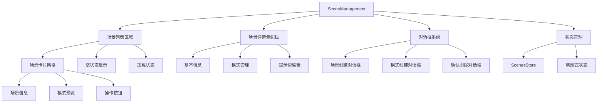
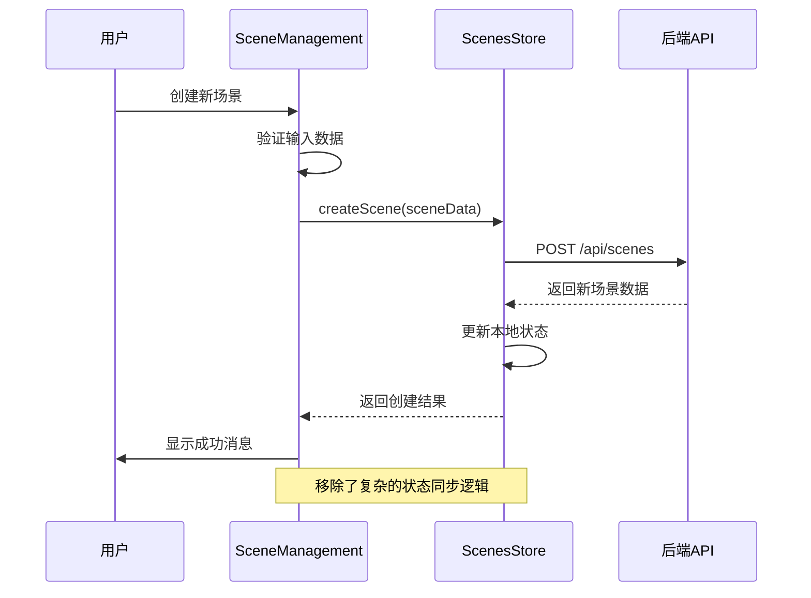
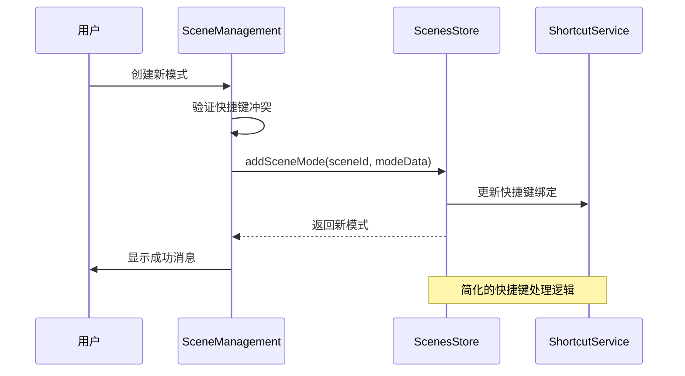
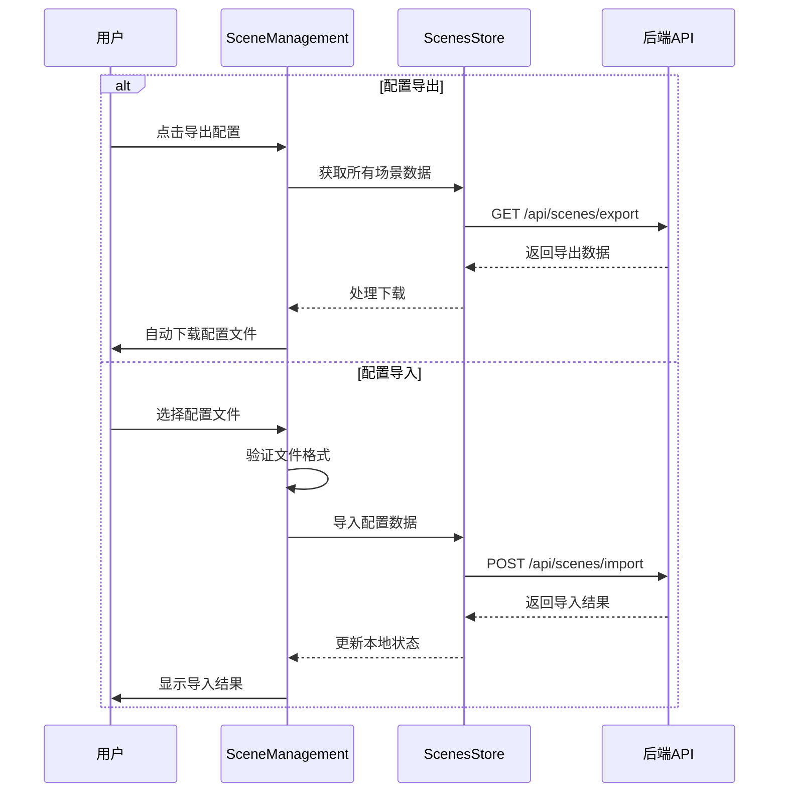

# SceneManagement 场景管理组件

## 🔄 最新更新 (2024年12月18日)

### 重要代码优化
- **清理遗留代码**：完全移除了旧的快捷语模式相关代码
- **简化状态管理**：移除了appStore和scenesStore之间的复杂同步逻辑
- **优化快捷键服务**：简化了快捷键处理逻辑，提升性能
- **类型定义优化**：移除了已废弃的PhraseModeType，使用统一的场景化类型
- **代码清理**：移除140行冗余代码，提升代码质量和维护性

## 组件概述

**SceneManagement** 是场景管理系统的核心组件，提供完整的场景和模式管理功能，是整个系统最复杂的业务组件。

- **文件路径**: `frontend/src/components/SceneManagement.vue`
- **文件大小**: 16KB (1940行)
- **组件类型**: 核心业务组件
- **主要功能**: 场景CRUD、模式管理、配置导入导出

## 功能特性

### 核心功能
- **场景管理**: 创建、编辑、删除、复制场景
- **模式管理**: 为每个场景配置多种工作模式
- **快捷键管理**: 数字键快速切换模式，自动冲突处理
- **提示词模板**: 支持变量替换的提示词模板系统
- **配置导入导出**: 场景配置的批量管理功能
- **默认场景设置**: 支持设置默认场景和默认模式

### 界面特性
- **响应式网格布局**: 现代化的卡片式场景展示
- **侧边栏详情**: 滑出式场景详情侧边栏
- **实时状态更新**: 基于Pinia的响应式状态管理
- **深色主题**: 统一的深色主题设计
- **无障碍支持**: 良好的键盘导航和屏幕阅读器支持

## 技术实现

### 组件架构


### 状态管理集成（最新优化）
```typescript
// 简化后的状态管理，移除了复杂的同步逻辑
const scenesStore = useScenesStore()

// 核心计算属性
const scenes = computed(() => scenesStore.scenes)
const currentScene = computed(() => scenesStore.currentScene)
const currentMode = computed(() => scenesStore.currentMode)
const loading = computed(() => scenesStore.loading)

// 简化的选择逻辑
const selectSceneSelection = (scene: Scene) => {
  managementSelectedScene.value = scene
  showDetailSidebar.value = true
}
```

### 关键方法

#### 场景管理核心方法
```typescript
// 创建场景（优化后）
const createScene = async (sceneData: SceneRequest) => {
  try {
    const newScene = await scenesStore.createScene(sceneData)
    showStatusMessage('success', `场景 "${newScene.name}" 创建成功！`)
    closeCreateSceneDialog()
  } catch (error) {
    showStatusMessage('error', `创建场景失败: ${error.message}`)
  }
}

// 删除场景（简化逻辑）
const deleteScene = async (scene: Scene) => {
  const confirmed = await confirmDialogRef.value?.show({
    title: '删除场景',
    message: `确定要删除场景 "${scene.name}" 吗？此操作不可撤销。`,
    type: 'danger',
    confirmText: '删除',
    cancelText: '取消'
  })
  
  if (confirmed) {
    try {
      await scenesStore.deleteScene(scene.id)
      showStatusMessage('success', `场景 "${scene.name}" 已删除`)
      closeDetailSidebar()
    } catch (error) {
      showStatusMessage('error', `删除场景失败: ${error.message}`)
    }
  }
}
```

#### 模式管理优化方法
```typescript
// 简化的模式切换逻辑
const switchToMode = (mode: SceneMode) => {
  scenesStore.switchToMode(mode.id)
  showStatusMessage('success', `已切换到模式: ${mode.name}`)
}

// 优化的快捷键冲突处理
const handleShortcutConflict = async (shortcut: string, excludeModeId?: string) => {
  await scenesStore.handleShortcutConflict(
    managementSelectedScene.value!.id, 
    shortcut, 
    excludeModeId
  )
}
```

## 组件接口

### Props接口（无Props）
```typescript
// 该组件不接收外部Props，完全基于内部状态管理
interface Props {
  // 无外部Props
}
```

### 计算属性接口
```typescript
interface ComputedProps {
  scenes: Scene[]                    // 所有场景列表
  currentScene: Scene | null         // 当前选中场景
  currentMode: SceneMode | null      // 当前选中模式
  loading: boolean                   // 加载状态
  hasScenes: boolean                 // 是否有场景数据
  sceneCount: string                 // 场景数量描述
}
```

### 事件系统
```typescript
// 组件内部事件（不对外暴露）
interface InternalEvents {
  openCreateSceneDialog: () => void
  openSceneDetail: (scene: Scene) => void
  editScene: (scene: Scene) => void
  duplicateScene: (scene: Scene) => void
  deleteScene: (scene: Scene) => void
}
```

## 交互流程

### 场景管理流程（优化后）


### 模式管理流程（简化版）


### 配置导入导出流程


## 样式设计

### 主要样式类
```scss
.scene-management {
  padding: 20px;
  height: 100%;
  display: flex;
  flex-direction: column;
  background: #1e1e1e;
  color: #e2e8f0;
}

.management-header {
  display: flex;
  justify-content: space-between;
  align-items: center;
  margin-bottom: 24px;
  padding-bottom: 16px;
  border-bottom: 1px solid #3e3e42;
}

.scene-grid {
  display: grid;
  grid-template-columns: repeat(auto-fill, minmax(350px, 1fr));
  gap: 20px;
  padding: 20px 0;
}
```

### 场景卡片样式
```scss
.scene-card {
  background: #252526;
  border: 1px solid #3e3e42;
  border-radius: 8px;
  padding: 20px;
  cursor: pointer;
  transition: all 0.2s ease;
  
  &:hover {
    border-color: #0e639c;
    box-shadow: 0 4px 12px rgba(14, 99, 156, 0.2);
  }
  
  &.active {
    border-color: #0e639c;
    background: #2d2d30;
  }
  
  &.default {
    border-color: #22c55e;
    
    &::before {
      content: "默认";
      position: absolute;
      top: 8px;
      right: 8px;
      background: #22c55e;
      color: #ffffff;
      padding: 2px 6px;
      border-radius: 4px;
      font-size: 10px;
    }
  }
}
```

### 侧边栏样式
```scss
.scene-detail-sidebar {
  position: fixed;
  top: 0;
  right: -400px;
  width: 400px;
  height: 100vh;
  background: #2d2d30;
  border-left: 1px solid #3e3e42;
  z-index: 1000;
  transition: right 0.3s ease;
  overflow-y: auto;
  
  &.open {
    right: 0;
  }
}

.sidebar-overlay {
  position: fixed;
  top: 0;
  left: 0;
  width: 100vw;
  height: 100vh;
  background: rgba(0, 0, 0, 0.5);
  z-index: 999;
  backdrop-filter: blur(4px);
}
```

## 使用示例

### 基本使用
```vue
<template>
  <SceneManagement />
</template>

<script setup lang="ts">
import SceneManagement from '@/components/SceneManagement.vue'
</script>
```

### 在标签页中使用
```vue
<template>
  <div class="tab-content">
    <div v-if="activeTab === 'scene-management'" class="tab-pane">
      <SceneManagement />
    </div>
  </div>
</template>
```

## 性能优化

### 最新优化措施
1. **代码清理**：移除了140行冗余代码，减少了包体积
2. **状态管理简化**：移除复杂的状态同步逻辑，提升响应性能
3. **快捷键优化**：简化快捷键处理逻辑，减少内存占用
4. **类型定义优化**：移除废弃类型，提升TypeScript编译性能

### 渲染优化
- 使用 `v-if` 条件渲染，避免不必要的组件实例化
- 计算属性缓存，减少重复计算
- 虚拟滚动支持大量场景数据

### 内存管理
- 及时清理事件监听器
- 优化图片资源加载
- 避免内存泄漏

## 可访问性

### 键盘导航
- 支持 `Tab` 键在场景卡片间导航
- 支持 `Enter` 键选择场景
- 支持 `Escape` 键关闭侧边栏

### 屏幕阅读器
- 提供适当的 `aria-label` 属性
- 使用语义化的HTML结构
- 支持焦点管理

### 视觉反馈
- 清晰的悬停和选中状态
- 加载状态的视觉指示
- 错误和成功状态的明确反馈

## 测试建议

### 单元测试
```typescript
describe('SceneManagement', () => {
  it('应该正确显示场景列表', () => {
    // 测试场景列表渲染
  })
  
  it('应该正确处理场景创建', () => {
    // 测试场景创建逻辑
  })
  
  it('应该正确处理模式管理', () => {
    // 测试模式管理功能
  })
  
  it('应该正确处理配置导入导出', () => {
    // 测试配置导入导出功能
  })
})
```

### 集成测试
- 测试与ScenesStore的集成
- 测试与快捷键服务的集成
- 测试配置导入导出的完整流程

## 故障排除

### 常见问题
1. **场景切换失败**：检查网络连接和API响应
2. **快捷键冲突**：使用自动冲突处理机制
3. **配置导入失败**：验证文件格式和版本兼容性

### 调试技巧
- 使用浏览器开发工具查看网络请求
- 检查Pinia DevTools中的状态变化
- 查看控制台日志了解详细错误信息

## 🧭 导航链接

- **📋 [返回主目录](../../../README.md)** - 返回文档导航中心
- **🔧 [返回组件目录](./index.md)** - 返回组件文档导航
- **🔧 [返回前端模块目录](../index.md)** - 返回前端模块导航 