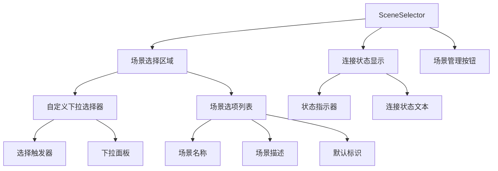
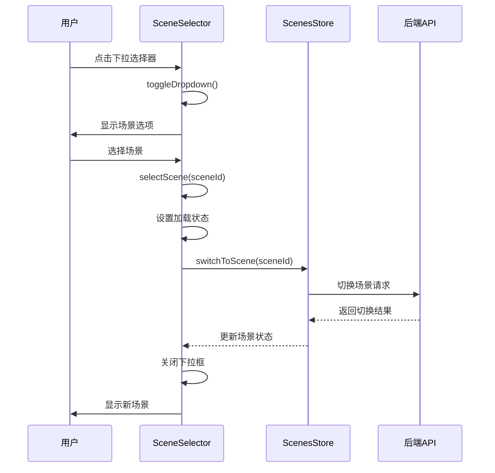
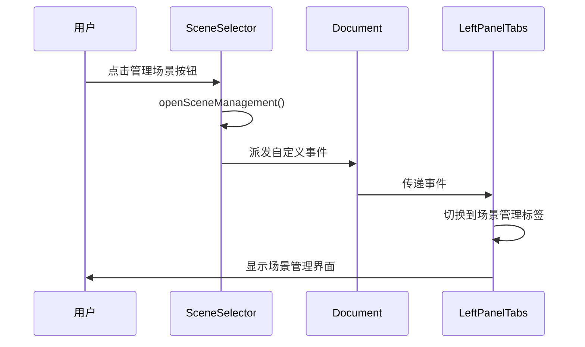

# SceneSelector 场景选择器组件

## 组件概述

**SceneSelector** 是一个智能场景选择器组件，提供直观的场景切换界面，支持场景管理和连接状态显示。

- **文件路径**: `frontend/src/components/SceneSelector.vue`
- **文件大小**: 10KB (448行)
- **组件类型**: 业务组件
- **主要功能**: 场景选择、状态显示、场景管理入口

## 功能特性

### 核心功能
- **场景选择**: 提供下拉选择器，支持场景切换
- **状态显示**: 实时显示连接状态（已连接/未连接）
- **场景管理**: 提供场景管理入口，支持跳转到场景管理页面
- **加载状态**: 显示场景加载和切换状态
- **交互反馈**: 提供丰富的视觉反馈和操作提示

### 界面特性
- **自定义下拉**: 完全自定义的下拉选择器，支持键盘导航
- **状态指示**: 连接状态的视觉指示器
- **加载动画**: 场景切换时的加载动画
- **响应式设计**: 适配不同屏幕尺寸

## 技术实现

### 组件架构


### 状态管理集成
```typescript
// Store依赖
const scenesStore = useScenesStore()      // 场景管理
const connectionStore = useConnectionStore()  // 连接状态

// 计算属性
const scenesLoading = computed(() => scenesStore.loading)
const hasScenes = computed(() => scenesStore.hasScenes)
const sceneOptions = computed(() => scenesStore.sceneOptions)
const currentScene = computed(() => scenesStore.currentScene)
```

### 关键方法

#### 场景选择逻辑
```typescript
const selectScene = async (sceneId: string) => {
  if (isLoading.value || sceneId === selectedSceneId.value) return
  
  isLoading.value = true
  selectedSceneId.value = sceneId
  
  try {
    await scenesStore.switchToScene(sceneId)
  } catch (error) {
    console.error('场景切换失败:', error)
  } finally {
    isLoading.value = false
    closeDropdown()
  }
}
```

#### 下拉框控制
```typescript
const toggleDropdown = () => {
  if (isLoading.value || scenesLoading.value || !hasScenes.value) return
  dropdownOpen.value = !dropdownOpen.value
}

const closeDropdown = () => {
  dropdownOpen.value = false
}
```

#### 场景管理跳转
```typescript
const openSceneManagement = () => {
  // 触发自定义事件，通知父组件切换到场景管理标签页
  const event = new CustomEvent('openSceneManagement', {
    bubbles: true,
    detail: { action: 'open-scene-management' }
  })
  document.dispatchEvent(event)
}
```

## 组件接口

### 计算属性
```typescript
interface ComputedProps {
  scenesLoading: boolean      // 场景加载状态
  hasScenes: boolean         // 是否有可用场景
  sceneOptions: SceneOption[] // 场景选项列表
  currentScene: Scene | null  // 当前选中场景
  currentSelection: Selection // 当前选择状态
}
```

### 场景选项数据结构
```typescript
interface SceneOption {
  value: string        // 场景ID
  label: string        // 场景名称
  description?: string // 场景描述
  isDefault?: boolean  // 是否为默认场景
}
```

### 事件系统
```typescript
// 自定义事件
interface CustomEvents {
  openSceneManagement: {
    action: 'open-scene-management'
  }
}
```

## 交互流程

### 场景选择流程


### 场景管理跳转流程


## 样式设计

### 主要样式类
```scss
.scene-selector-card {
  background-color: #252526;
  border: 1px solid #3e3e42;
  border-radius: 6px;
  padding: 16px 20px;
  max-height: 200px;
}

.scene-header {
  display: flex;
  align-items: center;
  justify-content: space-between;
  margin-bottom: 12px;
}

.custom-select {
  position: relative;
  
  &.open .select-arrow {
    transform: rotate(180deg);
  }
  
  &.disabled {
    opacity: 0.6;
    cursor: not-allowed;
  }
}

.select-dropdown {
  position: absolute;
  top: 100%;
  left: 0;
  right: 0;
  background: #2d2d30;
  border: 1px solid #3e3e42;
  border-radius: 4px;
  max-height: 200px;
  overflow-y: auto;
  z-index: 1000;
}
```

### 连接状态样式
```scss
.connection-status {
  display: flex;
  align-items: center;
  gap: 4px;
  
  .status-dot {
    width: 8px;
    height: 8px;
    border-radius: 50%;
    
    &.connected {
      background-color: #22c55e;
      box-shadow: 0 0 6px rgba(34, 197, 94, 0.5);
    }
    
    &.disconnected {
      background-color: #ef4444;
      box-shadow: 0 0 6px rgba(239, 68, 68, 0.5);
    }
  }
}
```

### 加载动画
```scss
.loading-spinner {
  width: 16px;
  height: 16px;
  border: 2px solid #3e3e42;
  border-top: 2px solid #0e639c;
  border-radius: 50%;
  animation: spin 1s linear infinite;
}

@keyframes spin {
  0% { transform: rotate(0deg); }
  100% { transform: rotate(360deg); }
}
```

## 使用示例

### 基本使用
```vue
<template>
  <SceneSelector />
</template>

<script setup lang="ts">
import SceneSelector from '@/components/SceneSelector.vue'
</script>
```

### 监听场景管理事件
```typescript
// 在父组件中监听场景管理事件
onMounted(() => {
  document.addEventListener('openSceneManagement', handleOpenSceneManagement)
})

const handleOpenSceneManagement = () => {
  // 处理场景管理跳转逻辑
  activeTab.value = 'scene-management'
}
```

## 性能优化

### 计算属性缓存
- 使用 `computed` 缓存场景选项和状态
- 避免不必要的重新计算

### 事件监听优化
- 使用 `onMounted` 和 `onUnmounted` 管理事件监听器
- 防止内存泄漏

### 防抖处理
- 场景切换操作添加防抖处理
- 避免重复请求

## 可访问性

### 键盘导航
- 支持 `Tab` 键焦点导航
- 支持 `Enter` 和 `Space` 键选择
- 支持 `Escape` 键关闭下拉框

### 屏幕阅读器
- 提供 `title` 属性说明
- 使用语义化的 HTML 结构
- 支持 `tabindex` 属性

### 视觉反馈
- 悬停状态样式
- 焦点状态样式
- 加载状态指示

## 测试建议

### 单元测试
```typescript
describe('SceneSelector', () => {
  it('应该正确显示场景选项', () => {
    // 测试场景选项渲染
  })
  
  it('应该正确处理场景切换', () => {
    // 测试场景切换逻辑
  })
  
  it('应该正确显示连接状态', () => {
    // 测试连接状态显示
  })
})
```

### 集成测试
- 测试与 ScenesStore 的集成
- 测试与 ConnectionStore 的集成
- 测试事件传递机制

## 🧭 导航链接

- **📋 [返回主目录](../../../README.md)** - 返回文档导航中心
- **🔧 [返回组件目录](./index.md)** - 返回组件文档导航
- **🔧 [返回前端模块目录](../index.md)** - 返回前端模块导航 