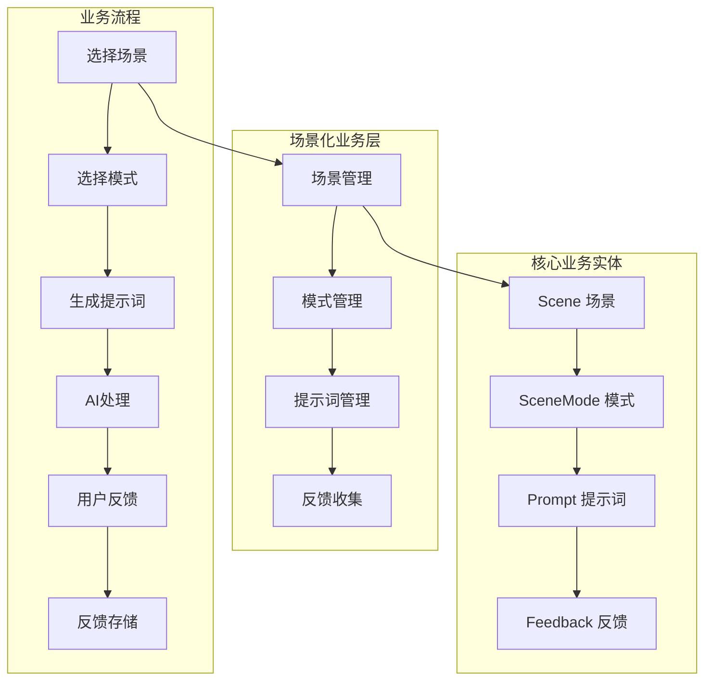
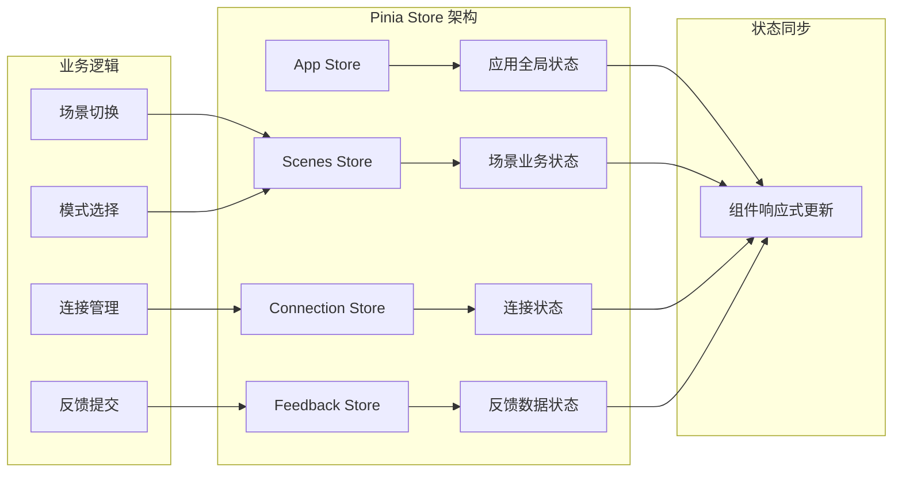
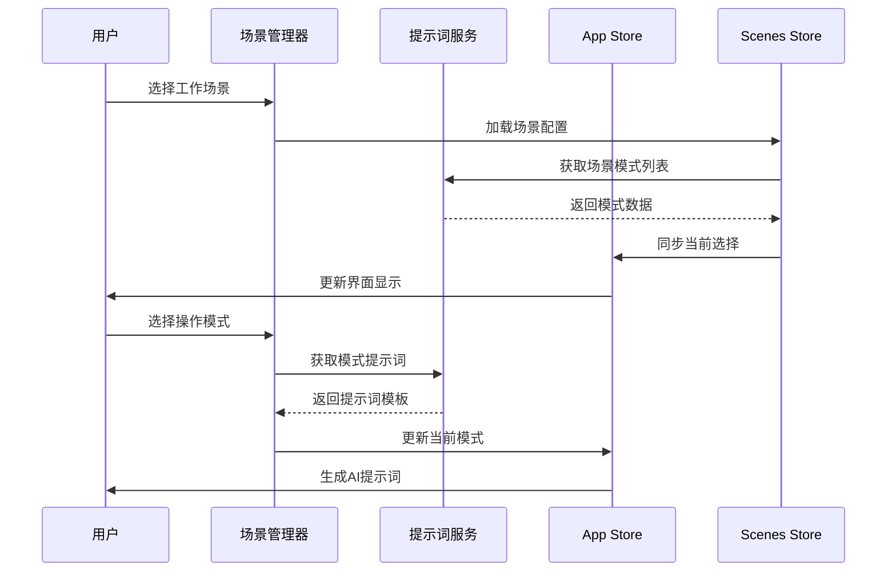
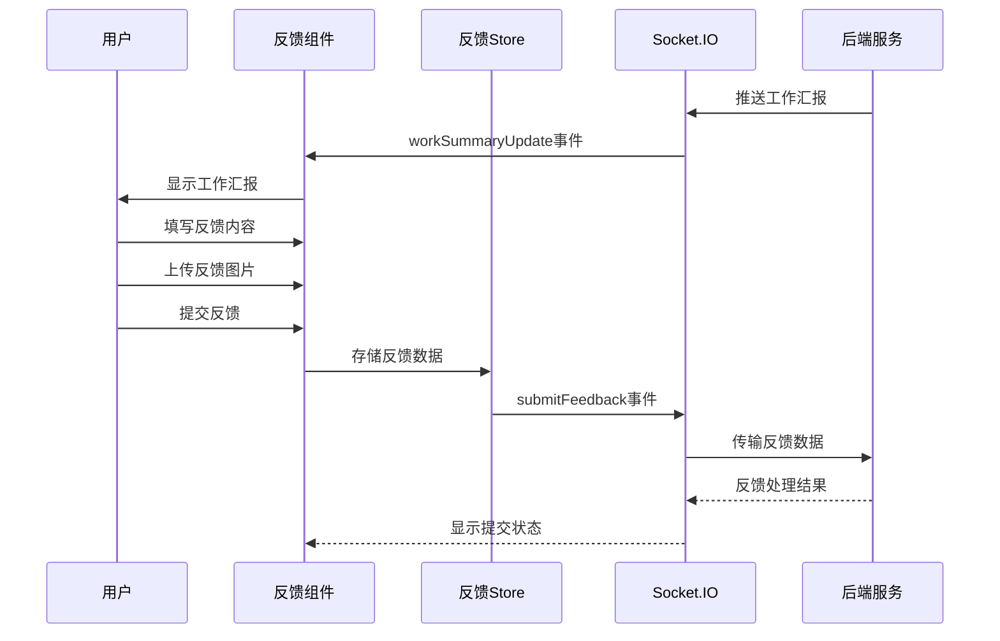

# 前端核心模块详细分析

## 模块概述

### 功能职责
前端核心模块是MCP Feedback Collector的用户界面层，基于Vue.js 3构建，负责：
- **反馈收集界面**: 提供用户友好的反馈提交和管理界面
- **场景化工作流**: 支持多场景、多模式的AI协作工作流程
- **实时通信**: 通过Socket.IO与后端进行实时数据交换
- **状态管理**: 使用Pinia管理复杂的应用状态
- **图片处理**: 支持图片上传、预览和处理功能

### 技术架构
- **框架**: Vue.js 3 (Composition API)
- **状态管理**: Pinia
- **构建工具**: Vite
- **类型系统**: TypeScript
- **通信**: Socket.IO Client
- **样式**: 原生CSS (模块化)

### 依赖关系
- **对后端的依赖**: 通过Socket.IO和HTTP API与后端服务通信
- **对外接口**: 提供Web界面供用户访问，集成Stagewise工具栏

## 业务架构设计

### 1. 场景化业务模型



### 2. 状态管理架构



## 核心业务实体

### 1. Scene (场景)

```typescript
interface Scene {
  id: string              // 场景唯一标识
  name: string           // 场景名称
  description: string    // 场景描述
  icon?: string          // 场景图标
  isDefault: boolean     // 是否为默认场景
  sortOrder: number      // 排序顺序
  createdAt: number      // 创建时间
  updatedAt: number      // 更新时间
}
```

**业务含义**: 场景代表不同的工作上下文，如"代码开发"、"文档编写"、"问题调试"等。每个场景包含多个操作模式。

### 2. SceneMode (场景模式)

```typescript
interface SceneMode {
  id: string              // 模式唯一标识
  sceneId: string        // 所属场景ID
  name: string           // 模式名称
  description: string    // 模式描述
  shortcut?: string      // 快捷键
  isDefault: boolean     // 是否为默认模式
  sortOrder: number      // 排序顺序
  createdAt: number      // 创建时间
  updatedAt: number      // 更新时间
}
```

**业务含义**: 模式代表在特定场景下的具体操作类型，如在"代码开发"场景下的"讨论"、"编辑"、"搜索"模式。

### 3. CurrentSelection (当前选择)

```typescript
interface CurrentSelection {
  sceneId: string        // 当前场景ID
  modeId: string         // 当前模式ID
}
```

**业务含义**: 表示用户当前的工作上下文，决定了AI的行为模式和提示词内容。

### 4. FeedbackData (反馈数据)

```typescript
interface FeedbackData {
  text: string           // 反馈文本内容
  images: ImageFile[]    // 附加图片
  timestamp: number      // 提交时间
  sessionId: string | null // 会话ID
}
```

**业务含义**: 用户对AI工作汇报的反馈，支持文本和图片形式。

## 业务流程分析

### 1. 场景化工作流程



### 2. 反馈收集流程



## 核心Store分析

### 1. App Store (`app.ts`)

**主要职责**:
- 管理应用全局状态
- 处理用户界面配置
- 协调各个子Store的状态

**核心状态**:
```typescript
interface AppState {
  isLoading: boolean
  currentView: string
  uiConfig: UIConfig
  globalSettings: GlobalSettings
}
```

### 2. Scenes Store (`scenes.ts`)

**主要职责**:
- 管理场景和模式数据
- 处理场景切换逻辑
- 提供场景相关的计算属性

**核心状态**:
```typescript
interface ScenesState {
  scenes: Scene[]
  currentSelection: CurrentSelection
  isLoading: boolean
  error: string | null
}
```

### 3. Connection Store (`connection.ts`)

**主要职责**:
- 管理Socket.IO连接状态
- 处理连接重试逻辑
- 监听连接状态变化

**核心状态**:
```typescript
interface ConnectionState {
  isConnected: boolean
  connectionId: string | null
  lastConnected: number | null
  retryCount: number
}
```

### 4. Feedback Store (`feedback.ts`)

**主要职责**:
- 管理反馈数据状态
- 处理反馈提交逻辑
- 维护反馈历史记录

**核心状态**:
```typescript
interface FeedbackState {
  currentFeedback: FeedbackData | null
  feedbackHistory: FeedbackData[]
  isSubmitting: boolean
  lastSubmitted: number | null
}
```

## 服务层架构

### 1. Socket Service (`socket.ts`)

**功能**: Socket.IO客户端封装
**主要方法**:
- `connect()`: 建立Socket连接
- `disconnect()`: 断开连接
- `emit()`: 发送事件
- `on()`: 监听事件

### 2. Prompt Service (`promptService.ts`)

**功能**: 提示词相关服务
**主要方法**:
- `getPromptForMode()`: 获取模式提示词
- `generateCustomPrompt()`: 生成自定义提示词
- `savePromptTemplate()`: 保存提示词模板

### 3. Image Service (`imageService.ts`)

**功能**: 图片处理服务
**主要方法**:
- `compressImage()`: 图片压缩
- `uploadImage()`: 图片上传
- `validateImage()`: 图片验证

### 4. Phrase Service (`phraseService.ts`)

**功能**: 快捷语处理服务
**主要方法**:
- `getQuickPhrases()`: 获取快捷语
- `applyPhrase()`: 应用快捷语
- `saveCustomPhrase()`: 保存自定义快捷语

## 📍 深入分析建议

### 🎯 组件分析优先级
基于复杂度和重要性，建议按以下优先级深入分析组件：
1. **场景管理组件** - 复杂的场景化工作流实现
2. **反馈表单组件** - 核心反馈收集功能
3. **短语模式选择器** - 模式切换和提示词生成
4. **图片上传组件** - 图片处理和上传功能

### 🔗 相关文档推荐
- **组件详细分析**: [前端组件模块](./组件/index.md)
- **服务层分析**: [前端服务模块](./服务/index.md)
- **状态管理**: [前端状态管理](./状态管理/index.md)

## 🧭 导航链接

- **📋 [返回主目录](../../README.md)** - 返回文档导航中心
- **🔧 [返回前端模块目录](./index.md)** - 返回前端模块导航
- **🔧 [返回模块层目录](../index.md)** - 返回模块层导航
- **⚙️ [后端模块文档](../后端模块/index.md)** - 查看后端模块分析

---

*前端核心模块最后更新: 2024年1月* 