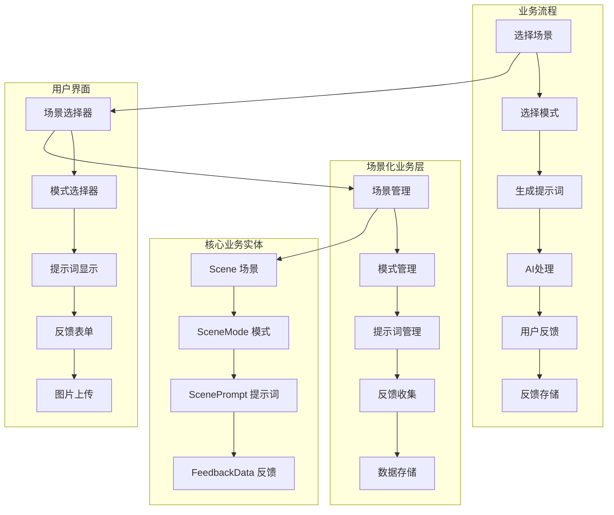
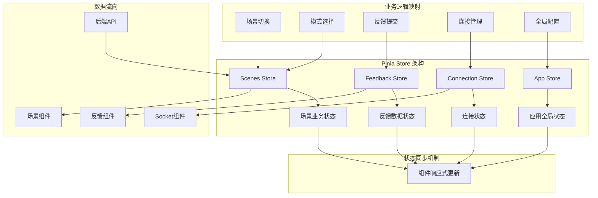
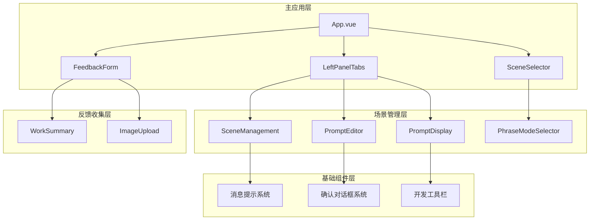
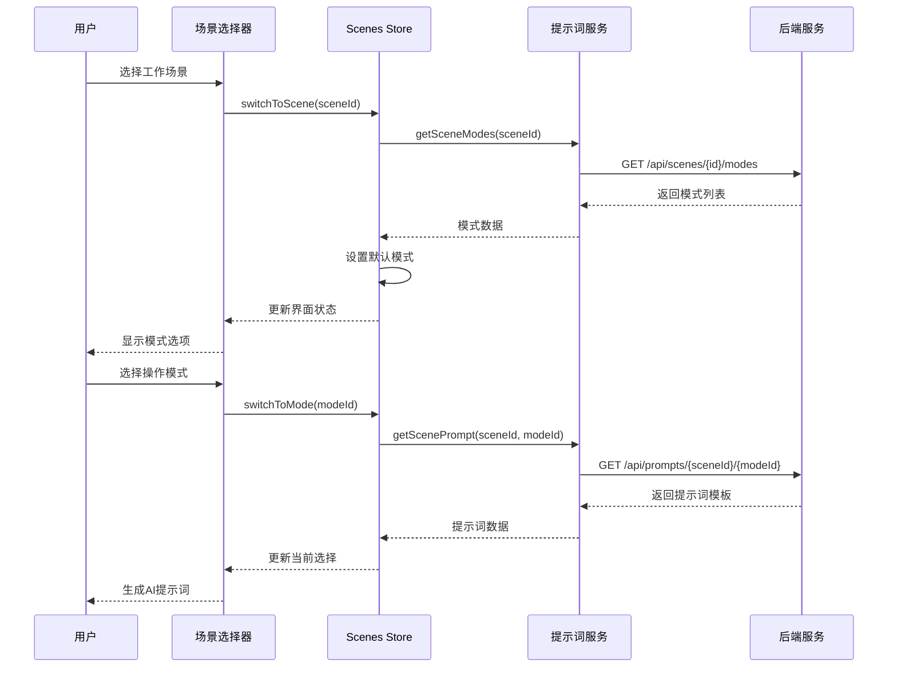
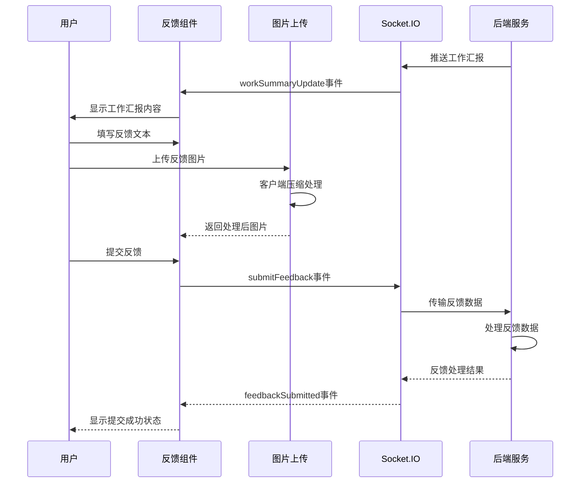
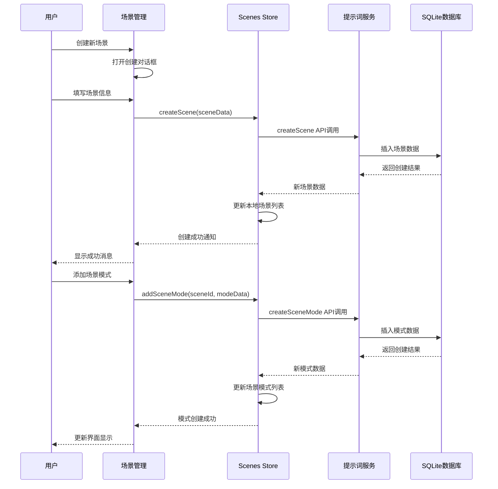
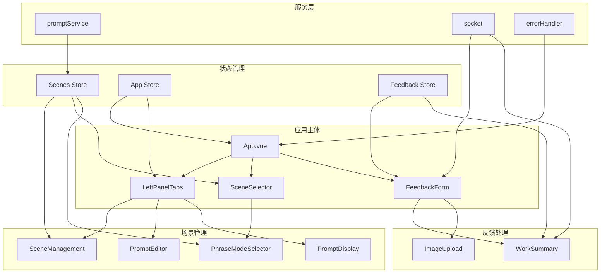
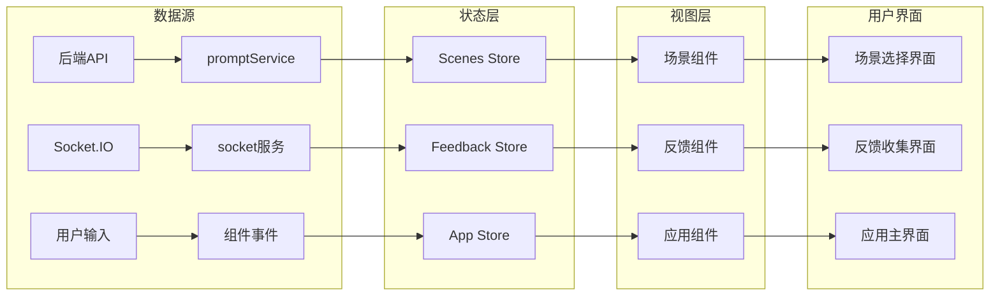

# 前端模块内部结构与关键文件分析

## 模块概述

### 功能职责
前端模块是MCP Feedback Collector的用户界面层，基于Vue.js 3构建，负责：
- **场景化工作流界面**: 提供场景管理、模式选择和切换功能
- **反馈收集界面**: 支持文本和图片反馈的收集和提交
- **实时通信**: 通过Socket.IO与后端进行实时数据交换
- **状态管理**: 使用Pinia管理复杂的应用状态和业务逻辑
- **图片处理**: 支持图片上传、压缩、预览和处理功能
- **Stagewise集成**: 集成工具栏插件提供增强的开发体验

### 技术架构
- **框架**: Vue.js 3.5.13 (Composition API)
- **状态管理**: Pinia 3.0.3
- **构建工具**: Vite 6.3.5
- **类型系统**: TypeScript 5.8.3
- **通信**: Socket.IO Client 4.8.1
- **样式**: 原生CSS (模块化设计)
- **工具栏**: @stagewise/toolbar-vue 0.4.4

### 依赖关系
- **对后端的依赖**: 通过Socket.IO和HTTP API与后端服务通信
- **对外接口**: 提供Web界面供用户访问，集成Stagewise工具栏插件

## 目录结构

```
frontend/src/
├── App.vue                    # 主应用组件
├── main.ts                    # 应用入口文件
├── style.css                  # 全局样式文件
├── components/                # Vue组件目录
│   ├── SceneManagement.vue    # 场景管理组件 (46KB, 1940行)
│   ├── FeedbackForm.vue       # 反馈表单组件 (17KB, 620行)
│   ├── SceneSelector.vue      # 场景选择器 (10KB, 448行)
│   ├── PhraseModeSelector.vue # 模式选择器 (14KB, 615行)
│   ├── PromptEditor.vue       # 提示词编辑器 (11KB, 534行)
│   ├── PromptDisplay.vue      # 提示词显示组件 (7.1KB, 331行)
│   ├── ImageUpload.vue        # 图片上传组件 (12KB, 517行)
│   ├── WorkSummary.vue        # 工作汇报组件 (5.4KB, 259行)
│   ├── StatusMessage.vue      # 状态消息组件 (4.5KB, 240行)
│   ├── LeftPanelTabs.vue      # 左面板标签页 (3.8KB, 176行)
│   ├── ConfirmDialog.vue      # 确认对话框 (4.4KB, 230行)
│   └── icons/                 # 图标组件目录
├── stores/                    # Pinia状态管理
│   ├── scenes.ts              # 场景状态管理 (16KB, 548行)
│   ├── app.ts                 # 应用状态管理 (2.8KB, 118行)
│   ├── feedback.ts            # 反馈状态管理 (1.5KB, 71行)
│   ├── connection.ts          # 连接状态管理 (829B, 36行)
│   └── index.ts               # Store索引文件
├── services/                  # 前端服务层
│   ├── promptService.ts       # 提示词服务 (18KB, 647行)
│   ├── socket.ts              # Socket.IO服务 (8.4KB, 281行)
│   ├── errorHandler.ts        # 错误处理服务 (3.6KB, 162行)
│   ├── shortcutService.ts     # 快捷键服务 (3.9KB, 167行)
│   ├── imageService.ts        # 图片服务 (空文件)
│   └── phraseService.ts       # 短语服务 (空文件)
├── types/                     # 前端类型定义
│   ├── app.ts                 # 应用类型定义
│   └── socket.ts              # Socket通信类型
└── assets/                    # 静态资源
    └── vue.svg                # Vue.js图标
```

## 业务架构设计

### 1. 场景化业务模型



### 2. Pinia状态管理架构



### 3. 组件层次架构



## 核心业务实体

### 1. Scene (场景)

```typescript
interface Scene {
  id: string              // 场景唯一标识
  name: string           // 场景名称
  description: string    // 场景描述
  icon?: string          // 场景图标
  isDefault: boolean     // 是否为默认场景
  sortOrder: number      // 排序顺序
  createdAt: number      // 创建时间
  updatedAt: number      // 更新时间
}
```

**业务含义**: 场景代表不同的工作上下文，如"编码场景"、"文档编写"、"问题调试"等。每个场景包含多个操作模式，为用户提供场景化的AI协作体验。

### 2. SceneMode (场景模式)

```typescript
interface SceneMode {
  id: string              // 模式唯一标识
  sceneId: string        // 所属场景ID
  name: string           // 模式名称
  description: string    // 模式描述
  shortcut?: string      // 快捷键 (支持1-9数字键)
  isDefault: boolean     // 是否为默认模式
  sortOrder: number      // 排序顺序
  defaultFeedback?: string // 默认反馈内容
  createdAt: number      // 创建时间
  updatedAt: number      // 更新时间
}
```

**业务含义**: 模式代表在特定场景下的具体操作类型，如在"编码场景"下的"讨论"、"编辑"、"搜索"模式。每个模式可配置快捷键和默认反馈内容。

### 3. CurrentSelection (当前选择)

```typescript
interface CurrentSelection {
  sceneId: string        // 当前场景ID
  modeId: string         // 当前模式ID
}
```

**业务含义**: 表示用户当前的工作上下文，决定了AI的行为模式和提示词内容。这是整个场景化系统的核心状态。

### 4. FeedbackData (反馈数据)

```typescript
interface FeedbackData {
  text: string           // 反馈文本内容
  images: ImageFile[]    // 附加图片列表
  timestamp: number      // 提交时间戳
  sessionId: string | null // 会话ID
}

interface ImageFile {
  name: string           // 文件名
  size: number          // 文件大小
  type: string          // MIME类型
  data: string          // Base64编码的图片数据
}
```

**业务含义**: 用户对AI工作汇报的反馈，支持文本和图片形式。图片支持多种格式，客户端自动压缩优化。

## 关键文件分析

### 核心业务文件

#### App.vue (主应用组件)
- **路径**: `frontend/src/App.vue`
- **主要功能**: 应用主入口，负责整体布局和全局状态初始化
- **关键特性**:
  - 两栏布局设计 (左侧标签页 + 右侧反馈区)
  - Stagewise工具栏集成 (仅开发环境)
  - 全局事件监听和处理
  - 场景数据初始化
- **核心方法**:
  - `handleFeedbackSuccess`: 处理反馈成功事件
  - `handlePromptNotification`: 处理提示词通知
  - `showStatusMessage`: 全局状态消息显示
- **依赖关系**: 
  - 导入所有主要组件
  - 初始化Socket服务和错误处理
  - 集成Pinia状态管理

#### SceneManagement.vue (场景管理组件)
- **路径**: `frontend/src/components/SceneManagement.vue`
- **主要功能**: 场景和模式的完整管理界面
- **关键特性**:
  - 场景CRUD操作 (创建、读取、更新、删除)
  - 模式管理 (添加、编辑、删除模式)
  - 场景导入导出功能
  - 拖拽排序支持
  - 快捷键冲突检测
- **业务逻辑**:
  - 场景卡片展示和操作
  - 模式预览和管理
  - 侧边栏详情展示
  - 确认对话框集成
- **代码结构**: 1940行代码，包含完整的场景管理业务逻辑

#### SceneSelector.vue (场景选择器)
- **路径**: `frontend/src/components/SceneSelector.vue`
- **主要功能**: 场景和模式的选择界面
- **关键特性**:
  - 场景下拉选择
  - 模式快速切换
  - 实时状态同步
  - 加载状态处理
- **业务逻辑**:
  - 与Scenes Store集成
  - 选择状态管理
  - 模式选项动态更新

#### FeedbackForm.vue (反馈表单组件)
- **路径**: `frontend/src/components/FeedbackForm.vue`
- **主要功能**: 用户反馈收集和提交
- **关键特性**:
  - 文本反馈输入
  - 图片上传集成
  - 反馈历史显示
  - 提交状态管理
- **业务逻辑**:
  - 表单验证和提交
  - 图片处理集成
  - Socket.IO通信
  - 反馈成功处理

### 状态管理文件

#### scenes.ts (场景状态管理)
- **路径**: `frontend/src/stores/scenes.ts`
- **主要功能**: 场景化业务的核心状态管理
- **关键状态**:
  - `scenes`: 所有场景列表
  - `currentSelection`: 当前选择的场景和模式
  - `currentSceneModes`: 当前场景的模式列表
  - `loading/saving/deleting`: 操作状态标识
- **核心方法**:
  - `loadScenes()`: 加载所有场景
  - `loadSceneModes()`: 加载场景模式
  - `createScene()`: 创建新场景
  - `updateScene()`: 更新场景
  - `deleteScene()`: 删除场景
  - `switchToScene()`: 切换场景
  - `switchToMode()`: 切换模式
- **业务逻辑**:
  - 场景默认状态管理
  - 模式快捷键冲突处理
  - 状态同步和验证
- **代码结构**: 548行代码，包含完整的场景业务逻辑

#### app.ts (应用状态管理)
- **路径**: `frontend/src/stores/app.ts`
- **主要功能**: 应用全局状态和配置管理
- **关键状态**:
  - `isLoading`: 全局加载状态
  - `currentTab`: 当前活动标签页
  - `confirmDialogRef`: 确认对话框引用
- **核心方法**:
  - `setLoading()`: 设置加载状态
  - `switchTab()`: 切换标签页
  - `setConfirmDialogRef()`: 设置对话框引用

### 服务层文件

#### promptService.ts (提示词服务)
- **路径**: `frontend/src/services/promptService.ts`
- **主要功能**: 提示词相关的API调用和数据处理
- **关键功能**:
  - 场景CRUD API调用
  - 模式CRUD API调用
  - 提示词获取和处理
  - 错误处理和重试机制
- **API接口**:
  - `getAllScenes()`: 获取所有场景
  - `getSceneModes()`: 获取场景模式
  - `createScene()`: 创建场景
  - `updateScene()`: 更新场景
  - `deleteScene()`: 删除场景
- **代码结构**: 647行代码，包含完整的API调用逻辑

#### socket.ts (Socket.IO服务)
- **路径**: `frontend/src/services/socket.ts`
- **主要功能**: 实时通信服务
- **关键功能**:
  - Socket连接管理
  - 事件监听和处理
  - 连接状态管理
  - 自动重连机制
- **事件处理**:
  - `workSummaryUpdate`: 工作汇报更新
  - `feedbackSubmitted`: 反馈提交成功
  - `connect/disconnect`: 连接状态变化
- **代码结构**: 281行代码，包含完整的Socket通信逻辑

## 业务流程分析

### 1. 场景化工作流程



### 2. 反馈收集流程



### 3. 场景管理流程



## 组件交互关系

### 1. 主要组件依赖图



### 2. 数据流向图



## 技术特点

### 1. Vue 3 Composition API
- **响应式系统**: 基于Proxy的响应式数据绑定
- **组合式函数**: 逻辑复用和代码组织
- **TypeScript集成**: 完整的类型推导和检查
- **性能优化**: 树摇优化和按需加载

### 2. Pinia状态管理
- **模块化设计**: 按业务功能划分Store
- **TypeScript支持**: 完整的类型安全保证
- **开发工具**: Vue DevTools集成支持
- **插件系统**: 支持状态持久化等插件

### 3. 实时通信
- **Socket.IO客户端**: 与后端实时双向通信
- **事件驱动**: 基于事件的数据更新机制
- **连接管理**: 自动重连和错误处理
- **状态同步**: 多客户端状态实时同步

### 4. 图片处理
- **客户端压缩**: Canvas API实现图片压缩
- **多格式支持**: JPEG、PNG、WebP等格式
- **预览功能**: 实时图片预览和管理
- **大小控制**: 可配置的文件大小限制

## 🧭 导航链接

- **📋 [返回主目录](../../README.md)** - 返回文档导航中心
- **🔧 [返回模块目录](./index.md)** - 返回本模块导航
- **🔧 [返回模块层目录](../index.md)** - 返回模块层导航
- **🔄 [上一层：交互层](../../交互层/index.md)** - 返回交互分析
- **🔧 [同级：后端模块](../后端模块/详细分析.md)** - 查看后端模块分析

---

*前端模块详细分析最后更新: 2024年1月* 