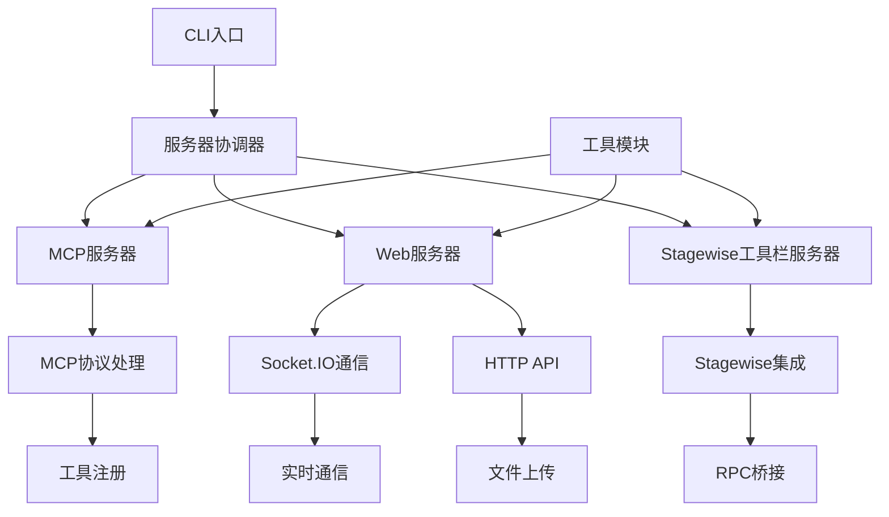

# 后端模块文档导航

## 📋 后端模块组概述

后端模块提供了 MCP 协议实现、Web 服务、Stagewise 工具栏集成和各种基础设施服务。

## 📋 本模块文档列表

### 服务器模块组
- **[服务器模块详细文档](./服务器/index.md)** - 核心服务器实现和协调管理

### 工具模块组
- **[工具模块详细文档](./工具/index.md)** - 基础工具和辅助服务

## 🏗️ 后端架构概览

## 🎯 重点模块推荐

基于模块重要性和复杂度，建议优先了解：

1. **MCP服务器模块** - 核心协议实现和工具注册
2. **Web服务器模块** - Socket.IO集成和会话管理  
3. **服务器协调器** - 多服务器实例管理
4. **工具模块集合** - 基础设施和辅助功能

## 🧭 导航链接

- **📋 [返回主目录](../../README.md)** - 返回文档导航中心
- **🔧 [返回模块层目录](../index.md)** - 返回模块层导航
- **🎨 [前端模块文档](../前端模块/index.md)** - 查看前端模块分析
- **🔄 [交互层文档](../../交互层/index.md)** - 查看模块交互分析

---

*后端模块导航最后更新: 2024年1月* 