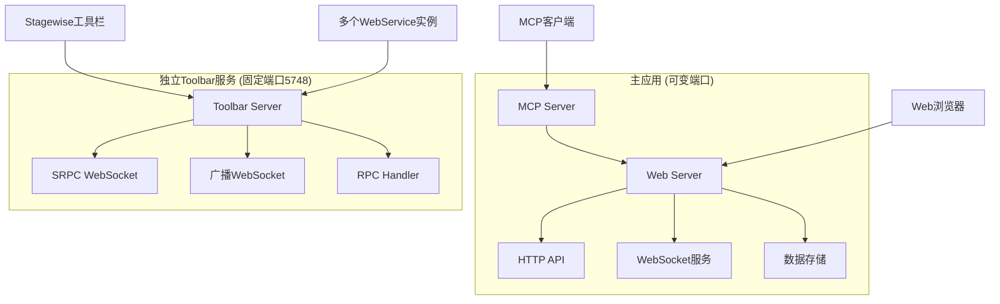

# 后端模块

## 模块概述

后端模块是MCP Feedback Collector的核心架构，采用双服务器设计：主Web服务器处理核心业务逻辑，独立Toolbar服务器专门处理工具栏集成。这种解耦设计确保了系统的可扩展性和维护性。

## 核心架构

### 双服务器架构


## 模块结构

### 🖥️ 服务器层
- **[服务器](服务器/index.md)** - 核心服务器组件
  - 主Web服务器 (Express.js + Socket.IO)
  - 独立Toolbar服务器 (WebSocket + SRPC)
  - RPC处理器组件

### 🗄️ 数据层
- **[数据层](数据层/index.md)** - 数据存储和管理
  - SQLite数据库操作
  - 数据模型定义
  - 存储策略

### 🔧 工具类
- **[工具类](工具类/index.md)** - 通用工具和辅助类
  - 日志系统
  - 端口管理
  - 文件处理工具

## 技术特点

### 主应用服务器
- **MCP协议支持**: 完整的MCP服务器实现
- **Web服务**: Express.js + Socket.IO
- **数据存储**: SQLite + Better-SQLite3
- **实时通信**: WebSocket双向通信
- **文件处理**: 多媒体文件上传和处理

### 独立Toolbar服务器
- **SRPC通信**: 与Stagewise工具栏的标准通信协议
- **Prompt广播**: 实时广播到所有WebService实例
- **固定端口**: 5748端口解决服务发现问题
- **多客户端**: 支持多个WebService同时连接

## 服务通信

### 内部通信
- MCP Server ↔ Web Server: 数据共享和状态同步
- Web Server ↔ 数据层: 数据持久化操作
- 工具类: 为各层提供通用功能支持

### 外部通信
- **MCP协议**: 与MCP客户端的标准通信
- **HTTP/WebSocket**: 与Web前端的通信
- **SRPC**: 与Stagewise工具栏的通信
- **广播机制**: 向多个WebService实例分发prompt

## 部署策略

### 开发环境
```bash
# 启动主应用
npm run dev

# 启动独立Toolbar服务
cd toolbar && npm run dev
```

### 生产环境
```bash
# 主应用
npm run build && npm start

# 独立Toolbar服务
cd toolbar && npm run build && npm start
```

### Docker部署
```dockerfile
# 支持多服务容器部署
# 主应用和Toolbar服务可分别容器化
```

## 性能特性

### 并发处理
- **主应用**: 支持多MCP客户端并发连接
- **Toolbar服务**: 支持多WebService实例同时接收广播
- **会话隔离**: 每个客户端独立的数据和状态管理

### 资源优化
- **内存管理**: 智能的连接和数据清理
- **端口策略**: 主应用动态分配，Toolbar固定端口
- **负载均衡**: 支持多实例部署和负载分担

## 监控和维护

### 健康检查
- 主应用: `/api/health`
- Toolbar服务: `/health`
- 状态监控: 连接数、资源使用、错误统计

### 日志系统
- 分层日志记录
- 错误追踪和调试
- 性能指标监控

## 🧭 导航链接

### 📁 子模块
- [服务器](服务器/index.md) - 核心服务器组件
- [数据层](数据层/index.md) - 数据存储和管理  
- [工具类](工具类/index.md) - 通用工具和辅助类

### 📄 相关文档
- [前端模块](../前端模块/index.md) - 前端组件系统
- [根目录](../index.md) - 模块层总览
- [项目根目录](../../index.md) - 项目文档首页

---

*后端模块导航最后更新: 2024年1月* 