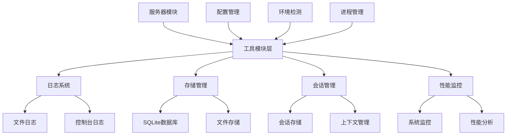

# 后端工具模块详细文档

## 📋 工具模块概述

后端工具模块提供了各种基础设施服务和辅助功能，支撑整个系统的稳定运行。

## 🛠️ 核心工具组件

### 日志系统 (logger.ts)
- **文件**: `src/utils/logger.ts`
- **功能**: 统一的日志管理系统
- **特性**:
  - 多级别日志记录 (DEBUG, INFO, WARN, ERROR)
  - 文件输出和控制台输出
  - 日志轮转和归档
  - 结构化日志格式

### 会话存储管理 (session-storage.ts)
- **文件**: `src/utils/session-storage.ts`
- **功能**: 会话数据存储和管理
- **特性**:
  - 基于 SQLite 的数据存储
  - 会话数据持久化
  - 数据加密和安全
  - 自动清理过期数据

### 提示词管理器 (prompt-manager.ts)
- **文件**: `src/utils/prompt-manager.ts`
- **功能**: 提示词管理和处理
- **特性**:
  - 提示词模板管理
  - 动态内容替换
  - 提示词分类和搜索
  - 版本控制和历史记录

### 图片处理器 (image-processor.ts)
- **文件**: `src/utils/image-processor.ts`
- **功能**: 图片上传、压缩和处理
- **特性**:
  - 多格式图片支持
  - 自动压缩和优化
  - 缩略图生成
  - 图片元数据提取

### 客户端识别器 (client-identifier.ts)
- **文件**: `src/utils/client-identifier.ts`
- **功能**: 客户端识别和环境检测
- **特性**:
  - 客户端类型识别
  - 环境参数检测
  - 用户代理分析
  - 设备信息收集

### 端口管理器 (port-manager.ts)
- **文件**: `src/utils/port-manager.ts`
- **功能**: 端口分配和管理
- **特性**:
  - 自动端口分配
  - 端口冲突检测
  - 端口使用监控
  - 动态端口释放

### 性能监控器 (performance-monitor.ts)
- **文件**: `src/utils/performance-monitor.ts`
- **功能**: 性能监控和指标收集
- **特性**:
  - 系统资源监控
  - 响应时间统计
  - 内存使用分析
  - 性能报告生成

### 进程管理器 (process-manager.ts)
- **文件**: `src/utils/process-manager.ts`
- **功能**: 进程生命周期管理
- **特性**:
  - 子进程创建和管理
  - 进程间通信
  - 优雅关闭处理
  - 进程状态监控

### 运行模式检测器 (mode-detector.ts)
- **文件**: `src/utils/mode-detector.ts`
- **功能**: 运行模式检测和配置
- **特性**:
  - 开发/生产模式检测
  - 环境变量解析
  - 配置自动加载
  - 模式切换支持

### 提示词数据库 (prompt-database.ts)
- **文件**: `src/utils/prompt-database.ts`
- **功能**: 提示词数据库管理
- **特性**:
  - 提示词存储和检索
  - 数据库事务处理
  - 索引优化
  - 数据迁移支持

### 会话上下文管理 (session-context.ts)
- **文件**: `src/utils/session-context.ts`
- **功能**: 会话上下文管理
- **特性**:
  - 上下文数据管理
  - 会话状态跟踪
  - 上下文继承
  - 数据序列化

### 默认场景配置 (default-scenes.ts)
- **文件**: `src/utils/default-scenes.ts`
- **功能**: 默认场景配置管理
- **特性**:
  - 预设场景模板
  - 场景配置验证
  - 动态场景生成
  - 场景导入导出

## 🔄 工具模块架构

## 📊 工具模块特性

### 高可用性设计
- 故障容错和自动恢复
- 资源泄露防护
- 异常处理和日志记录
- 优雅关闭和资源清理

### 性能优化
- 内存使用优化
- I/O 操作异步化
- 缓存策略实现
- 批量处理支持

### 安全性保障
- 数据加密存储
- 输入验证和过滤
- 权限检查和控制
- 安全日志记录

### 可扩展性
- 模块化设计
- 插件式架构
- 配置驱动功能
- 接口标准化

## 🧭 导航链接

- **📋 [返回后端模块导航](../index.md)** - 返回后端模块主目录
- **🔧 [返回模块层目录](../../index.md)** - 返回模块层导航
- **🔧 [服务器模块文档](../服务器/index.md)** - 查看服务器模块分析
- **🎨 [前端模块文档](../../前端模块/index.md)** - 查看前端模块分析

---

*后端工具模块文档最后更新: 2024年1月* 