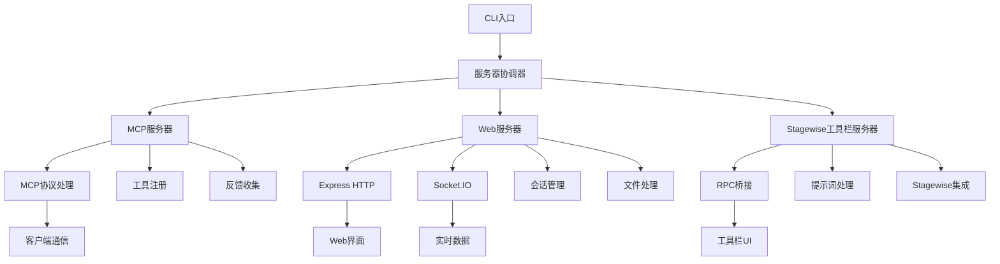

# 后端服务器模块详细文档

## 📋 服务器模块概述

后端服务器模块是整个系统的核心，负责 MCP 协议实现、Web 服务提供、实时通信和 Stagewise 工具栏集成。

## 🔧 核心服务器组件

### MCP 协议服务器 (mcp-server.ts)
- **文件**: `src/server/mcp-server.ts` (18KB, 632行)
- **功能**: MCP 协议的核心实现
- **职责**:
  - MCP 客户端连接管理
  - 工具注册和调用处理
  - HTTP/Stdio 传输支持
  - 反馈收集工具实现

**核心类和方法**:
```typescript
class MCPServer {
  start(): Promise<void>              // 启动服务器
  collectFeedback(): Promise<string>  // 收集反馈工具
  createMcpServerInstance()          // 创建MCP实例
}
```

### Web 服务器 (web-server.ts)
- **文件**: `src/server/web-server.ts` (53KB, 1661行)
- **功能**: Web服务器和Socket.IO实现
- **职责**:
  - HTTP 服务提供
  - Socket.IO 实时通信
  - 会话管理和客户端隔离
  - 文件上传和图片处理

**核心功能模块**:
```typescript
class WebServer {
  setupExpress()      // Express服务器配置
  setupSocketIO()     // Socket.IO配置
  handleFileUpload()  // 文件上传处理
  manageSession()     // 会话管理
}
```

### Stagewise 工具栏服务器 (toolbar-server.ts)
- **文件**: `src/server/toolbar-server.ts` (11KB, 384行)
- **功能**: Stagewise工具栏集成服务
- **职责**:
  - RPC 桥接服务
  - 提示词处理和转发
  - 工具栏通信协议

**集成架构**:
```typescript
class ToolbarServer {
  setupRPCBridge()    // RPC桥接设置
  handlePrompts()     // 提示词处理
  manageToolbar()     // 工具栏管理
}
```

### 服务器协调器 (server-coordinator.ts)
- **文件**: `src/server/server-coordinator.ts` (8.4KB, 318行)
- **功能**: 多服务器实例协调管理
- **职责**:
  - 服务器生命周期管理
  - 资源分配和优化
  - 客户端隔离策略

### Stdio 服务器启动器 (stdio-server-launcher.ts)
- **文件**: `src/server/stdio-server-launcher.ts` (7.9KB, 283行)
- **功能**: Stdio模式专用启动器
- **职责**:
  - 多客户端环境处理
  - 资源优化和性能监控

### Web 服务器管理器 (web-server-manager.ts)
- **文件**: `src/server/web-server-manager.ts`
- **功能**: Web服务器实例管理
- **职责**:
  - 服务器实例创建和销毁
  - 端口管理和冲突解决

## 🔄 服务器交互架构



## 📊 服务器性能特性

### 并发处理能力
- 支持多客户端同时连接
- 会话隔离和数据安全
- 资源优化和内存管理

### 通信协议支持
- **HTTP**: RESTful API 和文件上传
- **WebSocket**: 实时双向通信
- **Stdio**: 标准输入输出模式
- **RPC**: 远程过程调用

### 错误处理和恢复
- 优雅的错误处理机制
- 自动重连和故障恢复
- 详细的日志记录和监控

## 🧭 导航链接

- **📋 [返回后端模块导航](../index.md)** - 返回后端模块主目录
- **🔧 [返回模块层目录](../../index.md)** - 返回模块层导航
- **🛠️ [工具模块文档](../工具/index.md)** - 查看工具模块分析
- **🎨 [前端模块文档](../../前端模块/index.md)** - 查看前端模块分析

---

*后端服务器模块文档最后更新: 2024年1月* 