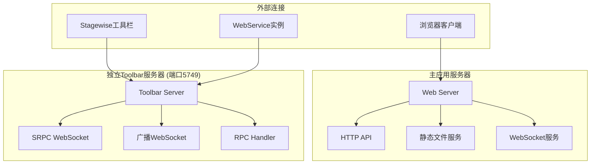

# 服务器模块

## 模块概述

服务器模块包含MCP Feedback Collector的核心服务器组件，负责处理HTTP请求、WebSocket通信、数据存储和外部服务集成。

## 核心服务器

### 1. 主Web服务器
- **[web-server.md](web-server.md)** - Express.js主服务器
  - HTTP API服务
  - 静态文件服务
  - 中间件配置
  - 路由管理

### 2. 独立Toolbar服务器
- **[toolbar-server.md](toolbar-server.md)** - 独立Toolbar服务
  - SRPC WebSocket通信
  - Prompt广播机制
  - 固定端口策略（5749）
  - 多客户端管理

## 处理器组件

### RPC处理器
- **[rpc-handler.md](rpc-handler.md)** - Toolbar RPC处理器
  - SRPC方法实现
  - Prompt广播处理
  - 会话信息管理
  - 广播回调机制

## 服务架构

### 双服务器架构


### 通信流程
1. **主服务器**: 处理Web界面和API请求
2. **独立Toolbar服务器**: 专门处理工具栏通信和prompt广播
3. **解耦设计**: 两个服务器完全独立，可单独部署和维护

## 技术特点

### 主Web服务器
- **技术栈**: Express.js + Socket.IO + SQLite
- **功能**: Web界面、API服务、数据存储
- **端口**: 可配置（默认3000）

### 独立Toolbar服务器
- **技术栈**: Node.js + WebSocket + SRPC
- **功能**: 工具栏通信、prompt广播
- **端口**: 固定5749端口

## 部署模式

### 开发环境
```bash
# 启动主服务器
npm run dev

# 启动独立Toolbar服务器
cd toolbar
npm run dev
```

### 生产环境
```bash
# 构建和启动主服务器
npm run build
npm start

# 构建和启动独立Toolbar服务器
cd toolbar
npm run build
npm start
```

## 服务发现

### 主服务器发现
- 通过配置文件或环境变量指定端口
- 支持动态端口分配

### Toolbar服务器发现
- 固定使用5749端口
- Stagewise工具栏通过 `/ping/stagewise` 端点发现
- 解决多服务实例的发现问题

## 监控和维护

### 健康检查
- 主服务器: `/api/health`
- Toolbar服务器: `/health`

### 状态监控
- 连接数统计
- 服务运行状态
- 错误日志记录

## 🧭 导航链接

### 📁 返回上级
- [后端模块](../index.md) - 后端模块总览

### 📄 相关文档
- [数据层](../数据层/index.md) - 数据存储和管理
- [工具类](../工具类/index.md) - 通用工具和辅助类
- [组件层](../../前端模块/组件层/index.md) - 前端组件系统

---

*后端服务器模块文档最后更新: 2024年1月* 