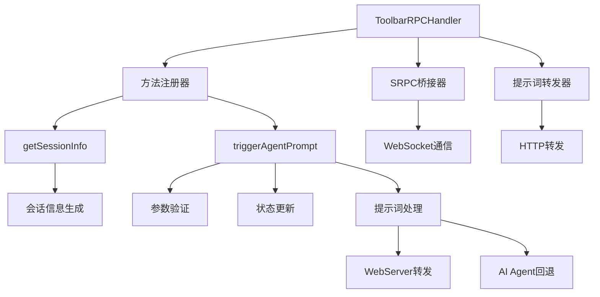
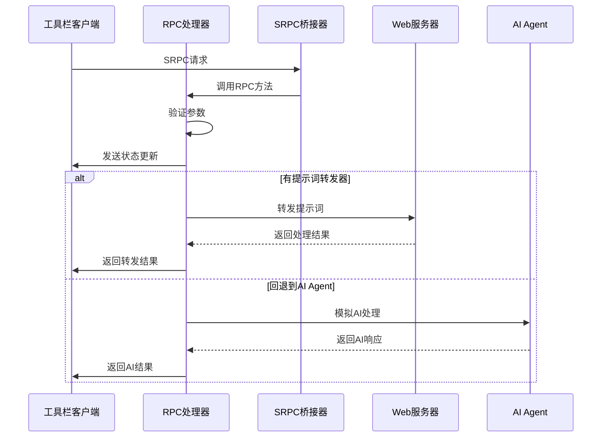

# ToolbarRPCHandler RPC处理器

## 处理器概述

**ToolbarRPCHandler** 是独立Toolbar服务器的RPC方法处理器，负责实现具体的RPC方法逻辑，处理来自Stagewise工具栏的SRPC请求。在独立服务架构中，它通过广播回调机制将prompt分发到所有连接的WebService实例。

- **文件路径**: `toolbar/src/toolbar/handlers/rpc-handler.ts`
- **处理器类型**: SRPC方法处理器
- **主要功能**: RPC方法实现、Prompt广播、会话管理

## 功能特性

### 核心功能
- **RPC方法注册**: 自动注册和管理RPC方法
- **会话信息管理**: 提供会话信息获取服务
- **Prompt广播处理**: 处理工具栏提示词并广播到所有WebService
- **广播回调机制**: 通过回调函数实现prompt的实时广播
- **实时更新**: 支持处理过程中的实时状态更新

### 支持的RPC方法
1. **getSessionInfo**: 获取当前会话信息
2. **triggerAgentPrompt**: 触发AI代理处理提示词

## 技术架构

### 处理器架构图


### RPC调用流程图


## 核心类定义

### ToolbarRPCHandler类
```typescript
export class ToolbarRPCHandler {
  private bridge: SRPCWebSocketBridge;
  private promptForwarder: PromptForwarder | undefined;

  constructor(bridge: SRPCWebSocketBridge, promptForwarder?: PromptForwarder) {
    this.bridge = bridge;
    this.promptForwarder = promptForwarder || undefined;
    this.registerMethods();
  }
}
```

### 提示词转发器类型
```typescript
type PromptForwarder = (promptData: {
  prompt: string;
  sessionId: string;
  model?: string;
  files?: any[];
  images?: any[];
  mode?: string;
  metadata?: any;
}) => Promise<any>;
```

## RPC方法实现

### 1. getSessionInfo方法

#### 方法签名
```typescript
private async getSessionInfo(
  request: any,
  sendUpdate: (update: any) => void,
): Promise<any>
```

#### 实现逻辑
```typescript
private async getSessionInfo(
  request: any,
  sendUpdate: (update: any) => void,
): Promise<any> {
  console.log('[Toolbar RPC] getSessionInfo called with request:', request);
  
  // 发送更新（可选）
  sendUpdate({
    status: 'gathering_session_info',
    message: 'Collecting session information...',
  });

  // 返回会话信息
  const sessionInfo = {
    sessionId: 'mcp-feedback-collector-session-' + Date.now(),
    appName: 'MCP Feedback Collector',
    displayName: 'MCP Feedback Collector - Toolbar Integration',
    port: process.env['PORT'] || 3000,
    version: '2.0.8',
    features: ['feedback-collection', 'ai-agent', 'toolbar-integration'],
  };

  console.log('[Toolbar RPC] Returning session info:', sessionInfo);
  return sessionInfo;
}
```

#### 返回数据结构
```typescript
interface SessionInfo {
  sessionId: string;        // 会话唯一标识
  appName: string;         // 应用名称
  displayName: string;     // 显示名称
  port: string | number;   // 服务端口
  version: string;         // 版本信息
  features: string[];      // 支持的功能列表
}
```

### 2. triggerAgentPrompt方法

#### 方法签名
```typescript
private async triggerAgentPrompt(
  request: any,
  sendUpdate: (update: any) => void,
): Promise<any>
```

#### 实现逻辑
```typescript
private async triggerAgentPrompt(
  request: any,
  sendUpdate: (update: any) => void,
): Promise<any> {
  console.log('[Toolbar RPC] triggerAgentPrompt called with request:', request);
  
  const { prompt, model, files, mode, images, sessionId } = request;

  // 发送处理更新
  sendUpdate({
    sessionId,
    updateText: 'Processing your prompt...',
    status: 'processing',
  });

  try {
    // 如果有prompt转发器，使用它转发到WebServer
    if (this.promptForwarder) {
      console.log('[Toolbar RPC] Forwarding prompt to WebServer...');
      
      sendUpdate({
        sessionId,
        updateText: 'Forwarding prompt to feedback system...',
        status: 'forwarding',
      });

      const forwardResult = await this.promptForwarder({
        prompt,
        sessionId: sessionId || `rpc_${Date.now()}`,
        model,
        files,
        images,
        mode,
        metadata: {
          source: 'toolbar_rpc',
          timestamp: Date.now(),
          rpcMethod: 'triggerAgentPrompt'
        }
      });

      sendUpdate({
        sessionId,
        updateText: 'Prompt forwarded successfully to feedback system',
        status: 'forwarded',
      });

      // 返回转发结果
      const result = {
        sessionId,
        result: {
          success: true,
          output: 'Prompt has been forwarded to the MCP Feedback Collector system. Please check the feedback interface for the prompt display.',
          forwardResult,
          metadata: {
            model: model || 'default',
            mode: mode || 'agent',
            processedAt: new Date().toISOString(),
            service: 'mcp-feedback-collector',
            version: '2.0.8',
            forwarded: true
          }
        },
      };

      console.log('[Toolbar RPC] Prompt forwarded successfully:', result);
      return result;

    } else {
      // 回退到模拟处理（兼容性）
      return await this.handleFallbackProcessing(request, sendUpdate);
    }

  } catch (error) {
    console.error('[Toolbar RPC] Error in triggerAgentPrompt:', error);
    
    sendUpdate({
      sessionId,
      updateText: `Error: ${error instanceof Error ? error.message : 'Unknown error'}`,
      status: 'error',
    });

    return {
      sessionId,
      result: {
        success: false,
        error: error instanceof Error ? error.message : 'Unknown error occurred',
        metadata: {
          processedAt: new Date().toISOString(),
          service: 'mcp-feedback-collector',
          version: '2.0.8'
        }
      },
    };
  }
}
```

#### 回退处理逻辑
```typescript
private async handleFallbackProcessing(request: any, sendUpdate: Function): Promise<any> {
  const { prompt, model, files, images, mode, sessionId } = request;
  
  console.log('[Toolbar RPC] No prompt forwarder available, using fallback simulation...');
  
  sendUpdate({
    sessionId,
    updateText: 'AI agent is working on your request...',
    status: 'ai_processing',
  });

  // 模拟AI处理
  await new Promise(resolve => setTimeout(resolve, 2000));

  // 生成响应
  let response = `MCP Feedback Collector AI Agent Response:\n\n`;
  response += `Prompt: "${prompt}"\n`;
  
  if (files && files.length > 0) {
    response += `Files referenced: ${files.join(', ')}\n`;
  }
  
  if (images && images.length > 0) {
    response += `Images processed: ${images.length} image(s)\n`;
  }
  
  response += `\nModel: ${model || 'default'}\n`;
  response += `Mode: ${mode || 'agent'}\n\n`;
  
  response += '--- AI Analysis ---\n';
  response += 'This is integrated with the MCP Feedback Collector system. ';
  response += 'The AI agent can now work with feedback data and provide enhanced responses. ';
  response += 'This demonstrates successful toolbar integration with the core MCP service.';

  // 返回结果
  return {
    sessionId,
    result: {
      success: true,
      output: response,
      metadata: {
        model: model || 'default',
        mode: mode || 'agent',
        processedAt: new Date().toISOString(),
        service: 'mcp-feedback-collector',
        version: '2.0.8',
        fallback: true
      }
    },
  };
}
```

## 通用RPC方法支持

### RPC方法接口
```typescript
interface RPCMethod {
  (request: any, sendUpdate: UpdateSender): Promise<any>;
}

interface UpdateSender {
  sendUpdate: (update: any) => void;
}
```

### 方法注册
```typescript
export const registerRPCMethod = (name: string, method: RPCMethod): void => {
  rpcMethods[name] = method;
  console.log(`[RPC] Registered method: ${name}`);
};
```

### 方法调用
```typescript
export const callRPCMethod = async (
  methodName: string, 
  request: any, 
  sessionId: string,
  sendUpdateCallback?: (update: any) => void
): Promise<any> => {
  const method = rpcMethods[methodName];
  
  if (!method) {
    throw new Error(`RPC method not found: ${methodName}`);
  }

  const updateSender = {
    sendUpdate: (update: any) => {
      if (sendUpdateCallback) {
        sendUpdateCallback({
          sessionId,
          ...update,
          timestamp: new Date().toISOString()
        });
      }
    }
  };

  try {
    console.log(`[RPC] Calling method: ${methodName}`);
    const result = await method(request, updateSender.sendUpdate);
    console.log(`[RPC] Method ${methodName} completed successfully`);
    return result;
  } catch (error) {
    console.error(`[RPC] Method ${methodName} failed:`, error);
    throw error;
  }
};
```

## 状态更新机制

### 更新消息类型
```typescript
interface UpdateMessage {
  sessionId: string;
  updateText: string;
  status: 'processing' | 'forwarding' | 'forwarded' | 'ai_processing' | 'completed' | 'error';
  timestamp?: string;
  result?: any;
}
```

### 状态更新流程
1. **processing**: 开始处理请求
2. **forwarding**: 正在转发到Web服务器
3. **forwarded**: 转发完成
4. **ai_processing**: AI代理处理中
5. **completed**: 处理完成
6. **error**: 处理出错

## 错误处理

### 统一错误处理
```typescript
try {
  // RPC方法执行
  const result = await method(request, sendUpdate);
  return result;
} catch (error) {
  console.error('[Toolbar RPC] Error in method:', error);
  
  sendUpdate({
    sessionId,
    updateText: `Error: ${error instanceof Error ? error.message : 'Unknown error'}`,
    status: 'error',
  });

  return {
    sessionId,
    result: {
      success: false,
      error: error instanceof Error ? error.message : 'Unknown error occurred',
      metadata: {
        processedAt: new Date().toISOString(),
        service: 'mcp-feedback-collector'
      }
    },
  };
}
```

### 错误类型
- **参数验证错误**: 缺少必需参数或参数类型错误
- **转发错误**: 转发到Web服务器失败
- **AI处理错误**: AI代理处理失败
- **网络错误**: 网络连接或通信错误

## 性能优化

### 异步处理
- **非阻塞调用**: 所有RPC方法都是异步的
- **状态更新**: 实时向客户端发送处理状态
- **错误恢复**: 优雅的错误处理和恢复机制

### 内存管理
- **及时清理**: 处理完成后及时清理临时数据
- **避免泄漏**: 正确处理Promise和回调
- **资源复用**: 复用连接和处理器实例

## 集成示例

### 基本使用
```typescript
import { ToolbarRPCHandler } from './handlers/rpc-handler.js';
import { createSRPCBridge } from './bridge/srpc-websocket-bridge.js';

// 创建SRPC桥接器
const bridge = createSRPCBridge(httpServer);

// 创建RPC处理器
const rpcHandler = new ToolbarRPCHandler(bridge, promptForwarder);

// RPC处理器会自动注册方法到桥接器
console.log('已注册的方法:', bridge.getRegisteredMethods());
```

### 自定义提示词转发器
```typescript
const customPromptForwarder = async (promptData) => {
  // 自定义转发逻辑
  const response = await fetch('http://localhost:3000/api/custom-prompt', {
    method: 'POST',
    headers: { 'Content-Type': 'application/json' },
    body: JSON.stringify(promptData)
  });
  
  return await response.json();
};

const rpcHandler = new ToolbarRPCHandler(bridge, customPromptForwarder);
```

### 添加自定义RPC方法
```typescript
// 注册自定义方法
registerRPCMethod('customMethod', async (request, sendUpdate) => {
  sendUpdate({ status: 'processing', message: 'Processing custom request...' });
  
  // 自定义处理逻辑
  const result = await processCustomRequest(request);
  
  return {
    success: true,
    data: result
  };
});
```

## 测试支持

### 单元测试示例
```typescript
describe('ToolbarRPCHandler', () => {
  let rpcHandler: ToolbarRPCHandler;
  let mockBridge: SRPCWebSocketBridge;
  let mockForwarder: PromptForwarder;

  beforeEach(() => {
    mockBridge = createMockBridge();
    mockForwarder = jest.fn();
    rpcHandler = new ToolbarRPCHandler(mockBridge, mockForwarder);
  });

  it('should handle getSessionInfo correctly', async () => {
    const request = {};
    const sendUpdate = jest.fn();
    
    const result = await rpcHandler.getSessionInfo(request, sendUpdate);
    
    expect(result).toHaveProperty('sessionId');
    expect(result).toHaveProperty('appName');
    expect(sendUpdate).toHaveBeenCalled();
  });

  it('should forward prompts when forwarder is available', async () => {
    const request = {
      prompt: 'Test prompt',
      sessionId: 'test-session'
    };
    const sendUpdate = jest.fn();
    
    const result = await rpcHandler.triggerAgentPrompt(request, sendUpdate);
    
    expect(mockForwarder).toHaveBeenCalledWith(expect.objectContaining({
      prompt: 'Test prompt',
      sessionId: 'test-session'
    }));
    expect(result.result.success).toBe(true);
  });
});
```

## 故障排除

### 常见问题
1. **方法未注册**: 检查方法是否正确注册到桥接器
2. **转发失败**: 检查Web服务器是否运行和网络连接
3. **参数错误**: 验证传入的请求参数格式

### 调试技巧
- **启用详细日志**: 查看控制台输出的详细日志
- **检查网络**: 使用网络工具检查HTTP请求
- **模拟测试**: 使用模拟数据测试各个方法

## 🧭 导航链接

- **📋 [返回主目录](../../../README.md)** - 返回文档导航中心
- **🔧 [返回服务器目录](./index.md)** - 返回服务器文档导航
- **🔧 [返回后端模块目录](../index.md)** - 返回后端模块导航
- **🏗️ [Toolbar服务器文档](./toolbar-server.md)** - 查看Toolbar服务器详细文档
- **🤖 [AI Agent文档](./ai-agent.md)** - 查看AI Agent详细文档 