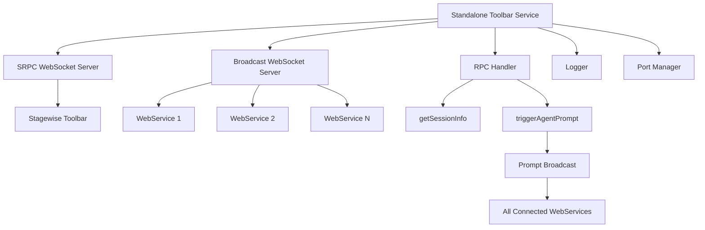
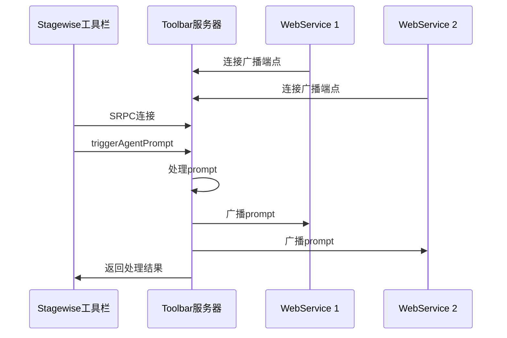

# 独立Toolbar服务器

## 服务器概述

**独立Toolbar服务器** 是从MCP Feedback Collector主应用中分离出来的独立服务，专门处理Stagewise工具栏的SRPC通信和Prompt广播功能。该服务运行在固定端口5749上，解决了多服务发现的问题。

- **服务名称**: Standalone Toolbar Service
- **固定端口**: 5749
- **技术栈**: Node.js + TypeScript + WebSocket + SRPC
- **主要功能**: SRPC通信、Prompt广播、多客户端管理

## 功能特性

### 核心功能
- **SRPC WebSocket通信**: 与Stagewise工具栏建立SRPC连接
- **Prompt广播机制**: 将拦截的prompt实时广播到所有WebService
- **双WebSocket支持**: 
  - SRPC端点(/)：用于工具栏连接
  - 广播端点(/broadcast)：用于WebService连接
- **固定端口策略**: 使用5749端口解决服务发现问题
- **多客户端管理**: 支持多个WebService同时连接接收广播
- **优雅关闭**: 支持SIGINT和SIGTERM信号的优雅关闭

### 技术特点
- **独立部署**: 完全独立于主应用，可单独启动和管理
- **实时通信**: 基于WebSocket的实时双向通信
- **类型安全**: 完整的TypeScript类型定义
- **日志记录**: 详细的操作日志和调试信息
- **健康检查**: 提供服务状态监控端点

## 技术架构

### 服务架构图


### 通信流程图


## 核心类定义

### ToolbarServer类
```typescript
export class ToolbarServer {
  private server: http.Server;
  private srpcWss: WebSocket.Server;
  private broadcastWss: WebSocket.Server;
  private rpcHandler: ToolbarRPCHandler;
  private broadcastClients: Set<WebSocket>;
  private logger: Logger;

  constructor(
    port: number = 5749,
    logger?: Logger
  ) {
    this.logger = logger || new Logger('ToolbarServer');
    this.broadcastClients = new Set();
    // ... 初始化逻辑
  }
}
```

### 广播数据类型
```typescript
interface PromptBroadcastData {
  prompt: string;
  sessionId: string;
  timestamp: number;
  model?: string;
  files?: any[];
  images?: any[];
  mode?: string;
  metadata?: any;
}

type PromptBroadcastCallback = (data: PromptBroadcastData) => void;
```

## 服务器实现

### 1. 服务器初始化
```typescript
public async start(): Promise<void> {
  return new Promise((resolve, reject) => {
    try {
      // 创建HTTP服务器
      this.server = http.createServer();
      
      // 创建SRPC WebSocket服务器
      this.srpcWss = new WebSocket.Server({
        server: this.server,
        path: '/'
      });
      
      // 创建广播WebSocket服务器
      this.broadcastWss = new WebSocket.Server({
        server: this.server,
        path: '/broadcast'
      });
      
      this.setupSRPCWebSocket();
      this.setupBroadcastWebSocket();
      this.setupHTTPRoutes();
      
      this.server.listen(this.port, () => {
        this.logger.info(`Standalone Toolbar Server started on port ${this.port}`);
        resolve();
      });
    } catch (error) {
      reject(error);
    }
  });
}
```

### 2. SRPC WebSocket设置
```typescript
private setupSRPCWebSocket(): void {
  this.srpcWss.on('connection', (ws: WebSocket) => {
    this.logger.info('SRPC client connected');
    
    // 创建SRPC桥接器
    const bridge = new SRPCWebSocketBridge(ws, this.logger);
    
    // 创建RPC处理器（带广播回调）
    this.rpcHandler = new ToolbarRPCHandler(
      bridge, 
      this.broadcastPromptToClients.bind(this)
    );
    
    ws.on('close', () => {
      this.logger.info('SRPC client disconnected');
    });
  });
}
```

### 3. 广播WebSocket设置
```typescript
private setupBroadcastWebSocket(): void {
  this.broadcastWss.on('connection', (ws: WebSocket) => {
    this.broadcastClients.add(ws);
    this.logger.info(`Broadcast client connected. Total clients: ${this.broadcastClients.size}`);
    
    // 发送欢迎消息
    ws.send(JSON.stringify({
      type: 'welcome',
      message: 'Connected to Toolbar Prompt Broadcast',
      timestamp: Date.now()
    }));
    
    ws.on('close', () => {
      this.broadcastClients.delete(ws);
      this.logger.info(`Broadcast client disconnected. Total clients: ${this.broadcastClients.size}`);
    });
    
    ws.on('error', (error) => {
      this.logger.error('Broadcast WebSocket error:', error);
      this.broadcastClients.delete(ws);
    });
  });
}
```

### 4. Prompt广播实现
```typescript
private broadcastPromptToClients(data: PromptBroadcastData): void {
  const message = JSON.stringify({
    type: 'prompt',
    ...data
  });
  
  this.logger.info(`Broadcasting prompt to ${this.broadcastClients.size} clients`);
  
  // 广播到所有连接的客户端
  this.broadcastClients.forEach((client) => {
    if (client.readyState === WebSocket.OPEN) {
      try {
        client.send(message);
      } catch (error) {
        this.logger.error('Error sending broadcast message:', error);
        this.broadcastClients.delete(client);
      }
    } else {
      // 清理无效连接
      this.broadcastClients.delete(client);
    }
  });
}
```

### 5. HTTP路由设置
```typescript
private setupHTTPRoutes(): void {
  this.server.on('request', (req: http.IncomingMessage, res: http.ServerResponse) => {
    const url = req.url || '';
    
    // 健康检查
    if (url === '/health' || url === '/ping') {
      res.writeHead(200, { 'Content-Type': 'application/json' });
      res.end(JSON.stringify({
        status: 'ok',
        service: 'standalone-toolbar-service',
        port: this.port,
        timestamp: new Date().toISOString(),
        clients: {
          srpc: this.srpcWss.clients.size,
          broadcast: this.broadcastClients.size
        }
      }));
      return;
    }
    
    // Stagewise工具栏发现端点
    if (url === '/ping/stagewise') {
      res.writeHead(200, { 'Content-Type': 'application/json' });
      res.end(JSON.stringify({
        service: 'mcp-feedback-collector-toolbar',
        version: '1.0.0',
        capabilities: ['srpc', 'prompt-broadcast'],
        endpoints: {
          srpc: `ws://localhost:${this.port}/`,
          broadcast: `ws://localhost:${this.port}/broadcast`
        }
      }));
      return;
    }
    
    // 404处理
    res.writeHead(404, { 'Content-Type': 'text/plain' });
    res.end('Not Found');
  });
}
```

## 主入口程序

### StandaloneToolbarService类
```typescript
export class StandaloneToolbarService {
  private toolbarServer: ToolbarServer;
  private logger: Logger;
  private isShuttingDown: boolean = false;

  constructor() {
    this.logger = new Logger('StandaloneService');
    this.toolbarServer = new ToolbarServer(5749, this.logger);
    this.setupGracefulShutdown();
  }

  public async start(): Promise<void> {
    try {
      await this.toolbarServer.start();
      this.logger.info('Standalone Toolbar Service is running');
    } catch (error) {
      this.logger.error('Failed to start service:', error);
      throw error;
    }
  }

  private setupGracefulShutdown(): void {
    const shutdown = async (signal: string) => {
      if (this.isShuttingDown) return;
      this.isShuttingDown = true;
      
      this.logger.info(`Received ${signal}, shutting down gracefully...`);
      
      try {
        await this.toolbarServer.stop();
        this.logger.info('Service stopped successfully');
        process.exit(0);
      } catch (error) {
        this.logger.error('Error during shutdown:', error);
        process.exit(1);
      }
    };

    process.on('SIGINT', () => shutdown('SIGINT'));
    process.on('SIGTERM', () => shutdown('SIGTERM'));
  }
}
```

### 启动函数
```typescript
async function main(): Promise<void> {
  const service = new StandaloneToolbarService();
  
  try {
    await service.start();
  } catch (error) {
    console.error('Failed to start Standalone Toolbar Service:', error);
    process.exit(1);
  }
}

// 如果直接运行此文件，启动服务
if (require.main === module) {
  main().catch(console.error);
}
```

## API端点

### 健康检查端点
- **路径**: `/health` 或 `/ping`
- **方法**: GET
- **响应**: 
```json
{
  "status": "ok",
  "service": "standalone-toolbar-service", 
  "port": 5749,
  "timestamp": "2024-12-18T10:30:00.000Z",
  "clients": {
    "srpc": 1,
    "broadcast": 2
  }
}
```

### Stagewise发现端点
- **路径**: `/ping/stagewise`
- **方法**: GET
- **响应**:
```json
{
  "service": "mcp-feedback-collector-toolbar",
  "version": "1.0.0", 
  "capabilities": ["srpc", "prompt-broadcast"],
  "endpoints": {
    "srpc": "ws://localhost:5749/",
    "broadcast": "ws://localhost:5749/broadcast"
  }
}
```

## WebSocket端点

### SRPC端点
- **路径**: `ws://localhost:5749/`
- **协议**: SRPC over WebSocket
- **用途**: Stagewise工具栏连接

### 广播端点
- **路径**: `ws://localhost:5749/broadcast`
- **协议**: 普通WebSocket
- **用途**: WebService连接接收prompt广播

## 部署和使用

### 安装依赖
```bash
cd toolbar
npm install
```

### 启动服务
```bash
# 开发模式
npm run dev

# 生产模式
npm run build
npm start
```

### 集成示例
WebService连接广播端点的示例代码：
```typescript
const ws = new WebSocket('ws://localhost:5749/broadcast');

ws.on('message', (data) => {
  const message = JSON.parse(data.toString());
  
  if (message.type === 'prompt') {
    console.log('收到新的prompt:', message.prompt);
    // 处理prompt逻辑
  }
});
```

## 性能监控

### 连接统计
- SRPC连接数：通常为1（工具栏）
- 广播连接数：等于活跃WebService数量
- 内存使用：约10-20MB
- CPU使用：空闲时<1%

### 日志监控
服务提供详细的日志记录，包括：
- 客户端连接/断开
- Prompt广播事件
- 错误和异常
- 性能指标

## 故障排除

### 常见问题
1. **端口占用**: 确保5749端口未被其他服务占用
2. **连接失败**: 检查防火墙设置和网络连接
3. **广播失败**: 查看日志确认WebSocket连接状态
4. **内存泄漏**: 定期检查无效连接清理

### 调试技巧
- 启用详细日志：设置环境变量 `DEBUG=true`
- 监控连接数：访问 `/health` 端点
- 测试广播：使用WebSocket客户端工具连接 `/broadcast` 端点

## 🧭 导航链接

- **📋 [返回服务器模块导航](./index.md)** - 返回服务器模块主目录
- **🔧 [返回后端模块导航](../index.md)** - 返回后端模块导航
- **🔧 [返回模块层目录](../../index.md)** - 返回模块层导航
- **📋 [返回主目录](../../../README.md)** - 返回文档导航中心

---

*独立Toolbar服务器文档最后更新: 2024年12月*
 