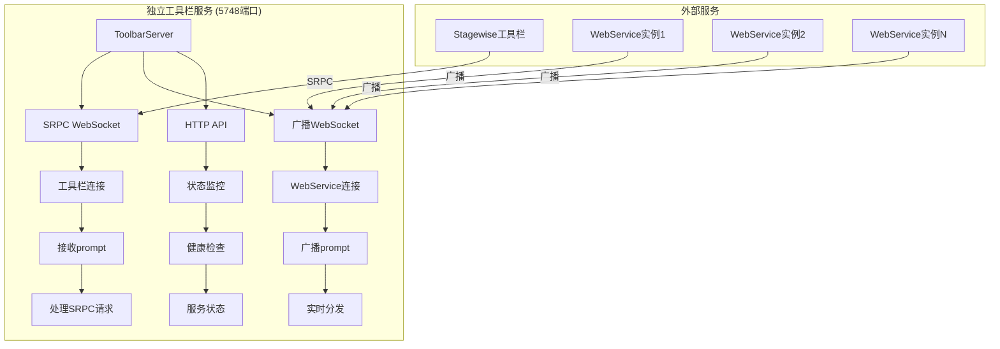
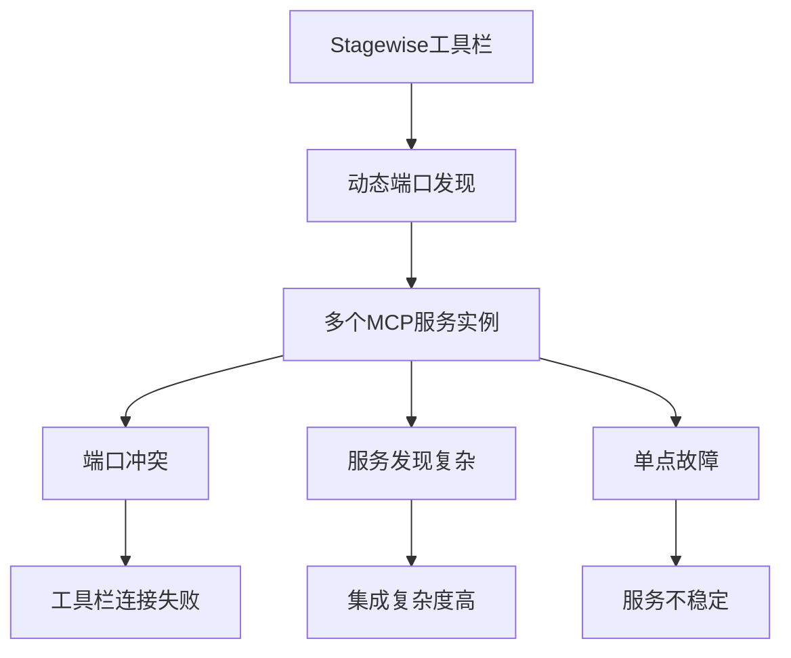
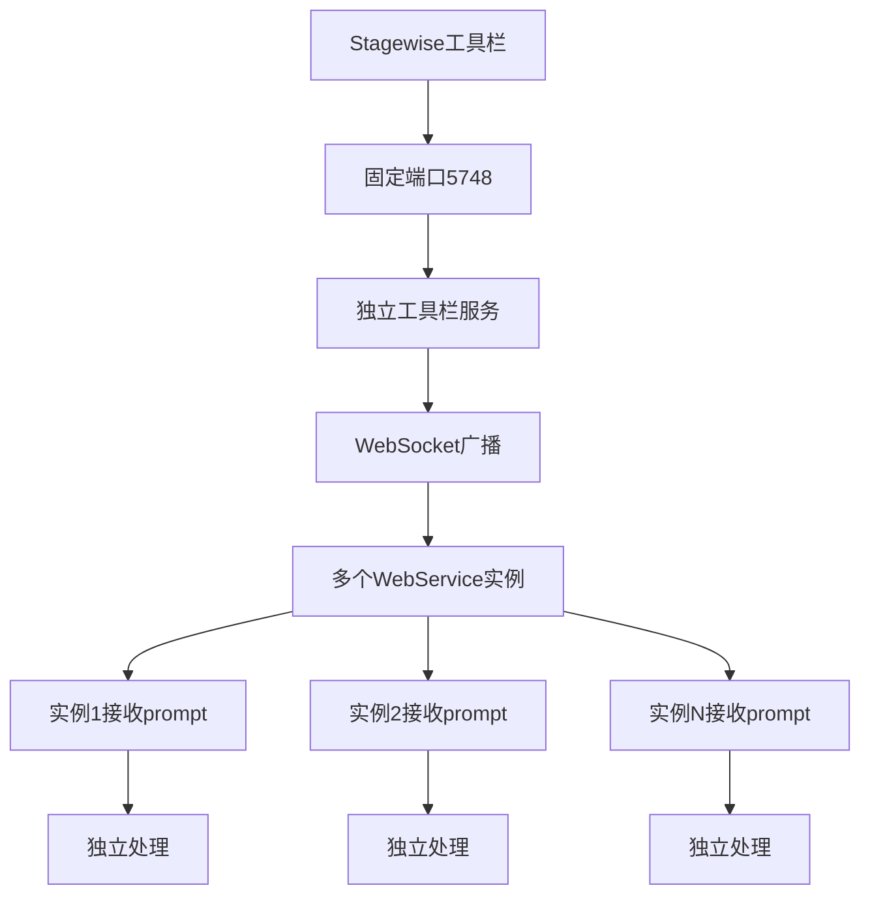
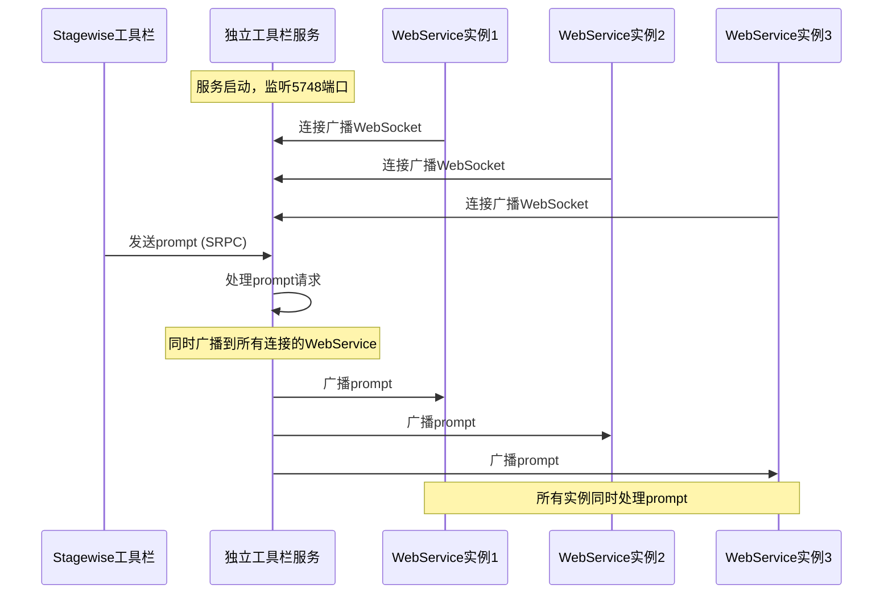

# 独立工具栏服务

## 服务介绍

独立工具栏服务是从MCP Feedback Collector主项目中完全解耦出来的独立服务，专门为解决多服务环境下的Stagewise工具栏集成问题而设计。通过创新的双WebSocket架构和固定端口策略，实现了完美的服务解耦和多实例支持。

### 核心价值

- **彻底解耦**: 从主项目中完全独立，可单独部署、更新和维护
- **多服务支持**: 支持多个WebService实例同时接收工具栏prompt
- **固定端口策略**: 使用5748端口，彻底解决动态端口带来的服务发现问题
- **即插即用**: 启动即可使用，无需复杂配置

## 技术特性

### 🚀 创新架构设计

#### 双WebSocket架构


#### 固定端口策略
- **端口**: 5748 (固定不变)
- **优势**: 无需动态发现，简化集成
- **兼容性**: 完全兼容现有Stagewise工具栏

### 🔄 通信机制

#### SRPC WebSocket通信
- **端点**: `ws://localhost:5748`
- **协议**: Stagewise标准SRPC协议
- **功能**: 接收工具栏的prompt请求

#### 广播WebSocket通信
- **端点**: `ws://localhost:5748/broadcast`
- **协议**: 自定义JSON消息格式
- **功能**: 向所有WebService实例广播prompt

#### HTTP RESTful API
- **健康检查**: `GET /health`
- **服务状态**: `GET /api/toolbar/status`
- **最新Prompt**: `GET /api/latest-prompt`
- **客户端列表**: `GET /api/clients`
- **服务发现**: `GET /ping/stagewise`

### 🛡️ 可靠性保证

#### 连接管理
- **自动检测**: 实时检测连接状态
- **自动清理**: 清理断开的连接
- **心跳机制**: 保持连接活跃

#### 错误处理
- **优雅降级**: 部分功能故障不影响整体服务
- **详细日志**: 完整的错误追踪和调试信息
- **自动恢复**: 连接断开后自动重连

## 解耦设计

### 问题背景

#### 原有集成架构的问题


#### 解耦后的架构优势


### 解耦优势

#### 1. 部署独立性
- **独立部署**: 可以单独部署和更新
- **版本控制**: 独立的版本管理
- **故障隔离**: 故障不影响主项目

#### 2. 扩展性
- **水平扩展**: 支持多个WebService实例
- **负载均衡**: 自然的负载分散
- **弹性伸缩**: 动态增减实例

#### 3. 维护性
- **简化维护**: 独立的代码库和文档
- **专注功能**: 专门处理工具栏集成
- **测试独立**: 独立的测试和验证

## 多服务支持

### 工作原理

#### 广播机制


#### 连接管理
- **动态连接**: WebService实例可以随时连接和断开
- **状态跟踪**: 实时跟踪每个连接的状态
- **自动清理**: 自动清理断开的连接

### 使用场景

#### 1. 开发环境
- **多个开发者**: 每个开发者运行自己的WebService实例
- **同时调试**: 所有实例同时收到工具栏prompt
- **独立开发**: 不影响其他开发者的工作

#### 2. 测试环境
- **A/B测试**: 不同版本的服务同时运行
- **压力测试**: 多实例并发处理
- **功能验证**: 独立验证各个功能模块

#### 3. 生产环境
- **高可用**: 多实例部署，提高可用性
- **负载分散**: 自然的负载分散机制
- **故障恢复**: 单个实例故障不影响整体服务

## 部署配置

### 环境要求

#### 系统要求
- **Node.js**: 版本 >= 18.0.0
- **操作系统**: Windows, macOS, Linux
- **内存**: 最少 128MB
- **存储**: 最少 50MB

#### 网络要求
- **端口**: 5748 (需要可访问)
- **防火墙**: 允许5748端口的入站连接
- **网络**: 支持WebSocket连接

### 部署步骤

#### 1. 获取代码
```bash
# 克隆项目
git clone <repository-url>
cd mcp-feedback-collector/toolbar
```

#### 2. 安装依赖
```bash
# 安装依赖包
npm install

# 验证安装
npm list
```

#### 3. 构建项目
```bash
# 构建TypeScript代码
npm run build

# 验证构建
ls -la dist/
```

#### 4. 启动服务
```bash
# 开发模式 (自动重启)
npm run dev

# 生产模式
npm run start

# 后台运行 (Linux/macOS)
nohup npm run start > toolbar.log 2>&1 &
```

#### 5. 验证部署
```bash
# 健康检查
curl http://localhost:5748/health

# 服务状态
curl http://localhost:5748/api/toolbar/status

# Ping测试
curl http://localhost:5748/ping/stagewise
```

### 配置选项

#### 环境变量
```bash
# 日志级别
export LOG_LEVEL=debug

# 端口配置 (可选，默认5748)
export TOOLBAR_PORT=5748

# 服务名称
export SERVICE_NAME=standalone-toolbar-service
```

#### 配置文件 (可选)
```json
{
  "port": 5748,
  "logging": {
    "level": "info",
    "format": "combined"
  },
  "websocket": {
    "heartbeat": 30000,
    "timeout": 60000
  }
}
```

## 使用示例

### WebService集成

#### 基础集成
```javascript
// 连接到独立工具栏服务
const WebSocket = require('ws');

class ToolbarIntegration {
  constructor() {
    this.ws = null;
    this.connected = false;
  }

  connect() {
    this.ws = new WebSocket('ws://localhost:5748/broadcast');
    
    this.ws.on('open', () => {
      console.log('Connected to standalone toolbar service');
      this.connected = true;
    });

    this.ws.on('message', (data) => {
      const message = JSON.parse(data);
      this.handleMessage(message);
    });

    this.ws.on('close', () => {
      console.log('Disconnected from toolbar service');
      this.connected = false;
      // 自动重连
      setTimeout(() => this.connect(), 5000);
    });
  }

  handleMessage(message) {
    switch (message.event) {
      case 'welcome':
        console.log('Welcome from toolbar service:', message.data);
        break;
      case 'prompt_received':
        this.handlePrompt(message.data);
        break;
      case 'pong':
        console.log('Heartbeat response received');
        break;
    }
  }

  handlePrompt(promptData) {
    console.log('Received prompt from toolbar:', promptData.prompt);
    
    // 在你的WebService中处理prompt
    this.processPrompt(promptData);
  }

  processPrompt(promptData) {
    // 实现你的prompt处理逻辑
    console.log('Processing prompt:', {
      prompt: promptData.prompt,
      sessionId: promptData.sessionId,
      timestamp: promptData.timestamp
    });
  }

  // 发送心跳
  sendHeartbeat() {
    if (this.connected && this.ws.readyState === WebSocket.OPEN) {
      this.ws.send(JSON.stringify({ type: 'ping' }));
    }
  }
}

// 使用示例
const toolbar = new ToolbarIntegration();
toolbar.connect();

// 定期发送心跳
setInterval(() => {
  toolbar.sendHeartbeat();
}, 30000);
```

#### 高级集成
```javascript
// 带有错误处理和重连机制的集成
class AdvancedToolbarIntegration {
  constructor(options = {}) {
    this.options = {
      url: 'ws://localhost:5748/broadcast',
      reconnectInterval: 5000,
      heartbeatInterval: 30000,
      maxReconnectAttempts: 10,
      ...options
    };
    
    this.ws = null;
    this.connected = false;
    this.reconnectAttempts = 0;
    this.heartbeatTimer = null;
  }

  async connect() {
    try {
      this.ws = new WebSocket(this.options.url);
      
      this.ws.on('open', () => {
        console.log('Connected to standalone toolbar service');
        this.connected = true;
        this.reconnectAttempts = 0;
        this.startHeartbeat();
      });

      this.ws.on('message', (data) => {
        try {
          const message = JSON.parse(data);
          this.handleMessage(message);
        } catch (error) {
          console.error('Failed to parse message:', error);
        }
      });

      this.ws.on('close', () => {
        console.log('Disconnected from toolbar service');
        this.connected = false;
        this.stopHeartbeat();
        this.attemptReconnect();
      });

      this.ws.on('error', (error) => {
        console.error('WebSocket error:', error);
      });

    } catch (error) {
      console.error('Failed to connect:', error);
      this.attemptReconnect();
    }
  }

  attemptReconnect() {
    if (this.reconnectAttempts < this.options.maxReconnectAttempts) {
      this.reconnectAttempts++;
      console.log(`Attempting reconnect ${this.reconnectAttempts}/${this.options.maxReconnectAttempts}`);
      
      setTimeout(() => {
        this.connect();
      }, this.options.reconnectInterval);
    } else {
      console.error('Max reconnect attempts reached');
    }
  }

  startHeartbeat() {
    this.heartbeatTimer = setInterval(() => {
      if (this.connected && this.ws.readyState === WebSocket.OPEN) {
        this.ws.send(JSON.stringify({ type: 'ping' }));
      }
    }, this.options.heartbeatInterval);
  }

  stopHeartbeat() {
    if (this.heartbeatTimer) {
      clearInterval(this.heartbeatTimer);
      this.heartbeatTimer = null;
    }
  }

  handleMessage(message) {
    switch (message.event) {
      case 'welcome':
        console.log('Welcome from toolbar service:', message.data);
        this.onWelcome(message.data);
        break;
      case 'prompt_received':
        this.onPromptReceived(message.data);
        break;
      case 'pong':
        this.onHeartbeatResponse();
        break;
      default:
        console.log('Unknown message type:', message.event);
    }
  }

  onWelcome(data) {
    // 处理欢迎消息
    console.log('Client ID:', data.clientId);
  }

  onPromptReceived(promptData) {
    // 处理接收到的prompt
    console.log('Received prompt:', promptData.prompt);
    
    // 触发自定义事件
    this.emit('prompt', promptData);
  }

  onHeartbeatResponse() {
    // 处理心跳响应
    console.log('Heartbeat OK');
  }

  // 简单的事件发射器
  emit(event, data) {
    if (this.listeners && this.listeners[event]) {
      this.listeners[event].forEach(callback => {
        try {
          callback(data);
        } catch (error) {
          console.error('Event listener error:', error);
        }
      });
    }
  }

  on(event, callback) {
    if (!this.listeners) {
      this.listeners = {};
    }
    if (!this.listeners[event]) {
      this.listeners[event] = [];
    }
    this.listeners[event].push(callback);
  }

  disconnect() {
    this.stopHeartbeat();
    if (this.ws) {
      this.ws.close();
    }
  }
}

// 使用示例
const toolbar = new AdvancedToolbarIntegration();

// 监听prompt事件
toolbar.on('prompt', (promptData) => {
  console.log('Processing prompt:', promptData.prompt);
  // 在这里实现你的prompt处理逻辑
});

// 连接到服务
toolbar.connect();

// 优雅关闭
process.on('SIGINT', () => {
  console.log('Shutting down...');
  toolbar.disconnect();
  process.exit(0);
});
```

### 状态监控

#### 服务状态检查
```javascript
// 检查服务状态的工具函数
async function checkToolbarServiceStatus() {
  try {
    const response = await fetch('http://localhost:5748/api/toolbar/status');
    const status = await response.json();
    
    console.log('Toolbar Service Status:', {
      running: status.running,
      srpcConnected: status.srpcConnected,
      broadcastClients: status.broadcastClients,
      uptime: status.uptime,
      version: status.version
    });
    
    return status;
  } catch (error) {
    console.error('Failed to check toolbar service status:', error);
    return null;
  }
}

// 定期检查服务状态
setInterval(async () => {
  const status = await checkToolbarServiceStatus();
  if (!status || !status.running) {
    console.warn('Toolbar service may be down');
  }
}, 60000); // 每分钟检查一次
```

#### 客户端连接监控
```javascript
// 监控连接的客户端
async function monitorClients() {
  try {
    const response = await fetch('http://localhost:5748/api/clients');
    const data = await response.json();
    
    console.log('Connected Clients:', {
      count: data.clientCount,
      clients: data.clients.map(client => ({
        id: client.id,
        connected: client.connected,
        lastActivity: new Date(client.lastActivity)
      }))
    });
    
    return data;
  } catch (error) {
    console.error('Failed to get client list:', error);
    return null;
  }
}

// 定期监控客户端连接
setInterval(monitorClients, 30000); // 每30秒检查一次
```

## 故障排除

### 常见问题解决

#### 1. 服务启动失败

**问题**: 服务无法启动，提示端口占用
```bash
Error: listen EADDRINUSE: address already in use :::5748
```

**解决方案**:
```bash
# 查找占用端口的进程
netstat -tulpn | grep 5748
# 或者
lsof -i :5748

# 杀死占用进程
kill -9 <PID>

# 重新启动服务
npm run start
```

#### 2. WebSocket连接失败

**问题**: WebService无法连接到广播WebSocket
```
WebSocket connection failed: Error: connect ECONNREFUSED 127.0.0.1:5748
```

**解决方案**:
```bash
# 检查服务是否运行
curl http://localhost:5748/health

# 检查防火墙设置
sudo ufw status
sudo ufw allow 5748

# 检查服务日志
npm run start 2>&1 | tee toolbar.log
```

#### 3. 广播消息未收到

**问题**: WebService连接成功但收不到prompt广播

**解决方案**:
```bash
# 检查客户端连接状态
curl http://localhost:5748/api/clients

# 检查最新prompt状态
curl http://localhost:5748/api/latest-prompt

# 检查WebService连接端点
# 确保连接到 ws://localhost:5748/broadcast 而不是 ws://localhost:5748
```

#### 4. SRPC通信异常

**问题**: Stagewise工具栏无法与服务通信

**解决方案**:
```bash
# 检查ping端点
curl http://localhost:5748/ping/stagewise

# 检查SRPC状态
curl http://localhost:5748/api/toolbar/status

# 检查工具栏配置
# 确保工具栏配置指向正确的端口5748
```

### 调试技巧

#### 启用详细日志
```bash
# 设置详细日志级别
export LOG_LEVEL=debug
npm run start

# 查看实时日志
tail -f toolbar.log
```

#### 使用调试工具
```javascript
// 在代码中添加调试信息
console.log('WebSocket connection state:', ws.readyState);
console.log('Message received:', JSON.stringify(message, null, 2));
```

#### 网络调试
```bash
# 使用netcat测试端口连通性
nc -zv localhost 5748

# 使用curl测试HTTP端点
curl -v http://localhost:5748/health

# 使用wscat测试WebSocket连接
npm install -g wscat
wscat -c ws://localhost:5748/broadcast
```

## 性能优化

### 连接优化

#### 连接池管理
```javascript
class ConnectionPool {
  constructor(maxConnections = 10) {
    this.maxConnections = maxConnections;
    this.connections = new Map();
  }

  getConnection(id) {
    if (!this.connections.has(id)) {
      if (this.connections.size >= this.maxConnections) {
        // 移除最旧的连接
        const oldestId = this.connections.keys().next().value;
        this.removeConnection(oldestId);
      }
      
      const connection = new AdvancedToolbarIntegration();
      this.connections.set(id, connection);
      connection.connect();
    }
    
    return this.connections.get(id);
  }

  removeConnection(id) {
    const connection = this.connections.get(id);
    if (connection) {
      connection.disconnect();
      this.connections.delete(id);
    }
  }
}
```

#### 消息批处理
```javascript
class BatchProcessor {
  constructor(batchSize = 10, flushInterval = 1000) {
    this.batchSize = batchSize;
    this.flushInterval = flushInterval;
    this.batch = [];
    this.timer = null;
  }

  addMessage(message) {
    this.batch.push(message);
    
    if (this.batch.length >= this.batchSize) {
      this.flush();
    } else if (!this.timer) {
      this.timer = setTimeout(() => this.flush(), this.flushInterval);
    }
  }

  flush() {
    if (this.batch.length > 0) {
      this.processBatch(this.batch);
      this.batch = [];
    }
    
    if (this.timer) {
      clearTimeout(this.timer);
      this.timer = null;
    }
  }

  processBatch(messages) {
    console.log(`Processing batch of ${messages.length} messages`);
    messages.forEach(message => {
      // 处理消息
    });
  }
}
```

### 内存优化

#### 内存监控
```javascript
// 定期监控内存使用
function monitorMemory() {
  const usage = process.memoryUsage();
  console.log('Memory Usage:', {
    rss: `${Math.round(usage.rss / 1024 / 1024)} MB`,
    heapTotal: `${Math.round(usage.heapTotal / 1024 / 1024)} MB`,
    heapUsed: `${Math.round(usage.heapUsed / 1024 / 1024)} MB`,
    external: `${Math.round(usage.external / 1024 / 1024)} MB`
  });
}

setInterval(monitorMemory, 60000); // 每分钟检查一次
```

#### 垃圾回收优化
```javascript
// 手动触发垃圾回收 (仅在必要时使用)
if (global.gc) {
  setInterval(() => {
    global.gc();
  }, 300000); // 每5分钟
}
```

## 安全考虑

### 网络安全

#### CORS配置
```javascript
// 生产环境CORS配置
const corsOptions = {
  origin: process.env.NODE_ENV === 'production' 
    ? ['https://yourdomain.com'] 
    : '*',
  methods: ['GET', 'POST'],
  allowedHeaders: ['Content-Type', 'Authorization'],
  credentials: true
};
```

#### 输入验证
```javascript
// 验证WebSocket消息
function validateMessage(message) {
  if (!message || typeof message !== 'object') {
    throw new Error('Invalid message format');
  }
  
  if (message.type === 'ping' && Object.keys(message).length !== 1) {
    throw new Error('Invalid ping message');
  }
  
  // 更多验证逻辑...
}
```

### 访问控制

#### 简单的Token认证
```javascript
// 在WebSocket连接时验证token
function authenticateConnection(request) {
  const token = request.headers.authorization;
  
  if (!token || !isValidToken(token)) {
    throw new Error('Authentication failed');
  }
  
  return true;
}

function isValidToken(token) {
  // 实现token验证逻辑
  return token === process.env.TOOLBAR_TOKEN;
}
```

## 🧭 导航链接

- **📋 [返回服务器模块导航](./index.md)** - 返回服务器模块主目录
- **🔧 [独立Toolbar服务器文档](./toolbar-server.md)** - 查看技术实现详情
- **🔧 [RPC处理器文档](./rpc-handler.md)** - 查看RPC处理器文档
- **🔧 [返回后端模块导航](../index.md)** - 返回后端模块导航
- **🔧 [返回模块层目录](../../index.md)** - 返回模块层导航
- **📋 [返回主目录](../../../README.md)** - 返回文档导航中心

---

*独立工具栏服务文档最后更新: 2024年12月* 