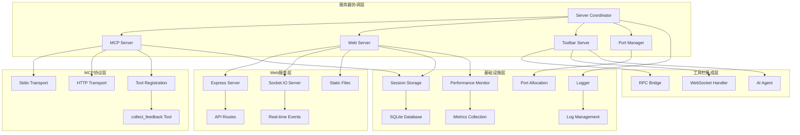
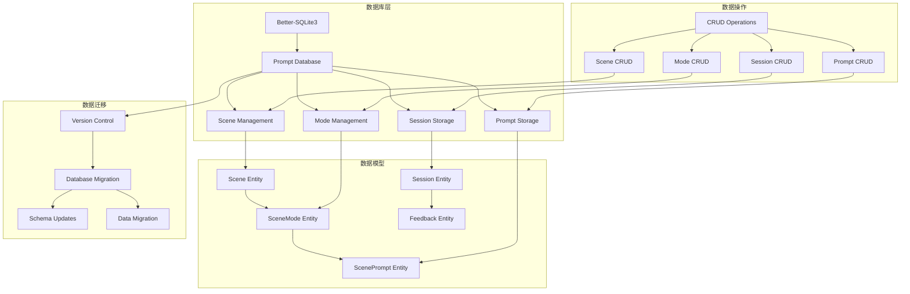
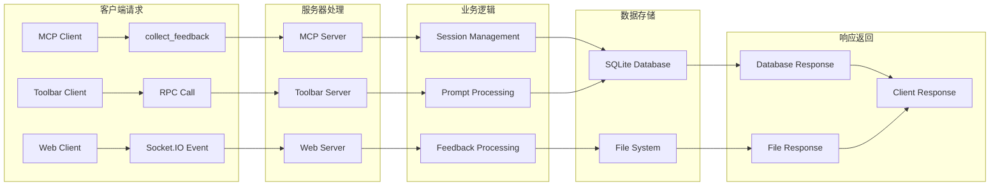
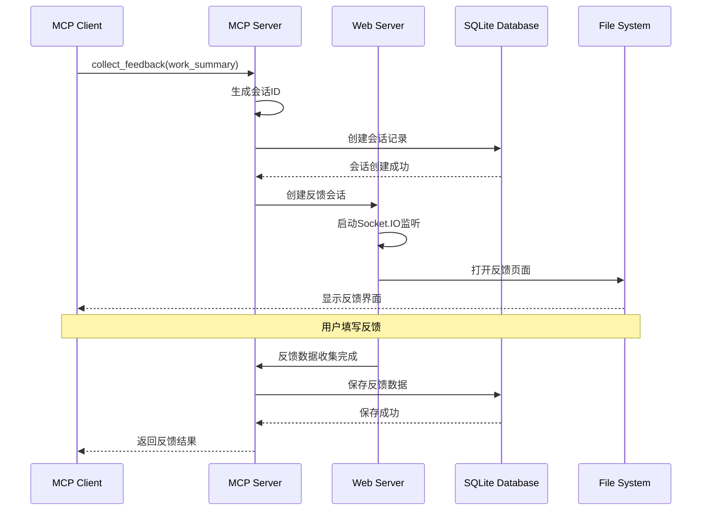
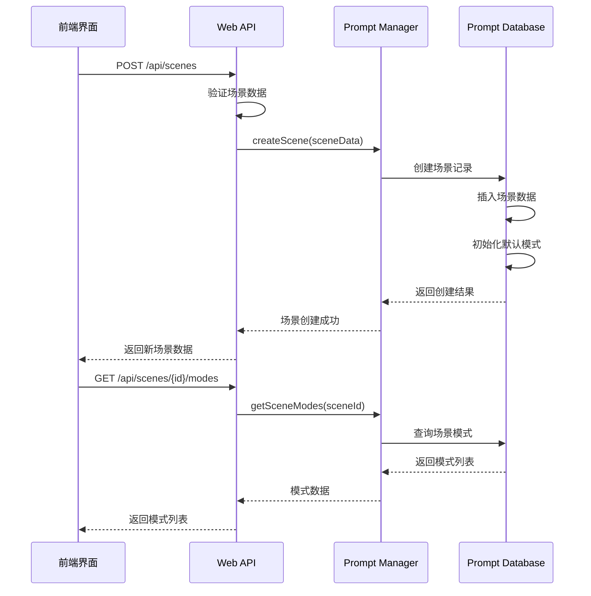
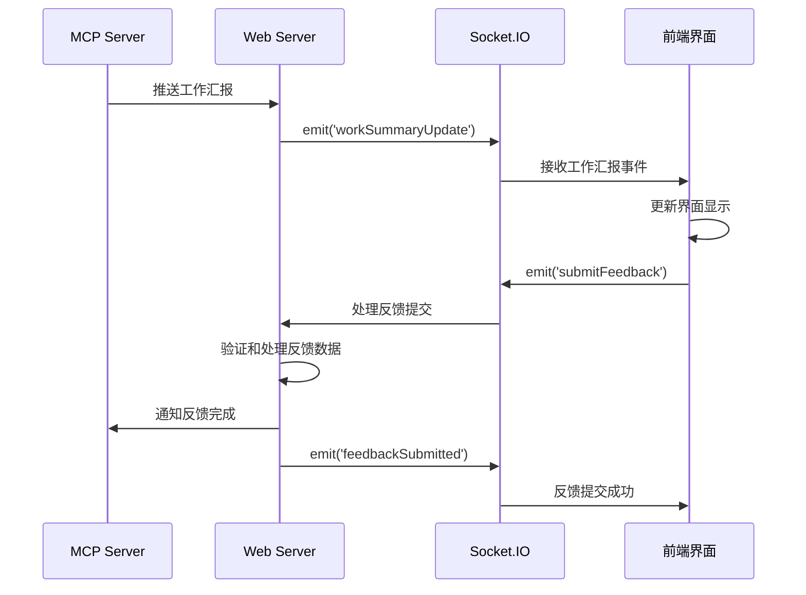

# 后端模块内部结构与关键文件分析

## 模块概述

### 功能职责
后端模块是MCP Feedback Collector的核心服务层，基于Node.js和TypeScript构建，负责：
- **MCP协议实现**: 完整的Model Context Protocol协议支持和工具注册
- **场景化数据管理**: SQLite数据库存储场景、模式和提示词配置
- **Web服务**: Express服务器提供HTTP API和静态文件服务
- **实时通信**: Socket.IO服务器实现与前端的实时双向通信
- **会话管理**: 多客户端会话隔离和状态管理
- **图片处理**: 图片上传、压缩和存储服务
- **性能监控**: 实时性能指标收集和监控
- **Stagewise集成**: 工具栏服务器和RPC桥接服务

### 技术架构
- **运行时**: Node.js 18.0.0+
- **类型系统**: TypeScript 5.2.2
- **Web框架**: Express 4.18.2
- **实时通信**: Socket.IO 4.7.2
- **数据库**: Better-SQLite3 9.2.2
- **MCP协议**: @modelcontextprotocol/sdk 1.12.3
- **进程管理**: 多服务器协调和生命周期管理

### 依赖关系
- **对外接口**: 提供MCP协议接口、HTTP API、Socket.IO实时通信
- **内部依赖**: 服务器间协调、数据库存储、会话管理、性能监控

## 目录结构

```
src/
├── cli.ts                      # CLI命令行入口 (13KB, 435行)
├── index.ts                    # 主模块导出 (501B, 17行)
├── server/                     # 服务器模块组
│   ├── mcp-server.ts           # MCP协议服务器 (19KB, 646行)
│   ├── web-server.ts           # Web服务器和Socket.IO (66KB, 1990行)
│   ├── toolbar-server.ts       # Stagewise工具栏服务器 (11KB, 384行)
│   ├── server-coordinator.ts   # 服务器协调器 (8.4KB, 318行)
│   ├── stdio-server-launcher.ts # Stdio模式启动器 (7.9KB, 283行)
│   └── web-server-manager.ts   # Web服务器管理器 (5.7KB, 221行)
├── utils/                      # 工具模块组
│   ├── prompt-database.ts      # SQLite数据库管理 (30KB, 931行)
│   ├── prompt-manager.ts       # 提示词管理器 (20KB, 676行)
│   ├── session-storage.ts      # 会话存储管理 (8.3KB, 343行)
│   ├── image-processor.ts      # 图片处理器 (5.8KB, 218行)
│   ├── performance-monitor.ts  # 性能监控器 (8.0KB, 321行)
│   ├── logger.ts               # 日志系统 (5.8KB, 236行)
│   ├── port-manager.ts         # 端口管理器 (11KB, 416行)
│   ├── client-identifier.ts    # 客户端识别器 (3.1KB, 144行)
│   ├── session-context.ts      # 会话上下文管理 (1.8KB, 64行)
│   ├── process-manager.ts      # 进程管理器 (7.8KB, 289行)
│   └── mode-detector.ts        # 模式检测器 (3.6KB, 130行)
├── config/                     # 配置管理
│   └── index.ts                # 配置文件和环境变量处理
├── toolbar/                    # Stagewise工具栏集成
│   ├── index.ts                # 工具栏主入口
│   ├── bridge/                 # 桥接服务
│   │   └── srpc-websocket-bridge.ts # RPC WebSocket桥接
│   ├── handlers/               # 处理器
│   │   ├── ai-agent.ts         # AI代理处理器
│   │   └── rpc-handler.ts      # RPC处理器
│   └── types/                  # 工具栏类型定义
└── types/                      # 全局类型定义
    └── index.ts                # 主要类型定义
```

## 核心架构设计

### 1. 服务器协调架构



### 2. 数据库存储架构



### 3. 业务流程架构



## 关键文件分析

### 核心服务器文件

#### mcp-server.ts (MCP协议服务器)
- **路径**: `src/server/mcp-server.ts`
- **主要功能**: MCP协议的核心实现，处理客户端连接和工具调用
- **关键特性**:
  - 完整的MCP协议实现
  - collect_feedback工具注册
  - Stdio和HTTP传输支持
  - 多客户端会话管理
- **核心方法**:
  - `start()`: 启动MCP服务器
  - `collectFeedback()`: 处理反馈收集工具调用
  - `createMcpServerInstance()`: 创建MCP服务器实例
  - `handleToolCall()`: 处理工具调用请求
- **业务逻辑**:
  - 工具注册和管理
  - 会话创建和隔离
  - 反馈数据处理
  - 错误处理和恢复
- **代码结构**: 646行代码，包含完整的MCP协议实现

#### web-server.ts (Web服务器)
- **路径**: `src/server/web-server.ts`
- **主要功能**: Web服务和Socket.IO实时通信的核心实现
- **关键特性**:
  - Express Web服务器
  - Socket.IO实时通信
  - 场景管理API
  - 图片上传处理
  - 会话管理
  - 性能监控集成
- **API路由**:
  - `GET /api/scenes`: 获取所有场景
  - `POST /api/scenes`: 创建新场景
  - `PUT /api/scenes/:id`: 更新场景
  - `DELETE /api/scenes/:id`: 删除场景
  - `GET /api/scenes/:id/modes`: 获取场景模式
  - `POST /api/scenes/:sceneId/modes`: 创建场景模式
- **Socket.IO事件**:
  - `workSummaryUpdate`: 工作汇报更新
  - `submitFeedback`: 提交反馈
  - `feedbackSubmitted`: 反馈提交成功
  - `connect/disconnect`: 连接状态管理
- **业务逻辑**:
  - HTTP API处理
  - 实时事件处理
  - 会话映射管理
  - 文件上传处理
- **代码结构**: 1990行代码，是系统最大的单个文件

#### server-coordinator.ts (服务器协调器)
- **路径**: `src/server/server-coordinator.ts`
- **主要功能**: 多服务器实例的协调和生命周期管理
- **关键特性**:
  - 服务器实例管理
  - 端口分配协调
  - 资源共享管理
  - 生命周期控制
- **核心方法**:
  - `startServers()`: 启动所有服务器
  - `stopServers()`: 停止所有服务器
  - `getServerStatus()`: 获取服务器状态
  - `allocateResources()`: 分配资源
- **业务逻辑**:
  - 服务器启动顺序控制
  - 端口冲突避免
  - 资源清理和回收
  - 错误传播和处理

### 数据库管理文件

#### prompt-database.ts (SQLite数据库管理)
- **路径**: `src/utils/prompt-database.ts`
- **主要功能**: SQLite数据库的完整管理，包括场景、模式、提示词存储
- **关键特性**:
  - Better-SQLite3数据库引擎
  - 跨平台存储路径管理
  - 数据库版本控制和迁移
  - 完整的CRUD操作
  - 事务处理和数据完整性
- **数据表结构**:
  - `scenes`: 场景基本信息
  - `scene_modes`: 场景模式配置
  - `scene_prompts`: 场景提示词模板
  - `db_metadata`: 数据库版本控制
- **核心方法**:
  - `getAllScenes()`: 获取所有场景
  - `createScene()`: 创建新场景
  - `updateScene()`: 更新场景
  - `deleteScene()`: 删除场景
  - `getSceneModes()`: 获取场景模式
  - `createSceneMode()`: 创建场景模式
  - `getScenePrompt()`: 获取场景提示词
  - `saveScenePrompt()`: 保存场景提示词
- **业务逻辑**:
  - 默认场景初始化
  - 数据库迁移处理
  - 外键约束管理
  - 事务处理
- **代码结构**: 931行代码，包含完整的数据库操作逻辑

#### prompt-manager.ts (提示词管理器)
- **路径**: `src/utils/prompt-manager.ts`
- **主要功能**: 提示词的业务逻辑管理和模板处理
- **关键特性**:
  - 提示词模板渲染
  - 场景化提示词管理
  - 变量替换和处理
  - 缓存机制
- **核心方法**:
  - `getPromptForScene()`: 获取场景提示词
  - `renderPromptTemplate()`: 渲染提示词模板
  - `validatePromptTemplate()`: 验证提示词模板
  - `cachePrompt()`: 缓存提示词
- **业务逻辑**:
  - 模板变量处理
  - 场景上下文集成
  - 提示词缓存优化
  - 错误处理和回退

### 工具和基础设施文件

#### session-storage.ts (会话存储管理)
- **路径**: `src/utils/session-storage.ts`
- **主要功能**: 会话数据的存储和管理
- **关键特性**:
  - 会话生命周期管理
  - 内存存储优化
  - 会话超时处理
  - 数据序列化
- **核心方法**:
  - `createSession()`: 创建会话
  - `getSession()`: 获取会话
  - `updateSession()`: 更新会话
  - `deleteSession()`: 删除会话
  - `cleanupExpiredSessions()`: 清理过期会话

#### performance-monitor.ts (性能监控器)
- **路径**: `src/utils/performance-monitor.ts`
- **主要功能**: 系统性能监控和指标收集
- **关键特性**:
  - 实时性能指标收集
  - 请求响应时间监控
  - 资源使用情况跟踪
  - 性能报告生成
- **监控指标**:
  - 请求处理时间
  - 成功/失败率
  - 内存使用情况
  - CPU使用率
  - 活跃会话数
- **核心方法**:
  - `recordRequest()`: 记录请求指标
  - `recordSessionCreated()`: 记录会话创建
  - `getMetrics()`: 获取性能指标
  - `getFormattedReport()`: 获取格式化报告

#### image-processor.ts (图片处理器)
- **路径**: `src/utils/image-processor.ts`
- **主要功能**: 图片上传、处理和存储服务
- **关键特性**:
  - 多格式图片支持
  - 图片压缩和优化
  - 文件大小限制
  - 安全验证
- **核心方法**:
  - `processImage()`: 处理图片
  - `validateImage()`: 验证图片
  - `compressImage()`: 压缩图片
  - `saveImage()`: 保存图片

## 业务流程分析

### 1. MCP工具调用流程



### 2. 场景管理流程



### 3. 实时通信流程



## 数据模型详解

### 1. 场景数据模型

```typescript
// 场景实体
interface Scene {
  id: string              // 场景唯一标识
  name: string           // 场景名称
  description: string    // 场景描述
  icon?: string          // 场景图标
  is_default: boolean    // 是否为默认场景
  sort_order: number     // 排序顺序
  created_at: number     // 创建时间戳
  updated_at: number     // 更新时间戳
}

// 场景模式实体
interface SceneMode {
  id: string              // 模式唯一标识
  scene_id: string       // 所属场景ID
  name: string           // 模式名称
  description: string    // 模式描述
  shortcut?: string      // 快捷键
  is_default: boolean    // 是否为默认模式
  sort_order: number     // 排序顺序
  default_feedback?: string // 默认反馈内容
  created_at: number     // 创建时间戳
  updated_at: number     // 更新时间戳
}

// 场景提示词实体
interface ScenePrompt {
  scene_id: string       // 场景ID
  mode_id: string        // 模式ID
  prompt: string         // 提示词内容
  created_at: number     // 创建时间戳
  updated_at: number     // 更新时间戳
}
```

### 2. 会话数据模型

```typescript
// 会话数据
interface SessionData {
  workSummary: string    // 工作汇报内容
  feedback: FeedbackData[] // 反馈数据列表
  startTime: number      // 会话开始时间
  timeout: number        // 会话超时时间
  mcpSessionId?: string  // MCP会话ID
  status: 'active' | 'completed' | 'expired' // 会话状态
}

// 反馈数据
interface FeedbackData {
  text: string           // 反馈文本
  images: ImageFile[]    // 图片文件列表
  timestamp: number      // 提交时间戳
  sessionId: string | null // 会话ID
}
```

### 3. 配置数据模型

```typescript
// 服务器配置
interface Config {
  port: number           // 服务端口
  corsOrigin: string     // CORS允许源
  maxFileSize: number    // 最大文件大小
  sessionTimeout: number // 会话超时时间
  dbPath?: string        // 数据库路径
  logLevel: string       // 日志级别
}

// 性能监控配置
interface PerformanceConfig {
  enableMonitoring: boolean // 是否启用监控
  metricsInterval: number   // 指标收集间隔
  reportInterval: number    // 报告生成间隔
  maxMetricsHistory: number // 最大历史记录数
}
```

## 技术特点

### 1. SQLite数据库集成
- **Better-SQLite3**: 高性能同步数据库操作
- **跨平台存储**: 自动选择合适的存储路径
- **数据库迁移**: 版本控制和自动迁移
- **事务处理**: ACID事务保证数据一致性
- **外键约束**: 数据完整性保证

### 2. MCP协议实现
- **标准协议**: 基于@modelcontextprotocol/sdk
- **多传输模式**: Stdio和HTTP传输支持
- **工具注册**: 动态工具注册和管理
- **会话隔离**: 多客户端独立会话
- **错误处理**: 完善的错误处理机制

### 3. 实时通信
- **Socket.IO服务器**: 高性能实时通信
- **事件驱动**: 基于事件的架构设计
- **连接管理**: 连接状态跟踪和管理
- **广播机制**: 多客户端消息广播
- **自动重连**: 客户端自动重连支持

### 4. 性能监控
- **实时监控**: 系统性能实时跟踪
- **指标收集**: 关键性能指标收集
- **报告生成**: 自动化性能报告
- **资源监控**: CPU、内存使用监控
- **告警机制**: 性能异常告警

### 5. 模块化设计
- **清晰分层**: 服务器、工具、配置分层
- **依赖注入**: 松耦合的依赖管理
- **插件化**: 支持功能模块插件化
- **可扩展性**: 易于扩展和维护

## 🧭 导航链接

- **📋 [返回主目录](../../README.md)** - 返回文档导航中心
- **🔧 [返回模块目录](./index.md)** - 返回本模块导航
- **🔧 [返回模块层目录](../index.md)** - 返回模块层导航
- **🔄 [上一层：交互层](../../交互层/index.md)** - 返回交互分析
- **🔧 [同级：前端模块](../前端模块/详细分析.md)** - 查看前端模块分析

---

*后端模块详细分析最后更新: 2024年1月* 