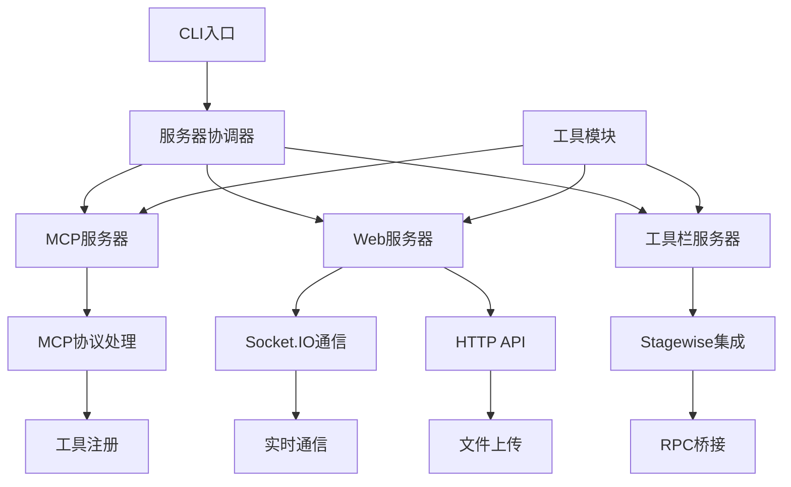

# 后端模块内部结构分析

## 模块概述
- **功能职责**：提供MCP协议实现、Web服务、工具栏集成和各种基础设施服务
- **依赖关系**：依赖Node.js、TypeScript、Express、Socket.IO等技术栈
- **对外接口**：MCP协议接口、HTTP API、Socket.IO实时通信接口

## 目录结构
```
src/
├── server/                   # 服务器模块组
│   ├── mcp-server.ts         # MCP协议服务器实现
│   ├── web-server.ts         # Web服务器和Socket.IO
│   ├── toolbar-server.ts     # Stagewise工具栏服务器
│   ├── server-coordinator.ts # 服务器协调器
│   ├── stdio-server-launcher.ts # Stdio模式启动器
│   └── web-server-manager.ts # Web服务器管理器
├── utils/                    # 工具模块组
│   ├── logger.ts             # 日志系统
│   ├── session-storage.ts    # 会话存储管理
│   ├── prompt-manager.ts     # 提示词管理器
│   ├── prompt-database.ts    # 提示词数据库管理
│   ├── default-scenes.ts     # 默认场景配置
│   ├── image-processor.ts    # 图片处理器
│   ├── client-identifier.ts  # 客户端识别器
│   ├── port-manager.ts       # 端口管理器
│   ├── performance-monitor.ts # 性能监控器
│   ├── process-manager.ts    # 进程管理器
│   └── session-context.ts    # 会话上下文管理
├── config/                   # 配置管理
│   └── index.ts              # 配置文件和环境变量处理
├── toolbar/                  # Stagewise工具栏集成
│   ├── index.ts              # 工具栏主入口
│   ├── bridge/               # 桥接服务
│   ├── handlers/             # 处理器
│   └── types/                # 工具栏类型定义
└── types/                    # 全局类型定义
    └── index.ts              # 主要类型定义
```

## 主要组件

### 1. 服务器模块组 (`/src/server/`)

#### MCP服务器 (`mcp-server.ts`)
- **功能**：实现MCP协议的核心服务器
- **职责**：处理MCP客户端连接、工具注册、HTTP/Stdio传输
- **关键类**：`MCPServer`
- **主要方法**：`start()`, `collectFeedback()`, `createMcpServerInstance()`

#### Web服务器 (`web-server.ts`)
- **功能**：Web服务器和Socket.IO实现
- **职责**：HTTP服务、实时通信、会话管理、文件上传
- **关键类**：`WebServer`
- **主要功能**：Express服务器、Socket.IO集成、图片处理

#### 工具栏服务器 (`toolbar-server.ts`)
- **功能**：Stagewise工具栏集成服务
- **职责**：RPC桥接、提示词处理、工具栏通信
- **关键类**：`ToolbarServer`

#### 服务器协调器 (`server-coordinator.ts`)
- **功能**：多服务器实例协调管理
- **职责**：资源分配、生命周期管理、客户端隔离

### 2. 工具模块组 (`/src/utils/`)

#### 核心工具类
- **`logger.ts`**：统一的日志管理系统，支持多级别日志和文件输出
- **`session-storage.ts`**：会话数据存储和管理，基于SQLite
- **`prompt-manager.ts`**：提示词管理和处理
- **`prompt-database.ts`**：提示词数据库管理，SQLite数据库操作
- **`default-scenes.ts`**：默认场景配置，内置编码场景和模式
- **`image-processor.ts`**：图片上传、压缩和处理
- **`client-identifier.ts`**：客户端识别和环境检测
- **`port-manager.ts`**：端口分配和管理
- **`performance-monitor.ts`**：性能监控和指标收集

## 内部流程图



## 关键文件说明

### 核心服务器文件
- **`mcp-server.ts`** (18KB, 632行)：MCP协议的核心实现
- **`web-server.ts`** (53KB, 1661行)：Web服务器和Socket.IO实现
- **`server-coordinator.ts`** (8.4KB, 318行)：多服务器实例协调管理

### 重要工具文件
- **`session-storage.ts`**：会话数据存储和管理
- **`prompt-manager.ts`**：提示词管理和处理
- **`logger.ts`**：统一的日志管理系统

## 📍 深入分析建议

### 🎯 文件分析优先级
基于文件重要性和复杂度，建议按以下优先级深入分析：
1. **核心业务文件** - `mcp-server.ts`, `web-server.ts`
2. **协调管理文件** - `server-coordinator.ts`
3. **基础工具文件** - `session-storage.ts`, `prompt-manager.ts`

## 🧭 导航链接
- **📋 [返回主目录](../../README.md)** - 返回文档导航中心
- **🔧 [返回模块目录](./index.md)** - 返回本模块导航
- **🔧 [返回模块层目录](../index.md)** - 返回模块层导航
- **📁 [下一层：文件层](../../文件层/index.md)** - 查看文件功能分析 